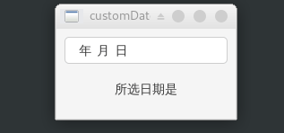

QLineEdit是使用频率最高的控件之一，当我们想获取用户输入时自然而然得会用到它。

通常我们会将QLineEdit的信号或其他控件的信号绑定至槽函数，然后获取并处理编辑器内的数据。你会觉得我们拿到的是第一手的“热乎着”的数据，所以理所当然地将过滤和验证逻辑都加入槽函数中，然而事实并非如此。那么数据究竟通过了哪些流程最终才经由信号被我们获取呢？

或者你希望QLineEdit能拥有自动补全或是输入联想的功能，这又如何实现呢？

如果你对上面的问题毫无头绪，那么本文就是为你量身打造的，请继续往下阅读吧！

<blockquote id="bookmark">
  <h4>本文索引</h4>
  <ul>
    <li>
      <a href="#引论">引论</a>
    </li>
    <li>
      <a href="#实现customdateedit">实现CustomDateEdit</a>
      <ul>
        <li>
          <a href="#过滤用户输入inputmask">过滤用户输入——inputMask</a>
        </li>
        <li>
          <a href="#数据验证qvalidator">数据验证——QValidator</a>
        </li>
        <li>
          <a href="#自动补全qcompleter">自动补全——QCompleter</a>
        </li>
        <li>
          <a href="#customdateedit的实现">CustomDateEdit的实现</a>
        </li>
      </ul>
    </li>
    <li>
      <a href="#测试customdateedit">测试CustomDateEdit</a>
    </li>
  </ul>
</blockquote>

## 引论
这一节将带你概览QLineEdit对数据的处理，并以一个示例引出后续章节的内容。你可以先在此处找到一些粗浅的回答，后续则会有详细的解释。

如果要简单的回答第一问，那么在我们获取到text内容前需要经过两个步骤：


它们分别由`inputMask`和`QValidator`实现，前者负责过滤用户的输入，后者则用于过滤后的信息的验证。

`inputMask`和`validator`的表现很相似，有时它们的功能还会有一些重合，那么它们是否能取代彼此呢？答案是否定的，看起来像鸭子的鸟有时候其实不是和鸭子没关系，后面我们仔细说明。

现在轮到回答第二个问题了。要实现补全和自动联想，你只需要将一个设置好的`QCompleter`对象传递给QLineEdit。是不是够简单？大部分时间也确实如此，然而“设置好的”这一形容词的很抽象的概念，所以有的时候你可能要失望了，不过别担心，后面我们也会详细介绍它的使用。

两问回答完毕，现在该来看看本文的示例了。这次我们将自己实现一个`DateEdit`（我知道有现成的QDateEdit，不过这里请允许我为了实践所学而造一个粗糙的轮子），并根据用户输入的日期计算当天是周几，效果如下：


## 实现CustomDateEdit
在本节中我们将逐步实现CustomDateEdit，并详细介绍引论中提到的概念。

按照流程图的顺序，我们首先要讲解的便是输入数据的过滤——`inputMask`的功能。

### 过滤用户输入——inputMask
在具体介绍一个能控制显示效果的特性前，我习惯于先描述其大致功能和具体的显示效果。

inputMask的功能：它是一串特定的规则，所有不符合规则的用户输入都会被丢弃，用户不管是从信号还是`text`槽都只能获取符合mask要求的输入数据，当然这个“用户”包括我们后面要介绍的`QValidator`及其派生类。

inputMask的显示效果：你只能输入合法的字符，输入非法字符是输入内容无法显示，光标停留在原处；如果你设置了mask的填充字符，则这些字符会显示在edit中，当输入合法字符时将覆盖它们，mask中的保留字符同样显示在edit中，但输入时会被跳过不可覆盖（类似占位符），引论中的效果图就是很好的例子。

inputMask就是一串由特殊字符组成的规则，通过规则给定的格式来控制文本的输入，具体的规则见下表：

| 特殊字符 | 对应规则 |
| ------ | ------ |
| A | 必须输入的ascii字母，包括A-Z，a-z |
| a | 和`A`一样，但是可选，也就是不输入这个字符也可以，占位符将保留 |
| N | 必须输入的ascii字母和数字，包括A-Z，a-z，0-9 |
| n | 和`N`一样，但是可选 |
| X | 必须输入的任意字符 |
| x | 和`X`一样，但是可选 |
| 9 | 必填的ascii的数字字符，包括0-9 |
| 0 | 和`9`一样，但是可选 |
| D | 必填的数字，包括1-9 |
| d | 和`D`一样，但可选 |
| # | 可选的数字或者加减号 |
| H | 必填的16进制的数字，包括A-F, a-f, 0-9 |
| h | 和`H`一样，但可选 |
| B | 必填的二进制数字，包括0和1 |
| b | 和`B`一样，但可选 |
| > | 所有在这个特殊字符之后的字符转换为大写 |
| < | 所有在这个特殊字符之后的字符转换为小写 |
| ! | 关闭前面的大小写转换 |
| [ ] { } | 保留的特殊字符 |
| \ | 将特殊字符转义为普通字符 |

inputMask的格式为：`([特殊字符]|[普通字符])*;占位符`，分号后跟的是占位符，用于填充特殊字符留下的空位，默认为空格。下面看些例子：
1. `000,000.00;_`：用于输入一个最大6位，有两位小数的值，用`_`填充空位，edit会显示出类似`___,___.__`的效果
2. `>AAAA-AAAA!-AAAA-AAAA`：用于输入一个由连字符分割的字母数字组成的uuid或license key，且前八个字母会被转换为大写，在edit中显示为`    -    -    -    `
3. `9999年09月09日`：用于输入年月日的时间格式，可以输入`2019年03月14日`或`2019年3月14日`，显示效果在引论的效果图中。
4. 空字符串：表示没有任何输入限制

你可以通过`setInputMask`设置mask，或`inputMask`获取当前的mask。

通过上面的说明和例子你应该已经学会了inputMask的使用，现在可以看看它与validator的区别了：
1. inputMask在用户进行输入时进行过滤，并且只存在符合规则和不符合两种状态，validator通常拥有第三种状态
2. inputMask只能过滤较为固定的格式，并且对于输入的最大长度产生限制，validator则要灵活的多

最主要的区别是这两点。上一节提到inputMask不能替代validator，现在我们揭晓原因：inputMask只能保证输入数据的格式，但并不保证数据有意义，比如例子3中我们可以在月份上输入20，但明显日期中没有20月，而这种错误是inputMask无法处理的，这就是为什么我们说有时候一只看起来像鸭子的鸟也许和鸭子没有半点关系的原因。

因此想要获得正确的数据，我们还需要验证器来帮忙。

### 数据验证——QValidator
现在该验证我们的输入了。因为有了inputMask的帮助，现在我们只需要验证数据本身是否正确而不用操心它的格式了，真是谢天谢地。

等等，这么说好像不太对，validator拿到的数据里居然还保留着mask的占位符？你没看错，这不是bug，能在edit里显示出来的数据那么一定能被获得，mask本身的占位符是能通过过滤的，所以它会原封不动地传给validator，只有用户输入合法的数据后这些占位符才会被覆盖。所以在写自己的验证器的时候要小心了——我们需要先删除所有的占位符，因为它们不是数据的一部分！

下面我们来看看validator的功能和显示效果。

功能：验证数据是否合法，不合法会被丢弃，同时还要识别出数据是否输入完成，这就是validator返回的第三种状态。

显示效果：和inputMask一样。如果数据未输入完则保留在edit中。

大致概览后我们可以深入了解一下`QValidator`了，所有的验证器都是它的派生类。

`QValidator`本身是一个纯虚基类，派生类需要实现`QValidator::State QValidator::validate(QString &input, int &pos) const`进行数据的验证，还有一个可选的`fixup`函数用于修复输入，不过一般来说很少有自行修复输入的需求，所以这里使用默认的实现，也就是什么都不做。

`validate`验证数据后返回数据是否合法，有`QValidator::State`类型的值表示：
- `QValidator::Invalid` 数据不合法
- `QValidator::Intermediate` 数据不完整需要进一步的输入
- `QValidator::Acceptable` 数据合法

PyQt5中的接口稍微有些不同，处理第一个返回值的为`QValidator::State`之外还需要把`input`和`pos`原封不动地作为第二和第三个值返回，否则edit无法正确显示输入的数据。

你可以通过`validator`和`setValidator`来获取和设置验证器。

因为额外引入了第三种状态，所以实现一个validator远比设置inputMask来的复杂，这里我们实现一个自定义的日期验证器用于配合`CustomDateEdit`（我知道这个工作交给QRegExpValidator会很简单），同时介绍如何实现一个验证器。

下面看看具体的代码，首先我们不需要为validator额外增加内容，只需要实现几个方法，因此不要要关注构造等行为：
```python
class CustomDateValidator(QValidator):
    """验证输入的是否是合法的年月日
    """
    def validate(self, input: str, pos: int):
        date = input.replace(' ', '')  # 去除占位符
        y, m, d = self.splitDate(date)
        if not (y and m and d):
            return QValidator.Intermediate, input, pos

        try:
            arrow.get(date, self.dateFormat())  # 如果解析失败代表日期输入不合法
        except Exception:
            return QValidator.Invalid, input, pos

        return QValidator.Acceptable, input, pos

    def dateFormat(self):
        """返回arrow库使用的日期解析格式，具体参见文档，这里与CustomDateEdit的inputMask保持一致
        """
        return self.tr('YYYY年M月D日')

    def splitDate(self, date: str):
        """分割日期成年，月，日，以便判断数据是否输入完整，
        只要有某一部分为空就表明数据未输入结束
        """
        y, date = date.split(self.tr('年'))
        m, date = date.split(self.tr('月'))
        d = date.split(self.tr('日'))[0]
        return y, m, d
```

可以看到验证器的逻辑其实很简单。整个验证器加上帮助函数一共做了三件事：
1. 首先去除占位符，如前文所述
2. 接着将输入信息按年月日分割，如果有某一部分为空则代表输入不完整
3. 对于完整的输入则使用arrow解析成时间对象，失败则表示输入数据错误

其他的细节都已经在注释中说明。

如此一来我们既验证了数据的合法性又处理了所有可能的输入情况。当然，通常我更建议你使用现有的`QDoubleValidator`和`QRegExpValidator`等现有的验证器，或将它们组合使用，这样更简单也更不容易出错。

### 自动补全——QCompleter
我们已经讲解了输入的过滤和验证，最后该讲讲补全了。

可以说过滤和验证是比较常用的功能的话，那补全就没有那么常见了。或者说，通常我们不需要关心它，比如`QComboBox`自带了QCompleter，它工作得也很好，所以我们往往忽略了它的存在。当然不只是下拉框，在`QLineEdit`中我们也可以用它和它的派生类实现补全效果。

功能：QCompleter包含了一个叫completeModel的数据模型，里面包含了用于根据输入信息进行补全的所有数据，通常是个listModel，也可以是设置了补全所用数据位于哪一列的tableModel，当然你还可以用treeModel，不过这超过了我们的讨论范围。

显示效果：completer从你输入的第一个字符开始匹配，如果在completeModel中找到了以输入内容开头的信息则会在edit下把所有匹配项一次放入一个下拉框并显示，你也可以设置为将第一个匹配项的数据替换放入edit。

还有一点我想额外补充一下，补全时弹出的下拉框其实是个view视图对象，因此你可以选择自己需要的视图以显示补全时想显示的自定义效果。

你可以通过`completer`和`setCompleter`获取和设置completer。

可以看到只要把我们用于补全输入的数据放入合适的model中，再把model设置给completer，就能实现补全功能了。

下面看个设置completer的例子：
```python
# model是一个QStandardItemModel，后面我们也会使用这个model来设置completer
completer = QCompleter()
model.setParent(completer)
completer.setModel(model)
edit.setCompleter(completer)
```

另外completer得到的数据是经过验证的，所以我们无需关心数据的格式和合法性。

现在我们已经把`QLineEdit`的数据处理流程介绍了一遍，有了这些预备知识下面该实现`CustomDateEdit`了。

### CustomDateEdit的实现
我们先来看代码，细节问题基本在注释中给出了说明：
```python
class CustomDateEdit(QLineEdit):
    def __init__(self, parent=None):
        super().__init__(parent=parent)
        self.setInputMask(self.tr('9999年09月09日'))  # 设置日期格式的inputMask
        validator = CustomDateValidator()
        self.setValidator(validator)  # 设置validator
        # 设置completer
        self._completer = QCompleter()
        self.setCompleter(self._completer)
        self.completerModel = QStandardItemModel(parent=self._completer)
        self._completer.setModel(self.completerModel)
        # 预先填充一些待补全内容
        self.addDateRecord("2019年03月14日")
        self.addDateRecord("2019年03月15日")

    def addDateRecord(self, text: str):
        """当有合法的输入被确认时就将其添加至completerModel，以便再次输入时补全
        """
        if self.completerModel.findItems(text):  # 避免重复添加
            return

        item = QStandardItem(text)
        self.completerModel.appendRow(item)

    def weekDayInfo(self, weekDay: int):
        """返回weekDay对应的名称，后面测试中会被使用
        """
        week = {
            0: self.tr('周一'),
            1: self.tr('周二'),
            2: self.tr('周三'),
            3: self.tr('周四'),
            4: self.tr('周五'),
            5: self.tr('周六'),
            6: self.tr('周日'),
        }

        return week[weekDay]
```

整个dateEdit的实现也很简单，所有复杂的逻辑都已经交给了inputMask，验证器和completer，而我们唯一要做的是为completer添加新输入的合法的数据，这在类方法`addDateRecord`中完成了。

## 测试CustomDateEdit
实现`CustomDateEdit`之后，我们就要动手实现引论一节中的程序了。

前面已经说过，最终通过信号传递或者由槽函数获取到的值一定是通过了过滤和验证通过的值。所以想实现引论中的程序我们只需要正确处理`CustomDateEdit`的信号即可。

下面直接上测试代码：
```python
class MainWindow(QMainWindow):
    def __init__(self, parent=None):
        super().__init__(parent=parent)
        center = QWidget()
        self.dateEdit = CustomDateEdit()
        self.info = QLabel(self.tr('所选日期是'))
        self.dateEdit.textEdited.connect(lambda: self.info.setText(self.tr('所选日期是')))
        # 输入结束后按回车触发该信号，同时只有输入数据通过过滤和验证后这个信号才会被发送
        self.dateEdit.returnPressed.connect(self.calcWeekDay)
        layout = QVBoxLayout()
        layout.addWidget(self.dateEdit)
        layout.addWidget(self.info, alignment=Qt.AlignCenter)
        center.setLayout(layout)
        self.setCentralWidget(center)

    def calcWeekDay(self):
        # 计算所选日期是周几
        t = arrow.get(self.dateEdit.text(), self.dateEdit.validator().dateFormat())
        weekDayInfo = self.dateEdit.weekDayInfo(t.weekday())
        self.info.setText(self.tr('所选日期是') + weekDayInfo)
        # 添加记录
        self.dateEdit.addDateRecord(self.dateEdit.text())


if __name__ == '__main__':
    app = QApplication(sys.argv)
    win = MainWindow()
    win.show()
    app.exec_()
```

当用户输入一个完整的日期后，按下回车键，程序会自动计算结果并更新到下方的label上。很简单的程序，主要就是为了测试我们的`CustomDateEdit`：



程序的行为和预想的差不多，现在你已经初步掌握所学的知识了。

另外也许你会奇怪，为什么要大量使用`self.tr`这个函数，不用担心，这只是为了以后介绍国际化时做的准备，现在忽略它也没问题。
