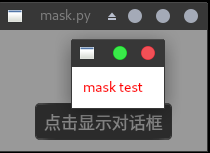
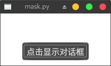

<blockquote id="bookmark">
  <h4>本文索引：</h4>
  <ul>
    <li><a href="#requirement">需求</a></li>
    <li><a href="#principle">原理</a></li>
    <li><a href="#implement">实现遮罩控件</a></li>
    <li><a href="#using">遮罩的使用</a></li>
  </ul>
</blockquote>

<h2 id="requirement">需求</h2>
我们在显示一些模态对话框的时候，往往需要将对话框的背景颜色调暗以达到突出当前对话框的效果，例如：



对话框的父窗口除了标题栏以外的部分都变暗了，在父窗口的对比下对话框的显示效果就得到了强调。

这种设计多见于web页面，当用户点击诸如购买之类的按钮后页面会弹出一个购物清单确认对话框，并将对话框以外的内容用类似图中的效果处理，使用户可以将注意力集中在对话框本身。

今天我们也将使用Qt来实现这一效果。

<h2 id="principle">原理</h2>
在介绍具体做法前我想先介绍一点预备知识——“亮盒效果”。这是一个摄影技术的名词，大意是指将背景暗化以便突出照片的主体，因为往往使用一个黑色的“盒子”来罩住需要拍摄的主体，所以被称为亮盒。而这与我们想实现的效果不谋而合。

所以想要实现让对话框的父窗口变暗的效果，最常见的手段就是使用一个半透明遮罩控件将父窗口组件整个遮住。

可能有人会问，既然只需要将背景暗化，那为何不直接修改父窗口的QSS，而要使用一个遮罩组件呢？原因也很简单，因为父控件的`background`属性是少数几个能被子控件继承的属性，当我们修改了父窗口的QSS那么我们的对话框也将不可避免的遭受影响，虽然可以使用`setStyleSheet('')`去除这些额外的影响，但是这样做将会引入许多不必要的复杂性，显然是与我们的设计初衷相违背的。

所以我们选择使用遮罩控件。回顾一下`QWidget`的特性，当除了`QDialog`以外的控件设置了非`None`的parent时，该控件就会绘制在parent控件上。布局管理器只是帮助我们设置了parent并自动指定了一个合适的位置和尺寸来绘制控件，所以我们完全可以自己指定控件的大小和需要绘制的区域。

绘制区域使用的是`QWidget`的逻辑坐标。与painter使用的坐标系统一致。所以我们只需要设置遮罩组件的parent为父窗口，然后获取父窗口的高度和宽度，并设置遮罩组件的大小与父窗口一致，最后从父窗口逻辑坐标系的(0, 0)出开始绘制控件即可保证遮罩控件可以完整的遮盖住父窗口实现遮罩效果。

注意，如果子控件的绘制区域或者大小超过了父控件，超过的部分将会被截断，也就是说不会显示出来。不过不用担心，Qt为我们提供了`geometry`和`setGeometry`接口，通过它们就可以方便的控制widgets的形状和位置而不用担心出错。

下面就让我们看一下python3实现的遮罩控件。

<h2 id="implement">实现遮罩控件</h2>
先看代码：
```python
class MaskWidget(QWidget):
    def __init__(self, parent=None):
        super().__init__(parent)
        self.setWindowFlag(Qt.FramelessWindowHint, True)
        self.setAttribute(Qt.WA_StyledBackground)
        self.setStyleSheet('background:rgba(0,0,0,102);')
        self.setAttribute(Qt.WA_DeleteOnClose)

    def show(self):
        """重写show，设置遮罩大小与parent一致
        """
        if self.parent() is None:
            return

        parent_rect = self.parent().geometry()
        self.setGeometry(0, 0, parent_rect.width(), parent_rect.height())
        super().show()
```
遮罩控件的实现相当简单，只需要注意一些细节。

遮罩控件的初始化和普通的自定义控件的过程一样，不过需要注意的是`self.setAttribute(Qt.WA_StyledBackground)`这一行，自定义控件只有设置该属性后才能正常设置背景。

随后我们还设置了无边框窗口和deleteOnClose，遮罩不需要显示任何边框，不过这里的deleteOnClose可以不用设置，因为python使用的pyqt可以完美地配合gc，当控件不在被使用时可以自动释放资源，不过我还是养成了显示释放的习惯，明确对资源的处理永远都不是坏事。

第一个重点在于那句QSS。QSS中也可以设置rgba颜色，不过与css相比有一些区别。最后的alpha参数，css中通常是0-1的实数或者一个百分数，而在QSS中它是一个0-255的整数值，而我们想要实现半透明的黑色遮罩，就需要指定控件背景色透明度为40%，也就是`255 * 0.4 = 102`，最终的结果就是`rgba(255, 0, 0, 102)`，设置完成后控件就拥有了半透明效果。

第二个重点在重写的`show`方法上。光设置了颜色和透明度还不够，我们还要让控件正确地遮盖住parent。为了达到这一目的，我们先获取parent的geometry，然后使用`self.setGeometry(0, 0, parent_rect.width(), parent_rect.height())`将控件设置到与parent重合（原理参考上一节内容）。而如果我们没有给控件设置parent，那么控件什么也不会做，因为控件本身需要依赖于parent，如果没有的话也就没法正常显示了。之后再使用`QWidget.show()`就可以显示我们的遮罩效果了。

<h2 id="using">遮罩的使用</h2>
使用遮罩也相当简单：
```python
class MyWidget(QWidget):
    """测试遮罩的显示效果
    """
    def __init__(self):
        super().__init__()
        # 设置白色背景，方便显示出遮罩
        self.setStyleSheet('background:white;')
        main_layout = QVBoxLayout()
        button = QPushButton('点击显示对话框')
        button.clicked.connect(self.show_dialog)
        main_layout.addStretch(5)
        main_layout.addWidget(button, 1, Qt.AlignCenter)
        self.setLayout(main_layout)
        self.show()

    def show_dialog(self):
        dialog = QDialog(self)
        dialog.setModal(True)
        dialog_layout = QVBoxLayout()
        dialog_layout.addWidget(QLabel('<font color="red">mask test</font>'))
        dialog.setLayout(dialog_layout)
        mask = MaskWidget(self)
        mask.show()
        dialog.exec()
        mask.close()


if __name__ == '__main__':
    app = QApplication(sys.argv)
    w = MyWidget()
    w.show()
    app.exec_()
```
遮罩的使用分为如下个步骤：
1. 根据需要遮盖的控件创建MaskWidget
2. 显示遮罩
3. 在模态对话框关闭后调用`close()`清除遮罩

之所以要在对话框显示之前先显示遮罩，是因为显示模态对话框后父窗口的事件循环被阻塞，这时所有对父窗口的操作都是被阻塞的，而对话框关闭后遮罩就被close了，父窗口的事件循环会将多次绘制事件智能的合并，所以遮罩可能根本不会被显示出来，因此我们必须在对话框前显示遮罩。（如果你好奇的话可以把两行代码的顺序对调，看看是否能正常显示遮罩控件）

这样我们的遮罩控件就完成了，运行程序：




