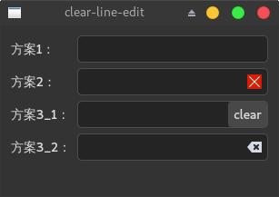
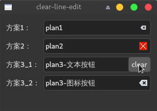

很多时候我们会发现输入的一长串内容不得不全部删除重新输入，这时比起一直按着退格键不放一个清除内容按钮更受欢迎。

今天我将介绍三种为QLineEdit添加清除内容按钮的方法，其中两种方法有较强的功能针对性，另一种方法则是通用的，不仅可以用来实现清除输入内容，还可以扩展出其他功能。

<blockquote id="bookmark">
  <h4>本文索引</h4>
  <ul>
    <li><a href="#plan1">方法1：setClearButtonEnabled显示清除按钮</a></li>
    <li><a href="#plan2">方法2：使用QAction实现清除按钮</a></li>
    <li><a href="#plan3">方法3：自定义QLineEdit为其添加按钮</a></li>
    <li><a href="#最终的显示效果">最终的显示效果</a></li>
  </ul>
</blockquote>

<h2 id="plan1">方法1：setClearButtonEnabled显示清除按钮</h2>
这是Qt5.2之后提供的方法，当使用了`setClearButtonEnabled(true);`之后会在  QLineEdit的右侧显示一个图标为`QStyle::SP_DialogResetButto`的QAction，点击后会清除输入内容：
```c++
// 方案1
auto edit1 = new QLineEdit;
edit1->setClearButtonEnabled(true);
```
效果：


看到右边那个图标，如果是Qt自带的话会是一个类似扫把的图形，如果使用了系统主题那么会有些许差异，点击它，输入内容就会全部清除。

<h2 id="plan2">方法2：使用QAction实现清除按钮</h2>
如前所述，`setClearButtonEnabled`其实只是让实现存在的QAction显示出来而已，所以我们也可以自己实现这一过程。

要实现这一功能，需要Qt5.2之后提供的`addAction`方法。它负责把一个QAction添加到edit的指定位置。

不过要注意的是，这个QAction只能显示出图标，文字内容的显示不出的。
```c++
// 方案2
auto clearAction = new QAction;
clearAction->setIcon(QApplication::style()->standardIcon(QStyle::SP_DialogResetButton));
auto edit2 = new QLineEdit;
// QLineEdit::TrailingPosition表示将action放置在右边
edit2->addAction(clearAction, QLineEdit::TrailingPosition);
QObject::connect(clearAction,
      &QAction::triggered,
      edit2,
      [edit2]{ edit2->setText(""); });
```
因为我们知道lineedit默认使用的清除按钮的图标，也知道如何清除输入，所以可以自己实现这一过程。

这是效果，与方法1时几乎没什么区别：


不过方法二的威力不止于此，基于我们可以使用自己的QAction，那么就可以定制一些操作，比如使用我们自己的图标:
```c++
clearAction->setIcon(QIcon(":/clear.png"));
```


这种方法相比前一种略显复杂，然而却提供了更好的扩展性。

接下来要介绍的最后一种方法更加的灵活，你不仅可以显示自定义图标，还可以显示自定义文字，当然作为代价它比第二种方法要复杂不少。

<h2 id="plan3">方法3：自定义QLineEdit为其添加按钮</h3>
这种方法对Qt的版本没有什么要求，所以它也足够通用。

想要在QLineEdit上添加一个widget一点也不复杂，首先我们要弄清以下几个原理：
- qt的widget和layout是可以堆叠的，之前在[实现半透明遮罩](https://www.cnblogs.com/apocelipes/p/10268108.html)中有提过
- 你可以为QLineEdit设置layout，如你所料layout会堆叠在edit的输入框上
- edit的layout会只使用控件的最小尺寸，这样不会导致将整个输入框遮盖掉
- edit的可输入区域是可以设置的，你可以合理的设置输入区的大小避免文字进入layout之下被遮盖

所以如果我们想为QLineEdit或是其派生类添加一个widget比如QPushButton，那么需要如下几部：
1. 创建你需要的widget以及一个布局管理器
2. 添加拉伸因子和widget至布局管理器，拉伸因子可以不添加，只要设置好布局管理器的排列方向即可
3. 设置布局管理器里组件的排列方向并把布局管理器添加到QLineEdit
4. 获取你添加的widget的宽度，然后在加上合适的边框距离，将QLineEdit的输入区域限制在合理的大小

说起来简单做起来难，我们边看代码边讲解。

我们先看类的定义，`ButtonEdit`是一个带有按钮的QLineEdit：
```c++
#include <QWidget>
#include <QLineEdit>
#include <QPushButton>
#include <QString>
#include <QIcon>

class ButtonEdit: public QLineEdit {
    Q_OBJECT
public:
    explicit ButtonEdit(const QString &btnText, QWidget *parent = nullptr);
    explicit ButtonEdit(const QIcon &icon, QWidget *parent = nullptr);
    ~ButtonEdit() override = default;

private:
    // 设置文本按钮或图标按钮的大小和外观
    void setTextButton();
    void setIconButton();
    // 将按钮添加到edit
    void addButton();

    QPushButton *button;

Q_SIGNALS:
    void buttonClicked(bool);
};

// 按钮和输入内容的边距
constexpr int buttonMargin = 3;
```
我们的类可以从一个string或者icon构建，当edit的按钮被点击那么我们就发出`buttonClicked`信号。

也许你会觉得对于按钮的设置分成两类没什么必要。事实不然，图形应用的开发有很多麻烦事，而其中比较头疼的要数如何让控件保持一个恰到好处的尺寸，而对于图标的处理和文本是不一样的，所以有分开的必要。当然，如果你不介意文字或者图标只显示一半或者突出到编辑框的话也可以跳过这一步。

下面我们来看下类成员的实现，构造函数没什么亮点，无非构造button，然后交由其他成员去处理：
```c++
ButtonEdit::ButtonEdit(const QString &btnText, QWidget *parent)
 : QLineEdit(parent)
{
    button = new QPushButton(btnText);
    setTextButton();
    addButton();
}

ButtonEdit::ButtonEdit(const QIcon &icon, QWidget *parent)
 : QLineEdit(parent)
{
    button = new QPushButton;
    button->setIcon(icon);
    setIconButton();
    addButton();
}
```
接着是`addButton`，在这里我们先把button添加进layout，随后又设置了输入区域的大小避免输入内容被遮住：
```c++
void ButtonEdit::addButton() {
    connect(button,
            &QPushButton::clicked,
            this,
            &ButtonEdit::buttonClicked);
    // 按钮已经是edit的一部分了，不应该再能被单独聚焦，否则可能导致误触
    button->setFocusPolicy(Qt::NoFocus);
    // 设置鼠标，否则点击按钮时仍然会显示输入内容是的鼠标图标
    button->setCursor(Qt::ArrowCursor);

    auto btnLayout = new QHBoxLayout;
    btnLayout->addStretch();
    btnLayout->addWidget(button);
    // 设置组件右对齐，按钮会显示在edit的右侧
    btnLayout->setAlignment(Qt::AlignRight);
    btnLayout->setContentsMargins(0, 0, 0, 0);
    setLayout(btnLayout);
    // 设置输入区域的范围，从edit的最左到按钮的最左(包含了按钮设置的buttonMargin)
    setTextMargins(0, 0, button->width(), 0);
}
```
下面就是如何设置button的大小和样式了，大小我们设置和图标/文本的大小一样大，然后两边加上`buttonMargin`。

对于图标按钮我们还要设置按钮背景平时不可见，毕竟图标周围有个`buttonMargin`宽度的框不太好看：
```c++
// 帮助函数，设置按钮的width，大小策略为fixed，不可放大或缩小
static void setButtonSize(QPushButton *button, int width) {
    auto policy = button->sizePolicy();
    policy.setHorizontalPolicy(QSizePolicy::Fixed);
    button->setSizePolicy(policy);
    // 固定宽度，加上边距
    button->setFixedWidth(width + buttonMargin*2);
}

void ButtonEdit::setTextButton() {
    if (!button) {
        return;
    }

    // 获得当前字体下文本内容的像素宽度
    auto width = QWidget::fontMetrics().width(button->text());
    setButtonSize(button, width);
}

void ButtonEdit::setIconButton() {
    if (!button) {
        return;
    }

    // 获取图标的width简单得多
    auto width = button->iconSize().width();
    setButtonSize(button, width);
    // 设置背景和边框在非点击时不可见
    button->setFlat(true);
}
```
现在工作完成了，不管我们添加什么样的图标还是多长的文本，按钮都可以保证有一个合适的大小，输入内容也不会被按钮遮住。

现在我们看下使用：
```c++
// 方案3
// 使用文本按钮
auto edit3_1 = new ButtonEdit("clear");
QObject::connect(edit3_1,
                &ButtonEdit::buttonClicked,
                edit3_1,
                [edit3_1]{ edit3_1->setText(""); });
// 使用图标按钮
auto edit3_2 = new ButtonEdit(QApplication::style()->standardIcon(QStyle::SP_DialogResetButton));
QObject::connect(edit3_2,
                &ButtonEdit::buttonClicked,
                edit3_2,
                [edit3_2]{ edit3_2->setText(""); });
```
效果如下：


这种方案是最复杂的，但也是最灵活的，我们可以定制button的外观，通过`buttonClicked`信号我们可以定制按钮按下后的行为。所以我在上一节才说这是扩展性最好的方法。

不过方案二和三都有一个显著的缺点，即使输入框中没有内容按钮或QAction也会一直显示，有些时候这不是我们需要的行为。解决办法也很简单，合理利用QLineEdit的信号加上`QWidget::hide`和`QAction::setVisible`就能实现按钮的隐藏，这一功能的实现就当做练习吧。

## 最终的显示效果
现在我们将三种方法合并显示在一起，以便大家看到各个方案带来的显示效果：
```c++
#include <QLineEdit>
#include <QApplication>
#include <QWidget>
#include <QAction>
#include <QObject>
#include <QIcon>
#include <QFormLayout>
#include <QStyle>

#include "ButtonEdit"

int main(int argc, char *argv[]) {
    QApplication app(argc, argv);

    // 方案1
    auto edit1 = new QLineEdit;
    edit1->setClearButtonEnabled(true);

    // 方案2
    auto clearAction = new QAction;
    clearAction->setIcon(QIcon(":/clear.png"));
    auto edit2 = new QLineEdit;
    edit2->addAction(clearAction, QLineEdit::TrailingPosition);
    QObject::connect(clearAction,
            &QAction::triggered,
            edit2,
            [edit2]{ edit2->setText(""); });

    // 方案3
    // 使用文本按钮
    auto edit3_1 = new ButtonEdit("clear");
    QObject::connect(edit3_1,
                     &ButtonEdit::buttonClicked,
                     edit3_1,
                     [edit3_1]{ edit3_1->setText(""); });
    // 使用图标按钮
    auto edit3_2 = new ButtonEdit(QApplication::style()->standardIcon(QStyle::SP_DialogResetButton));
    QObject::connect(edit3_2,
                     &ButtonEdit::buttonClicked,
                     edit3_2,
                     [edit3_2]{ edit3_2->setText(""); });

    auto win = new QWidget;
    auto layout = new QFormLayout;
    layout->addRow("方案1：", edit1);
    layout->addRow("方案2：", edit2);
    layout->addRow("方案3_1：", edit3_1);
    layout->addRow("方案3_2：", edit3_2);
    win->setLayout(layout);

    win->show();

    return app.exec();
}
```

当无输入内容时：



当有输入内容时：



这样三种方法都介绍完了，选用哪种需要自己决定。

当然最后两种方案不仅仅能用来做清除内容按钮，只要加入一点点想象力还有更高级的功能可以用它们来实现。
