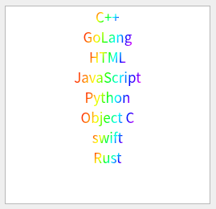

将view中的文本内容用自定义的颜色显示是一种十分常见的需求。今天我们稍微改变些“花样”。

<blockquote id="bookmark">
  <h4>本文索引</h4>
  <ul>
    <li>
      <a href="#需求定义">需求定义</a>
    </li>
    <li>
      <a href="#需求分析">需求分析</a>
    </li>
    <li>
      <a href="#代码实现">代码实现</a>
    </li>
    <li>
      <a href="#思考题">思考题</a>
    </li>
  </ul>
</blockquote>

## 需求定义

我们的需求很简单，现在有一些在view中的text内容需要使用彩色显示，而且不使用单一的一种颜色，而是多种颜色渐变实现的彩虹效果。

文字描述可能比较抽象，所以我们先给出预想的效果图：



现在让我们想办法实现图中的效果。

## 需求分析

好在Qt的Model/View机制对于用户自定义的外观控制提供了极为丰富的支持，因此我们可以轻松地实现许多独特的显示效果。

通常情况下，对于像按特定颜色显示内容的需求只需要在model的data接口中根据调用时的`Qt::ItemDataRole`返回对应的数据即可，比如控制文本颜色时我们只需要对`Qt::ForegroundRole`返回指定的`QBrush`对象就可以。

但是仔细思考之后你就会发现这种办法并不能解决我们的需求。

我们想要实现渐变效果是不能只返回单一的一种颜色的，需要用到`QLinearGradient`，并且需要指定线性填充的坐标及大小。而我们光从`Qt::ItemDataRole`是拿不到文字的显示范围的，因此我们就不能指定渐变填充的范围了。

不过正如本节开头所说，Qt提供了足够多的途径让你控制元素的外观。所以我们很快就把目光投向了delegate，一种经常用来控制model中数据显示的工具。

虽然delegate更多的是充当了显示非文本数据以及控制显示格式的责任，但是只要实现了它的`paint`方法。我们一样可以绘制想要的效果。特别的，`paint`方法还会将待绘制区域的信息从参数中传入，因此我们有充足的条件使用`QLinearGradient`实现文字的渐变效果了。

现在已经清楚实现我们的需求的思路了，接下来我们看看如何用代码实现它。

## 代码实现

我们只需要继承`QStyledItemDelegate`并重写它的`paint`和`sizeHint`方法：

```c++
class ColorDelegate : public QStyledItemDelegate {
public:
    void paint(QPainter *painter, const QStyleOptionViewItem &option,
               const QModelIndex &index) const override;

    QSize sizeHint(const QStyleOptionViewItem &option,
                   const QModelIndex &index) const override;
};
```

其中`paint`用来绘制我们的显示效果，而`sizeHint`则返回item的大小。

对于`sizeHint`没有什么特别的操作，单纯计算文字的长度和高度，然后基于这连个值指定item的大小：

```c++
QSize ColorDelegate::sizeHint(const QStyleOptionViewItem &option,
                              const QModelIndex &index) const {
    auto text = index.data().toString();
    auto width = option.fontMetrics.width(text) + 20;
    return QSize{width, option.fontMetrics.height()};
}
```

下面就要进入重点了：

```c++
void ColorDelegate::paint(QPainter *painter, const QStyleOptionViewItem &option,
                          const QModelIndex &index) const {
    auto text = index.data().toString();
    auto myOpt = option;
    myOpt.displayAlignment = Qt::AlignCenter;
    auto sWidth = myOpt.fontMetrics.width(text);
    auto sHeight = myOpt.fontMetrics.height();
    // 计算文字所在的范围，因为是居中对齐，所以需要计算相应的起始位置
    auto sRect = QRectF(myOpt.rect.x() + (myOpt.rect.width() - sWidth) / 2.0,
                        myOpt.rect.y() + ((myOpt.rect.height() - sHeight) / 2.0), sWidth, sHeight);

    // 将渐变填充的范围设置成文字所在的范围
    QLinearGradient l(sRect.x(), sRect.y(), sRect.x() + sRect.width(),
                      sRect.y() + sRect.height());

    // 设置彩虹色渐变效果，彩虹由赤橙黄绿青蓝紫的颜色组成
    // 因此我们除去起始点为红色，每隔1/6就设置一种颜色
    l.setColorAt(0, Qt::red);
    l.setColorAt(1.0 / 6, QColor(255, 97, 0));
    l.setColorAt(2.0 / 6, QColor(255, 255, 0));
    l.setColorAt(3.0 / 6, Qt::green);
    l.setColorAt(4.0 / 6, Qt::cyan);
    l.setColorAt(5.0 / 6, Qt::blue);
    l.setColorAt(1, QColor(255, 0, 255));

    // 这里并不使用painter，只需要QStyle即可实现效果
    // QPalette::Text为文本显示效果的role
    auto role = QPalette::Text;
    if (option.state & QStyle::State_Selected) {
        // 当前item被选中时绘制高亮的选中框
        role = QPalette::HighlightedText;
        painter->fillRect(option.rect, option.palette.highlight());
    }
    myOpt.palette.setBrush(role, QBrush(l));
    // 注意最后一个参数role，只有设置了它才能让QStyle正确地绘制自定义的文本显示效果
    QApplication::style()->drawItemText(painter, myOpt.rect, myOpt.displayAlignment,
                                        myOpt.palette, true, text, role);
}
```

需要注意的都已经在注释中说明，可以看到`paint`的逻辑实际上并不复杂，只需要正确计算文字的显示范围后调用相应的绘制接口即可。

可能你会有些疑惑，为什么要计算文本的范围？答案是因为如果将整个item作为填充范围的话，那么文本之外的空白部分也会被计算进去，因此文本的显示效果会被view的拉伸的缩小所影响，显然不是我们希望的结果，因此只填充文本所在的范围就很有必要了。

至于delegate的其他功能，我们选择继续使用父类的默认实现，因为我们只是使用delegate控制显示效果的功能，并不需要实现和数据的交互。

下面我们测试下自定义的`ColorDelegate`：

```c++
#include <QApplication>
#include <QStandardItemModel>
#include <QListView>
#include <QVBoxLayout>

#include "ColorDelegate.h"

int main(int argc, char **argv) {
    QApplication app(argc, argv);

    auto win = new QWidget{};
    auto model = new QStandardItemModel{win};
    model->appendRow(new QStandardItem{"C++"});
    model->appendRow(new QStandardItem{"GoLang"});
    model->appendRow(new QStandardItem{"JavaScript"});
    model->appendRow(new QStandardItem{"Object C"});
    model->appendRow(new QStandardItem{"Rust"});
    model->appendRow(new QStandardItem{"这是一串非常非常长的被作为测试用例的样本字符串。"});
    model->appendRow(new QStandardItem{"██████████████████"});
    auto view = new QListView{};
    view->setModel(model);
    view->setItemDelegate(new ColorDelegate{}); // 设置自定义delegate

    auto layout = new QVBoxLayout{};
    layout->addWidget(view);
    win->setLayout(layout);
    win->show();

    app.exec();
}
```

运行之后你就会看到如下图的界面：


虽然文字较短时某些位于边缘的颜色有些难以辨认，但整体的彩虹色渐变效果是很明显的。这样我们就实现了文字的彩虹渐变效果。

## 思考题

最后我们以一个小问题结尾。

虽然我们实现了需求，但是我们的delegate只能处理文字居中的情况，那么其他对齐的情况下呢？

或者如果我们已经在model设置了对齐方式，在delegate中不想改变它，这时候有办法让我们的delegate正常工作吗？

答案是肯定的，只需要将文本范围的计算逻辑做一些修改，因此各位读者不防将其作为一个小练习：）。
