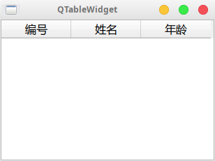
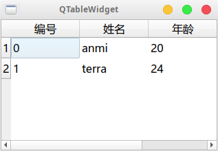

QTableWidget通常用于数据的展示，通过其表格布局可以让用户更清晰的查看数据，同时也让数据的筛选变得更加直观。

不过，初学者们和粗心大意的人总是会发现明明自己数据已经正常添加，可是程序运行之后却看不到QTableWidget上有任何一点数据，一片空白。

这是怎么回事呢？我们先看一个可以复现这个问题的代码：

```golang
func main() {
    widgets.NewQApplication(len(os.Args), os.Args)
 
    table := widgets.NewQTableWidget(nil)
    table.SetColumnCount(3)
    table.SetHorizontalHeaderLabels([]string{"编号", "姓名", "年龄"})
    // 去除边框
    table.SetShowGrid(false)

    // 设置数据
    num1 := widgets.NewQTableWidgetItem2("0", 0)
    name1 := widgets.NewQTableWidgetItem2("anmi", 0)
    age1 := widgets.NewQTableWidgetItem2("20", 0)
    table.SetItem(0, 0, num1)
    table.SetItem(0, 1, name1)
    table.SetItem(0, 2, age1)

    num2 := widgets.NewQTableWidgetItem2("1", 0)
    name2 := widgets.NewQTableWidgetItem2("terra", 0)
    age2 := widgets.NewQTableWidgetItem2("24", 0)
    table.SetItem(1, 0, num2)
    table.SetItem(1, 1, name2)
    table.SetItem(1, 2, age2)

    table.SetWindowTitle("QTableWidget")
    table.Show()

    widgets.QApplication_Exec()
}
```

这是它的效果：



没错，表头正常显示了，然而数据却不见了！

我们再来看一下修复后的代码：

```diff
func main() {
    widgets.NewQApplication(len(os.Args), os.Args)
 
    table := widgets.NewQTableWidget(nil)
    table.SetColumnCount(3)
+   table.SetRowCount(2)
    table.SetHorizontalHeaderLabels([]string{"编号", "姓名", "年龄"})
    // 去除边框
    table.SetShowGrid(false)

    // 设置数据
    num1 := widgets.NewQTableWidgetItem2("0", 0)
    name1 := widgets.NewQTableWidgetItem2("anmi", 0)
    age1 := widgets.NewQTableWidgetItem2("20", 0)
    table.SetItem(0, 0, num1)
    table.SetItem(0, 1, name1)
    table.SetItem(0, 2, age1)

    num2 := widgets.NewQTableWidgetItem2("1", 0)
    name2 := widgets.NewQTableWidgetItem2("terra", 0)
    age2 := widgets.NewQTableWidgetItem2("24", 0)
    table.SetItem(1, 0, num2)
    table.SetItem(1, 1, name2)
    table.SetItem(1, 2, age2)

    table.SetWindowTitle("QTableWidget")
    table.Show()

    widgets.QApplication_Exec()
}
```

修复后的显示效果：



其实问题很简单，看代码的第六行，我们设置了行数。

**QTableWidget需要先设置一共有多少行数据才能正常显示，如果不设置那么默认是０行数据，也就是什么也不显示。**

所以需要QTableWidget的人一定不要忘了使用SetRowCount告诉widget有多少数据需要绘制出来。
