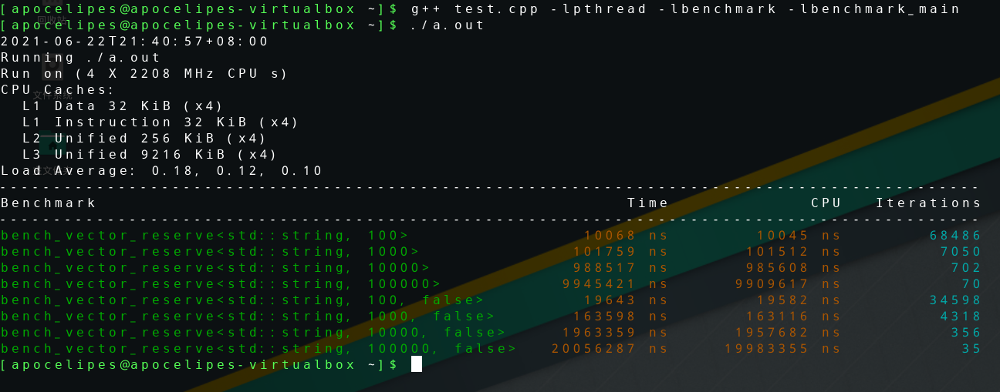
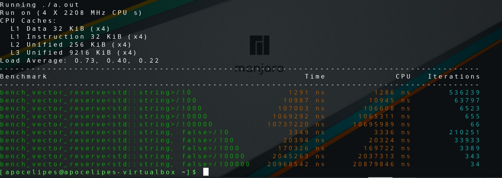
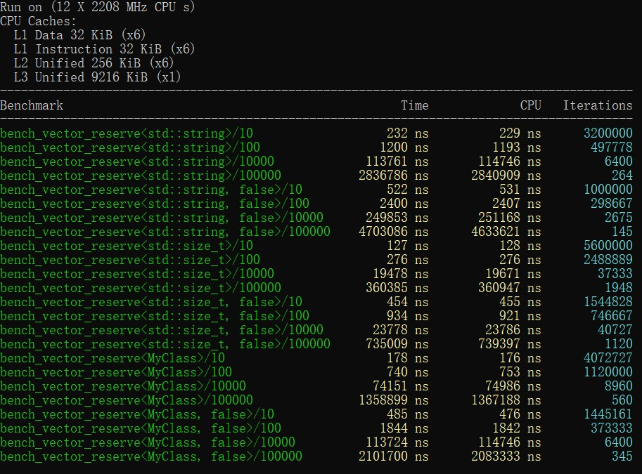
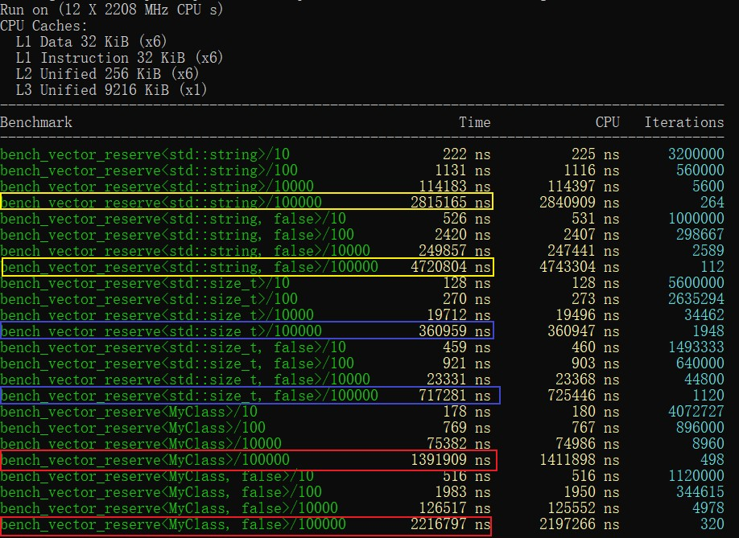

这是c++性能测试工具教程的第四篇文章，从本篇开始我将逐步介绍一些性能测试的高级技巧。

前三篇教程可以看这里：

- [c++性能测试工具：google benchmark入门（一）](https://www.cnblogs.com/apocelipes/p/10348925.html)
- [c++性能测试工具：google benchmark入门（二）](https://www.cnblogs.com/apocelipes/p/11067594.html)
- [c++性能测试工具：计算算法的时间复杂度](https://www.cnblogs.com/apocelipes/p/11108483.html)

本文将会介绍如何使用模板以及参数生成器来批量生成测试用例，简化繁琐的性能测试代码。

## 测试对象

这次测试的对象是标准库的vector，我们将会在vs2019 16.10和Linux + GCC 11.1上进行测试。为了代码写着方便，我还会启用c++17支持。

这次的疑问来自于《A Tour of C++》这本书，最近在重新翻阅本书的时候发现书里第九章给出了一个很有意思的建议：尽量少用reserve方法。

我们都知道reserve会提前分配足够大的内存来容纳元素，这样在push_back时可以减少内存分配和元素移动的次数，从而提高性能。所以习惯上如果我们知道vector中存储元素的大致数量，就会使用reserve提前进行内存分配，这是典型的“空间换时间”。

而书中给出的理由仅仅是说vector的内存分配器性能已经很高，预分配往往是多此一举，收效甚微。事实到底如何呢，性能问题光靠脑补是不能定位的，所以我们用实验结果说话。

## 使用模板函数生成测试

测试用例的设计很简单，我们定义普通vector和reserve过的vector，然后分别对其添加一定数量的元素（逐步从少到多）测试性能。

同时vector本身是泛型容器，所以为了测试的全面性我们需要测试两至三种类型参数。

如果针对每一种情况写测试函数，显然违反了DRY原则，因为除了vector的类型参数不同，其他代码几乎是完全一样的。

对于上面的需求，就需要模板测试函数登场了：

```c++
template <typename T, std::size_t length, bool is_reserve = true>
void bench_vector_reserve(benchmark::State& state)
{
	for (auto _ : state) {
		std::vector<T> container;
		if constexpr (is_reserve) {
			container.reserve(length);
		}
		for (std::size_t i = 0; i < length; ++i) {
			container.push_back(T{});
		}
	}
}
```

非常的简单，我们通过`length`控制插入的元素个数；`is_reserve`则负责控制是否预分配内存，通过`if constexpr`可以生成reserve和不进行任何操作的两种代码（如果不熟悉c++17的if constexpr，推荐花两分钟看看[这里](./模板元编程：遍历tuple.md#使用编译期条件分支)）。

然后我们像往常一样定义一个测试用例：

```c++
BENCHMARK(bench_vector_reserve<std::string,100>);
```

可是等我们编译的时候却报错了！

```bash
$ g++ test.cpp -lpthread -lbenchmark -lbenchmark_main

test.cpp:19:48: 错误：宏“BENCHMARK”传递了 2 个参数，但只需要 1 个
   19 | BENCHMARK(bench_vector_reserve<std::string,100>);
      |                                                ^
In file included from a.cpp:1:
/usr/local/include/benchmark/benchmark.h:1146: 附注：macro "BENCHMARK" defined here
 1146 | #define BENCHMARK(n)                                     \
      | 
test.cpp:19:1: 错误：‘BENCHMARK’不是一个类型名
   19 | BENCHMARK(bench_vector_reserve<std::string,100>);
```

原因是这样的，在编译器处理宏的时候实际上不会考虑c++语法，所以分割模板参数的逗号被识别成了分割宏参数的逗号，因此在宏处理器的眼里我们像是传了两个参数。这也说明了`BENCHMARK`是处理不了模板的。

不过别担心，Google早就想到这种情况了，所以提供了`BENCHMARK_TEMPLATE`宏，我们只需要把模板名字和需要的类型参数依次传给宏即可：

```c++
BENCHMARK_TEMPLATE(bench_vector_reserve, std::string, 100);
BENCHMARK_TEMPLATE(bench_vector_reserve, std::string, 1000);
BENCHMARK_TEMPLATE(bench_vector_reserve, std::string, 10000);
BENCHMARK_TEMPLATE(bench_vector_reserve, std::string, 100000);
BENCHMARK_TEMPLATE(bench_vector_reserve, std::string, 100, false);
BENCHMARK_TEMPLATE(bench_vector_reserve, std::string, 1000, false);
BENCHMARK_TEMPLATE(bench_vector_reserve, std::string, 10000, false);
BENCHMARK_TEMPLATE(bench_vector_reserve, std::string, 100000, false);
```

现在就可以正常编译运行了：



可以看到reserve过的容器性能几乎比默认的快了一倍。

不过在揭晓为什么书上不推荐reserve的谜底之前，我们的代码还有可以简化的地方。

## 定制测试参数

首当其冲的问题其实还是违反了DRY原则——除了数字，其他内容都是重复的。

看到这种代码直觉就告诉我该做些改进了。

首先我们来复习一下`Ranges`。在《[c++性能测试工具：google benchmark入门（二）](https://www.cnblogs.com/apocelipes/p/11067594.html)》中我们已经学习过它了，`Ranges`接受start和end两个int64_t类型的参数，默认从start起每次累乘8，一直达到end。

通过`RangeMultiplier`我们可以改变乘数，比如从8改成10。

在这里我们的length参数其实是不必要的，所以代码可以这样改：

```c++
template <typename T, bool is_reserve = true>
void bench_vector_reserve(benchmark::State& state)
{
	for (auto _ : state) {
		std::vector<T> container;
		if constexpr (is_reserve) {
            // 通过range方法获取传入的参数
			container.reserve(state.range(0));
		}
		for (std::size_t i = 0; i < state.range(0); ++i) {
			container.push_back(T{});
		}
	}
}

BENCHMARK_TEMPLATE(bench_vector_reserve, std::string)->RangeMultiplier(10)->Range(10, 10000 * 10);
BENCHMARK_TEMPLATE(bench_vector_reserve, std::string, false)->RangeMultiplier(10)->Range(10, 10000 * 10);
```

现在我们测试的元素数量是`[10, 100, 1000, 10^4, 10^5]`。

除此之外还有另一种叫“密集参数”的Ranges。google benchmark提供了`DenseRange`方法。

这个方法的原型如下：

```c++
DenseRange(int64_t start, int64_t end, int64_t step);
```

`Ranges`是累乘，而`DenseRange`是累加，因为累乘会导致几何级数的增长，在数轴上的分布越来越稀疏，累加则看上去像是均匀分布的，因此累加的参数生成器被叫做密集参数生成器。

如果我们把测试用例这么改：

```c++
BENCHMARK_TEMPLATE(bench_vector_reserve, std::string)->DenseRange(1000, 100 * 100, 1000);
```

现在我们的length就是这样一个序列：`[1000，2000，3000， ...，9000，10000]`。

关于自定义参数最后一个知识点是`ArgsProduct`。看名字就知道这是一个参数工厂。

```c++
ArgsProduct(const std::vector< std::vector<int64_t> >& arglists);
```

`std::vector<int64_t>`实际上就是一组参数，arglists就是多组参数的合集，他们之间会被求笛卡尔积，举个例子：

```c++
BENCHMARK(BM_test)->ArgsProduct({ {"a", "b", "c", "d"}, {1, 2, 3, 4} });

// 等价于下面的
BENCHMARK(BM_test)->Args({"a", 1})
                  ->Args({"a", 2})
                  ->Args({"a", 3})
                  ->Args({"a", 4})
                  ->Args({"b", 1})
                  ->Args({"b", 2})
                  ->Args({"b", 3})
                  ...
                  ->Args({"d", 3})
                  ->Args({"d", 4})
```

我们可以看到参数工厂其实得自己手写所有参数，那如果我想配合工厂使用Ranges呢？

没问题，benchmark的开发者们早就想到了，所以提供了下面这些帮助函数：

```c++
benchmark::CreateRange(8, 128, /*multi=*/2)   // 生成：[8, 16, 32, 64, 128]
benchmark::CreateDenseRange(1, 6, /*step=*/1) // 生成：[1, 2, 3, 4, 5, 6]
```

如果换成我们的例子，就可以这样写：

```c++
BENCHMARK_TEMPLATE(bench_vector_reserve, std::string)->ArgsProduct({
    benchmark::CreateRange(10, 10000*10, 10)
});
BENCHMARK_TEMPLATE(bench_vector_reserve, std::string, false)->ArgsProduct({
    benchmark::CreateRange(10, 10000*10, 10)
});
```

借助仅仅两行代码我们就能生成数量可观的测试用例：



当然，这只是一个类型参数，实际上我们还有另外两个类型需要测试。另外这是1.5.5新增的功能，如果你想尝鲜得先升级google benchmark。

## 进一步简化

通常做到上面那一步就足够了，然而在这里我们还有优化空间，因为如果我们把其他两个测试用的类型加上，代码是这样的，MyClass的定义后面会给出：

```c++
BENCHMARK_TEMPLATE(bench_vector_reserve, std::string)->ArgsProduct({
    benchmark::CreateRange(10, 10000*10, 10)
});
BENCHMARK_TEMPLATE(bench_vector_reserve, std::string, false)->ArgsProduct({
    benchmark::CreateRange(10, 10000*10, 10)
});
BENCHMARK_TEMPLATE(bench_vector_reserve, std::size_t)->ArgsProduct({
    benchmark::CreateRange(10, 10000*10, 10)
});
BENCHMARK_TEMPLATE(bench_vector_reserve, std::size_t, false)->ArgsProduct({
    benchmark::CreateRange(10, 10000*10, 10)
});
BENCHMARK_TEMPLATE(bench_vector_reserve, MyClass)->ArgsProduct({
    benchmark::CreateRange(10, 10000*10, 10)
});
BENCHMARK_TEMPLATE(bench_vector_reserve, MyClass, false)->ArgsProduct({
    benchmark::CreateRange(10, 10000*10, 10)
});
```

你看见了什么？没错，重复重复重复！我们又违背了DRY原则。

重复说不上什么十恶不赦，但能避免还是要避免的，所以我准备用宏来简化这些代码：

```c++
#define generate_test(type) \
	BENCHMARK_TEMPLATE(bench_vector_reserve, type)->ArgsProduct({benchmark::CreateRange(10, 100000, 10)}); \
	BENCHMARK_TEMPLATE(bench_vector_reserve, type, false)->ArgsProduct({benchmark::CreateRange(10, 100000, 10)});

generate_test(std::string);
generate_test(std::size_t);
generate_test(MyClass);
```

这下舒服多了。

接着来看我们的MyClass，我们的MyClass包含几个虚函数，禁止移动赋值，同时被刻意设计成了非平凡复制，这样的类型可以说是绕过了标准库容器设计的大部分优化措施，算是个妥妥的反面教材，希望你的项目里尽量不要出现这种东西：

```c++
class MyClass {
public:
	long i = 2L;
    MyClass() { i = 2L; }
	virtual ~MyClass() {}
	virtual long get() { return i; }
	MyClass& operator=(MyClass&&) = delete;
	MyClass(const MyClass& obj) {
		i = obj.i;
	}
	MyClass& operator=(const MyClass& obj) {
		i = obj.i;
	}
};
```

这个类其实就是针对内存分配器实现的，vector在重新进行内存分配后很可能靠移动语义或者memmove来移动数据，这两者将导致重新分配内存导致的性能损失变小，不利于我们观察vector的行为，所以我定制了这个类。



这是Windows上的结果，Linux上也差不多，到目前为止我们看到reserve过的vector有着惊人的性能，那书里说的到底是怎么回事呢？

## 揭晓答案

实际上上面测试的都是我们明确知道vector一定会被插入N个元素不多不少的情况。

然而这种情况其实在开发中是不多见的，更多的时候我们只能得到vector里元素数量的平均数、众数，甚至是一个没什么可靠依据的经验值。

所以试想一下这种情况，reserve给的参数是1000，而我的vector总是会插入1001~1005个参数，显然1000是不够的，除了reserve外还会进行一次内存分配，而且这次分配后很可能还需要把原先的元素都转移过去（realloc不是总能找到合适的位置扩展已有内存，而且像MyClass那样的类在c++17中是不能bitwise复制的），那么这样的开销究竟如何呢？我们还是拿测试说话。

篇幅有限，所以我只能简单模拟一下上述情况：

```c++
template <typename T, bool is_reserve = true>
void bench_vector_reserve(benchmark::State& state)
{
	for (auto _ : state) {
		std::vector<T> container;
		if constexpr (is_reserve) {
			container.reserve(state.range(0));
		}
        // 每次多插入两个元素，这样多半会导致一次内存分配（当然不保证一定会）
		for (std::size_t i = 0; i < state.range(0)+2; ++i) {
			container.push_back(T{});
		}
	}
}
```

编译均使用Release模式和默认的优化级别，这是Linux上的测试结果：


和我们预期的一样，多出来的一次内存分配使reserve带来的性能优势荡然无存。

有意思的是Windows上的结果：



奇怪的事情发生了，虽说多出的一次分配缩小了性能差距，但reserve任然带来了明显的优势。

这里我就不卖关子了，我们直接看vector的源码。

首先是GCC11.1的，代码在`/usr/include/c++/11.1.0/bits`目录下，分散在`vector.tcc`和`stl_vector.h`中，其中push_back在容器内存不够的时候会用`_M_realloc_insert`重新分配足够的内存，这个函数在`vector.tcc`的432行有定义，使用`_M_check_len`计算重新分配的内存大小。

`_M_check_len`是关键，定义在`stl_vector.h`的1756行：

```c++
// Called by _M_fill_insert, _M_insert_aux etc.
size_type
_M_check_len(size_type __n, const char* __s) const
{
	if (max_size() - size() < __n)
	  __throw_length_error(__N(__s));

	const size_type __len = size() + (std::max)(size(), __n);
	return (__len < size() || __len > max_size()) ? max_size() : __len;
}
```

__n在push_back的时候是1，所以不难看出GCC的vector的扩容策略是每次扩容一倍。

vs2019的stl实现开源在了[github](https://github.com/microsoft/STL/)。关键代码在[这里](https://github.com/microsoft/STL/blob/main/stl/inc/vector#L1692)，push_back在内存不够的时候会调用[_Emplace_reallocate](https://github.com/microsoft/STL/blob/main/stl/inc/vector#L765)，里面会调用`_Calculate_growth`计算重新分配的内存大小：

```c++
_CONSTEXPR20_CONTAINER size_type _Calculate_growth(const size_type _Newsize) const {
    // given _Oldcapacity and _Newsize, calculate geometric growth
    const size_type _Oldcapacity = capacity();
    const auto _Max              = max_size();

    if (_Oldcapacity > _Max - _Oldcapacity / 2) {
        return _Max; // geometric growth would overflow
    }

    const size_type _Geometric = _Oldcapacity + _Oldcapacity / 2; // 关键代码

    if (_Geometric < _Newsize) {
        return _Newsize; // geometric growth would be insufficient
    }

    return _Geometric; // geometric growth is sufficient
}
```

_Newsize相当于前面GCC的__n，在push_back的时候是1，所以不难看出vs2019的vector增长策略是每次扩容0.5倍。

除此之外两者的剩余部分大同小异，都是先分配新内存，然后在新内存里构建要插入的元素，再把其他元素移动到新内存里，就连移动元素的方式也差不多，都是先尝试memmove，接着试试移动语义，最后让复制操作兜底。

那么两者肉眼可见的区别就只有扩容策略这一条了。所以这会带来什么影响呢？看个例子：

```c++
#include <iostream>
#include <vector>

void test1(std::size_t len)
{
	std::vector<int> v1, v2;
	v2.reserve(len);
	for (std::size_t i = 0; i < len; ++i) {
		v1.push_back(1);
		v2.push_back(1);
	}
	std::cout << "v1: " << v1.capacity() << '\n';
	std::cout << "v2: " << v2.capacity() << '\n';
}

void test2(std::size_t len)
{
	std::vector<int> v1, v2;
	v2.reserve(len);
	for (std::size_t i = 0; i < len + 1; ++i) {
		v1.push_back(1);
		v2.push_back(1);
	}
	std::cout << "v1: " << v1.capacity() << '\n';
	std::cout << "v2: " << v2.capacity() << '\n';
}

int main()
{
	test1(100000);
	test2(100000);
}

/*
vs2019的运行结果:
v1: 138255
v2: 100000
v1: 138255
v2: 150000

GCC11.1.0的结果:
v1: 131072
v2: 100000
v1: 131072
v2: 200000
*/
```

如果是一个有10万个元素的vector想要扩容，GCC就会比vs多分配50000个元素需要的内存，分配如此多的内存需要花费更多的时间，即使reserve带来了性能优势在这一步也都挥霍的差不多了。

激进的扩容策略让GCC出现了明显的性能波动，不过这只是出现上面那样测试结果的原因之一，两个标准库的allocator实现上的区别也可能是其中一个原因。不过msvc的分配器实现并不公开，所以最终是什么导致了上述的结果并不能轻易断言。 

## 总结

我们学习了如何使用模板和参数生成器创建大量测试用例，以提高编写测试的效率。

我们还顺便了解了vector.reserve对性能的影响，总结规律有几条：

1. 如果明确知道vector要存放元素的具体数量，推荐reserve，性能提升是有目共睹的；
2. 否则你不应该使用reserve，一来有提前优化之嫌，二是在使用libstdc++的程序上会产生较大的性能波动；
3. 接上一条，reserve使用不当还会造成内存的浪费。

看来《A Tour of C++》的作者只说对了一半，这也证明了性能问题不能靠臆断，一定要靠测试来定位、解决。
