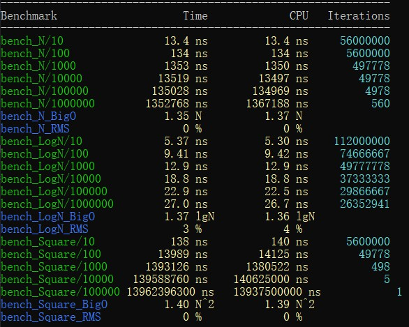

有时候除了测量算法的具体性能指数，我们也会希望测试出算法的时间复杂度，以便我们对待测试的算法的性能有一个更加直观的了解。

## 测量时间复杂度

google benchmark已经为我们提供了类似的功能，而且使用相当简单。

具体的解释在后面，我们先来看几个例子，我们人为制造几个时间复杂度分别为`O(n)`, `O(logn)`, `O(n^n)`的测试用例：

```c++
// 这里都是为了演示而写成的代码，没有什么实际意义
static void bench_N(benchmark::State& state)
{
    int n = 0;
    for ([[maybe_unused]] auto _ : state) {
        for (int i = 0; i < state.range(0); ++i) {
            benchmark::DoNotOptimize(n += 2); // 这个函数防止编译器将表达式优化，会略微降低一些性能
        }
    }
    state.SetComplexityN(state.range(0));
}
BENCHMARK(bench_N)->RangeMultiplier(10)->Range(10, 1000000)->Complexity();

static void bench_LogN(benchmark::State& state)
{
    int n = 0;
    for ([[maybe_unused]] auto _ : state) {
        for (int i = 1; i < state.range(0); i *= 2) {
            benchmark::DoNotOptimize(n += 2);
        }
    }
    state.SetComplexityN(state.range(0));
}
BENCHMARK(bench_LogN)->RangeMultiplier(10)->Range(10, 1000000)->Complexity();

static void bench_Square(benchmark::State& state)
{
    int n = 0;
    auto len = state.range(0);
    for ([[maybe_unused]] auto _ : state) {
        for (int64_t i = 1; i < len*len; ++i) {
            benchmark::DoNotOptimize(n += 2);
        }
    }
    state.SetComplexityN(len);
}
BENCHMARK(bench_Square)->RangeMultiplier(10)->Range(10, 100000)->Complexity();
```

如何传递参数和生成批量测试我们在上一篇已经介绍过了，这里不再重复。

需要关注的是新出现的`state.SetComplexityN`和`Complexity`。

首先是`state.SetComplexityN`，参数是一个64位整数，用来表示算法总体需要处理的数据总量。benchmark会根据这个数值，再加上运行耗时以及`state`的迭代次数计算出一个用于后面预估平均时间复杂度的值。

`Complexity`会根据同一组的多个测试用例计算出一个较接近的平均时间复杂度和一个均方根值，需要和`state.SetComplexityN`配合使用。

`Complexity`还有一个参数，可以接受一个函数或是`benchmark::BigO`枚举，它的作用是提示benchmark该测试用例的时间复杂度，默认值为`benchmark::oAuto`，测试中会自动帮我们计算出时间复杂度。对于较为复杂的算法，而我们又有预期的时间按复杂度，这时我们就可以将其传给这个方法，比如对于第二个测试用例，我们还可以这样写：

```c++
static void bench_LogN(benchmark::State& state)
{
    // 中间部分与前面一样，略过
}
BENCHMARK(bench_LogN)->RangeMultiplier(10)->Range(10, 1000000)->Complexity(benchmark::oLogN);
```

在选择正确的提示后对测试结果几乎没有影响，除了偏差值可以降得更低，使结果更准确。

`Complexity`在计算时间复杂度时会保留复杂度的系数，因此，如果我们发现给出的提示的时间复杂度前的系数过大的话，就意味着我们的预估发生了较大的偏差，同时它还会计算出RMS值，同样反应了时间复杂度的偏差情况。

运行我们的测试：



可以看到，自动的时间复杂度计算基本是准确的，可以在我们对算法进行测试时提供一个有效的参考。
