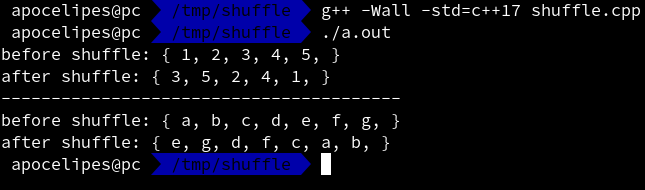

在各种程序语言中都提供了将容器元素随机排序的`shuffle`方法，c++也不例外。

不过c++将`shuffle`放在了`<algorithm>`中而不是像其他语言一样在`random`里，同时c++17删除了原先的`random_shuffle`新的程序应该使用c++11添加进去的`std::shuffle`。其中一个好处是新的函数在可以自定义随机数生成方法的同时保证了更好的安全性。

先来看下新函数的原型：

```c++
template< class RandomIt, class URBG >
void shuffle( RandomIt first, RandomIt last, URBG&& g );
```

其中`first`和`last`指定需要随机排序的范围，`g`是一个“UniformRandomBitGenerator”，就是一个可以产生规定范围内的随机数的可调用对象。

所以`g`可以是`std::random_device`或者像`std::default_random_engine`这样的随机数引擎，也可以是`std::mt19937`这样的标准库提供的随机数生成器的对象，它们都在`<random>`中。

`shuffle`调用后目标容器内的元素排列顺序会被随机打乱，我们看个例子。

首先是两个帮助函数，避免做一些重复劳动：

```c++
// 帮助函数，打印vector的内容
template <typename T>
std::ostream &operator<<(std::ostream &os, const std::vector<T> &v)
{
    os << "{ ";
    for (const auto &i: v) {
        os << i << ", ";
    }
    os << "}";

    return os;
}

// 帮助函数，生成一个符合UniformRandomBitGenerator要求的随机数生成器；
// std::random_device虽然符合要求但是只适合于生成seed及安全要求较高的场合，因为速度可能很慢。
// 所以我们选择std::mt19937算法，你可以自己选择其他合适的算法
auto get_URBG()
{
    std::random_device rd;
    // 使用random_device生成seed
    std::mt19937 g(rd());

    return g;
}
```

然后我们分别打乱一个`std::vector<int>`和`std::vector<std::string>`容器内元素的排列顺序：

```c++
// 随机排序容器内元素，打印随机排序前和随机排序后的容器内容
template <typename T>
void shuffle_container(std::vector<T> &container)
{
    std::cout << "before shuffle: " << container << std::endl;
    std::shuffle(container.begin(), container.end(), get_URBG());
    std::cout << "after shuffle: " << container << std::endl;
}

int main()
{
    std::vector<int> ivec{1,2,3,4,5};
    shuffle_container(ivec);

    // 分割线
    std::cout << std::string(40, '-') << std::endl;

    std::vector<std::string> svec{"a", "b", "c", "d", "e", "f", "g"};
    shuffle_container(svec);
}
```

我们编译写好的程序，然后运行：



可以看到元素都已经被随机排序了。
