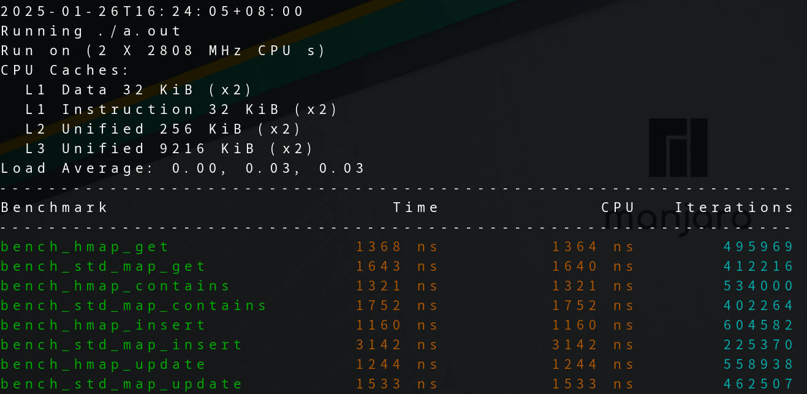
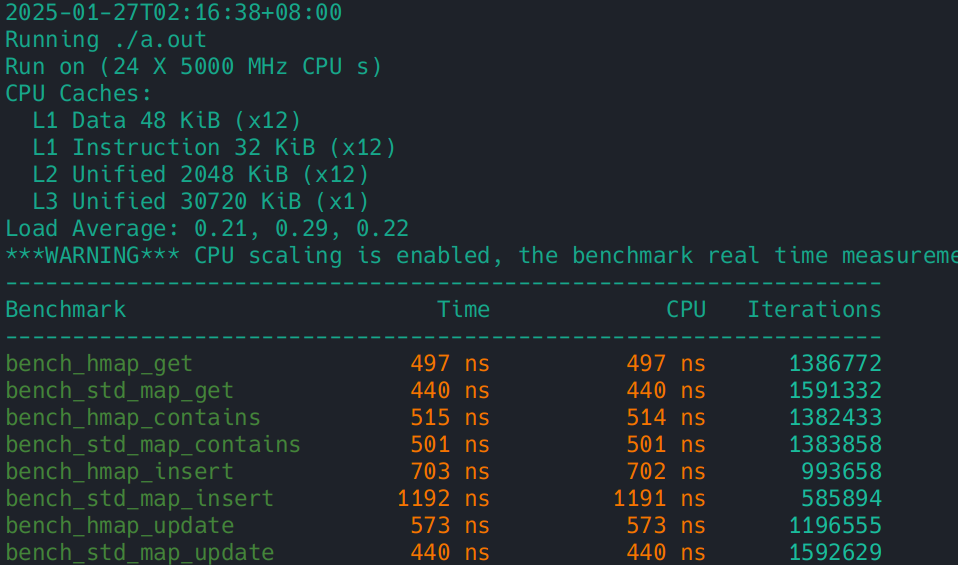

今天来看看Linux和一些常见的BSD系统上自带的hashmap。

是的，系统自带的。因为POSIX标准定义了一些常见的数据结构（比如哈希表、二叉搜索树、队列）和算法（比如二分查找和快速排序），这些接口数量不少而且实现起来没什么难度，因此各个想要兼容POSIX标准的操作系统/C函数库都乐意于实现这些接口，毕竟兼容性越高越有人用嘛。顺带一提早期的Unix里就有这些函数的原型了，虽然市面上有不少更好的替代品，但使用了这些接口的老程序应该也不会太少，因此兼容它们一定程度上也能提升自己的Unix兼容性，对于市场占有率来说是好事。

不过别高兴的太早，因为这些接口都是c语言的，所以泛型什么的就别想了，全是void指针和回调函数；而且这些接口为了兼容性设计得也都比较怪异，用起来十分甚至九分得不方便，对于大多数用户的大多数场景来说我想都是很难利用这些内置的数据结构的。

不过这不影响我们简单学习下这些接口并做些性能对比，所以接下来我们就来简单说说自带的hashmap——`hsearch(3)`吧。

## hsearch简介

前面提到过，hsearch和它的朋友是在Unix时代就已经出现然后在POSIX标准中被明确定义的一系列数据结构和算法之一。

hsearch实现的是hashmap，是日常开发中很常用的一种数据结构。

这个系统自带的哈希表的api分为三个函数：

1. `hcreate`，负责创建哈希表
2. `hsearch`，负责插入键值对、查找键值对
3. `hdestory`，负责释放`hcreate`创建的哈希表，不过里面的键值对的资源得自己管理`hdestory`不会释放键和值

其中`hcreate`创建的全局的哈希表，也就是一个进程里只有一个，类似全局变量，这其实已经带来第一个痛点了：全局的对象非常不安全，而且做不到多实例在作为数据结构的实用性上要大打折扣。所以glibc和muslc出于对安全性的考虑，都实现了这些函数的“_r”版本：`hcreate_r`、`hsearch_r`和`hdestory_r`。它们在功能上和没有r后缀的函数是一样的除了一点——它们不使用全局的哈希表对象而是需要显式传入要操作的对象实例。

我们后面的代码都会基于这些带有r后缀的函数，毕竟操作全局变量的东西没啥实用性也不好做自定义包装。但缺点是这些函数不是POSIX标准的一部分属于扩展，因此在一些BSD系统上有可能无法使用，但Linux用户是不需要担心的。

## 包装hsearch

如果你看过文档的话就会发现hsearch很狂野，哈希表的释放需要手动执行而且里面存着的key和value是不会被释放的，也就是说存里面的数据的生命周期得自己管理，然而hsearch并不支持遍历功能，也就是你在想释放hashmap的时候根本不知道里面存了什么存了多少——使用者得自己创建一些额外的空间来存储map里有哪些数据这样的信息。其次hsearch这个函数名字本身叫search，但实际上它既能插入数据又能查找数据——典型的一个函数干两件完全不相干的事情，而且查找和插入的参数和返回值含义都不相同，简直是误用的温床；这还不是最糟糕的，因为更关键的更新操作没有直接支持，你得用些不太安全的办法取巧实现。接着，hcreate创建的哈希表是不能扩容的，你得在创建时就制定最大长度（muslc的实现可以做扩容，但glibc的不行，标准里也明确说明没有扩容）。最后也是最关键的，hsearch不支持删除操作，你的数据存进去之后就没有办法删掉了，这点很要命，直接在很多场景上给hsearch判了死刑。

在功能缺失和接口难用的背景下，想直接使用这些接口是有很大挑战的，至少我是没兴趣直接用。所以我们需要做一些包装：

1. 包装遵循c++的RAII，自动调用hdestory
2. 包装同样不会去管理键和值的生命周期
3. 包装出来的对象支持移动语义但禁止复制，毕竟除非额外存一份键值对，否则我们不知道map里有啥，在库没有提供相应接口的前提下无法实现复制功能
4. 删除操作也不支持
5. 支持更新操作
6. 包装出来的接口尽量和c++标准库提供的对齐，包括使用方法和函数签名
7. 不支持泛型，只能存字符串，但接口里不会出现`void*`

为啥我不额外存一份键值对呢，因为那样做我还不如直接用标准库或者其他第三方库呢，它们只用存一份键值对接口也更友好。这个包装充其量只是为了让hsearch没那么难用而已。

### 对于hsearch_data的包装

`hsearch_data`是前面说的r后缀函数们要操作的哈希表对象，为了不再依赖全局变量，glibc定义了这一类型给使用者。虽说glibc定义成了struct，但我建议大家不要关注里面都有啥成员，因为用不上，而且不保证以后不会变，大家应该把`hsearch_data`当成一个所有数据成员都是私有访问属性的类就行了。

对于它的包装主要集中在生命周期的管理上，因为它是hashmap的实体：

```c++
class HSearchData
{
    hsearch_data data_{};

    friend void swap(HSearchData &lhs, HSearchData &rhs) noexcept
    {
        auto tmp = std::move(rhs.data_);
        rhs.data_ = std::move(lhs.data_);
        lhs.data_ = std::move(tmp);
    }

public:
    HSearchData(const size_t nelems) noexcept
    {
        hcreate_r(nelems == 0 ? 1 : nelems, &data_);
    }
    ~HSearchData() noexcept
    {
        hdestroy_r(&data_);
    }

    HSearchData(const HSearchData&) = delete;
    HSearchData& operator=(const HSearchData&) = delete;

    HSearchData(HSearchData &&other) noexcept
    : data_{std::move(other.data_)}
    {
        memset(&other.data_, 0, sizeof(hsearch_data));
    }
    HSearchData& operator=(HSearchData &&other) noexcept
    {
        HSearchData tmp{std::forward<HSearchData>(other)};
        swap(*this, tmp);
        return *this;
    }

    hsearch_data *get() const noexcept
    {
        return const_cast<hsearch_data*>(&data_);
    }
};
```

创建和销毁由构造函数和析构函数完成。`hcreate_r`很简单，第一个参数是map的最大大小，第二个是我们需要初始化的实例对象的指针。销毁就很简单了，把需要销毁的对象的指针穿进去就行。两个函数都只在参数是空指针时才报错，因此错误处理没什么必要也没法做。创建`hsearch_data`时size最低也得有1这其实只是我的习惯，传0进去也不会报错因为标准允许库函数自动调整大小到一个合适的值。但这留下一个坑，因为允许函数自动调整到合适的大小，所以你传进去的数字可能并不是哈希表能存的数据量的上限，比如你想控制只能存进6个数据，但实际上发现插入到第八个也没问题。现实也确实如此，glibc会把数量调整到一个离参数最近的素数，而muslc会调整成2的幂，上述意外几乎总是会发生的。包装当然对着没有直接的办法，但我们可以做额外的限制来保证上限有效。

复制操作都被显式delete掉了。前面也说过除非额外再存一份键值对，否则拷贝是无从实现的。

移动赋值使用了常见的[swap and move](./做个地道的c++程序猿：copy%20and%20swap惯用法.md)惯用法，我们必须保证对象被移动后仍然可以被安全地析构，因此需要将旧值交换过去或者用零值填充，因为`hsearch_data`是个普通的c结构体所以即使不知道其内部结构也可以放心用memset。前面定义的友元函数swap也是为了实现惯用法而编写的。

最后提供一个类似`unique_ptr`的get函数，毕竟hsearch接口只能操作`hsearch_data*`类型的数据它不认识我们包装出来的类，所以需要提供一种得到原始数据的办法。一种更简单的办法是提供类型转换运算符：

```c++
opertor hearch_data*() const noexcept
{
    return const_cast<hsearch_data*>(&data_);
}
```

这样用不着每次调get方法了，但我还是习惯使用get，你可以酌情自己选一种习惯了的方式。

之后只需要向用`std::string`那样正常用这个对象就行了，无需再额外关心生命周期问题。

### 包装类整体概览

在继续讲解插入的包装前，我们先来看下map整体的结构：

```c++
class HMap
{
public:
    HMap(size_t nelems) noexcept;

    HMap(const HMap&) = delete;
    HMap &operator=(const HMap&) = delete;

    HMap(HMap &&other) noexcept;
    HMap &operator=(HMap &&other) noexcept;

    bool insert(const char *key, const char *value) noexcept;

    bool contains(const char *key) const noexcept;

    // 返回最多能存多少个元素
    size_t capacity() const noexcept
    {
        return limit_;
    }
    // 返回当前map里存了多少个元素
    size_t size() const noexcept
    {
        return size_;
    }

    const char *get(const char *key) const noexcept;

    bool update(const char *key, const char *new_data) noexcept;

private:
    //std::unique_ptr<hsearch_data, decltype(&destory_heap_allocated_hsearch_data)> map_;
    HSearchData map_;
    size_t size_, limit_;

    // 用于实现copy and swap惯用法的帮助函数
    friend void swap(HMap &rhs, HMap &lhs) noexcept
    {
        using std::swap;
        swap(rhs.map_, lhs.map_);
        swap(rhs.size_, lhs.size_);
        swap(rhs.limit_, lhs.limit_);
    }
};
```

包装后的类叫`HMap`，它没有默认构造函数也不支持拷贝但支持移动语义，只提供一个构造函数显式设置存储元素数量的最大上限。同时我们也用私有数据成员记录了map可以容纳的最大元素数量和当前包含的元素数量。

操作上支持插入、更新、查找是否存在以及根据key获取value。这就是整体结构了，下面我们深入探讨下上面没给出具体实现的那些函数。

### 插入元素

插入元素需要用到`hsearch`函数，具体形式是`hsearch_r(struct ENTRY*, ENTER, struct ENTRY**, hsearch_data*)`。

其中`struct ENTRY`是要存入map的键值对，这也是hsearch接口规定的，具体结构如下：

```c++
typedef struct entry
{
    char *key;
    void *data;
}
ENTRY;
```

key必须是c风格的字符串，因此我们的包装函数也只接受字符串作为键；值因为是`void*`，理论上除了函数指针之外啥都能存，但为了免得自己处理生命周期问题，我们的包装类也只支持存储字符串常量。

现在函数的四个参数就好解释了，第一个参数就是我们要存入的键值对，没错需要我们自己把键值对构建出来，函数会把这个键值对复制一份存进`hsearch_data`里；第二个参数是操作的类型，是个宏，前面说过这个函数支持完全不同的操作，所以需要宏来告诉函数当前操作是在做什么，插入的时候需要传值`ENTER`；第三个参数是函数用来返回数据的，新插入进map的键值对的指针会被写进这个参数里，一般来说这个参数没什么用，我们的包装类里也没用到，但还是得传有效值进去不能传空指针；最后一个参数是我们需要操作的哈希表的实例，这个一目了然。

`hsearch_r`在调用失败的时候会返回零值，失败的原因一般是参数穿了空指针或者哈希表已达到容量上限。

插入的流程很直白，我们自己先检查容量上限因为前文说过不能依赖`hsearch_r`去检查，然后构造键值对，接着调用函数并检查执行结果即可：

```c++
bool insert(const char *key, const char *value) noexcept
{
    if (size_ >= limit_ || key == nullptr || value == nullptr) {
        return false;
    }
    auto entry = ENTRY{
        // c++里必须做转换去掉底层cosnt，不过这里我们只存字符串常量因此是安全的，hsearch也不会修改存进去的数据
        .key = const_cast<char*>(key),
        .data = const_cast<char*>(value),
    };
    ENTRY *p = nullptr;
    int ret = hsearch_r(entry, ENTER, &p, map_,get());
    if (ret == 0) {
        return false;
    }
    ++size_;
    return true;
}
```

需要注意的是，key必须不为空，而value其实没有硬性要求，但我们也要求不为空，这样方便处理。

### 检测元素是否存在

检测元素模仿的是c++20中`std::unordered_map`新增的`contains`方法，这个方法接收一个key，返回key是否在map中存在。

实现检测同样需要使用`hsearch_r`函数，这次的形式是`hsearch_r(struct ENTRY*, FIND, struct ENTRY**, hsearch_data*)`

第一个参数是我们要查找的key，其中data字段可以不设置，但我推荐设置成空指针，key则设置成我们需要查找的内容。

第二个参数是宏，需要填`FIND`进去。

第三个参数存的是根据key找到的键值对的指针，而第四个参数就不用我多说了是我们要操作的哈希表。

如果没找到对应的key，函数会返回零值，这里我们只需要关注这个返回值是否为零就可以了：

```c++
bool contains(const char *key) const noexcept
{
    if (!key) {
        return false;
    }
    ENTRY *p = nullptr;
    auto entry = ENTRY{
        .key = const_cast<char*>(key),
        .data = nullptr,
    };
    int ret = hsearch_r(entry, FIND, &p, map_.get());
    return ret != 0;
}
```

代码还是很简单的。

### 获取元素

这里我们的包装类模仿的是标准库map的at函数，不过有两点区别，第一是我们不返回引用，第二是没找到元素我们不会抛错而是返回空指针。

查找其实和前面的元素检测差不多，因此不再赘述，直接看代码：

```c++
const char *get(const char *key) const noexcept
{
    if (!key) {
        return nullptr;
    }
    ENTRY *p = nullptr;
    auto entry = ENTRY{
        .key = const_cast<char*>(key),
        .data = nullptr,
    };
    int ret = hsearch_r(entry, FIND, &p, map_.get());
    if (ret == 0 || p == nullptr) {
        return nullptr;
    }
    return static_cast<const char *>(p->data);
}
```

如果找到了函数会返回非零值，并将结果存入p，不过我们还是小心谨慎一点额外判断下p是否为空。然后直接返回拿到的数据即可。

### 更新元素

更新的实现比较麻烦，因为我们看到hsearch没有直接提供接口，不能想标准库那样`m[key] = newValue`。

不过我们还是可以用些取巧的办法去实现的。

我们不难注意到，`FIND`操作返回的其实是存在map内部的键值对的指针，因此只要我们修改这个指针指向的结构体的data字段，map里对应的键值对也会被修改，这不就实现了更新了吗。其实`ENTER`操作在成功插入时也会把map内部的键值对指针作为第三个参数的值返回给我们，实现效果是一样的。

这里我们肯定选择利用`FIND`操作，因为它更简单：

```c++
bool update(const char *key, const char *new_data) noexcept
{
    if (!key) {
        return false;
    }

    auto entry = ENTRY{
        .key = const_cast<char*>(key),
        .data = nullptr,
    };
    ENTRY *p = nullptr;
    int ret = hsearch_r(entry, FIND, &p, map_.get());
    if (ret == 0 || p == nullptr) {
        return false;
    }

    p->data = const_cast<char*>(new_data);
    return true;
}
```

我们先查找key是否存在，然后再修改函数给我们的键值对。

这个办法是很取巧的，因为我们相当于绕过了hashmap直接修改了它的内部数据，只不过恰巧这个操作是安全的。之所以我前面还说这个操作很不安全，是因为接口没有任何限制阻止我们修改键值对里的key，而一旦修改了key，这个哈希表就基本上报废不能正常使用了。

其余的操作就没啥好讲解的了，移动语义和`HSearchData`类实现的一样，都是用move and swap惯用法，构造函数也只是简单设置下size和limit。

顺带一提遍历操作也是没法支持的，除非额外存储键值对。

## 性能测试

性能测试主要对比上面包装出来的各个功能的执行速度，作为对比的是`std::unordered_map<std::string_view, const char*>`，注意必须得用`string_view`，这个类型作为key时标准库才会真正计算字符串的哈希，用`const char*`标准库只会对指针内部的地址值做哈希运算，这对hsearch来说是不公平也无意义的。

测试分为小样本和大样本，小样本有16个不同的键值对，大样本有70个。我们同时还会在 i5 8th 这样的老CPU和 i7 14th 这样的较新的CPU上做测试，毕竟哈希计算是比较考验CPU性能的，这几年CPU的性能以及simd的普及会预计对哈希表的性能产生影响，因此选择两个环境作为对比。

完整的测试代码很长，你可以在[这里](https://gist.github.com/apocelipes/06f0ef772c665ca38738ae0e0487b535)找到，我就不额外贴出来了，我们直接看结果。

首先是在老CPU上：

小样本：


大样本：



可以看到在老CPU上hsearch的速度要比标准库快，尤其是插入和contains上。插入更慢的原因有不少，比如标准库使用的哈希算法需要更多的计算量同时提供更好的哈希质量，而glibc实现的hsearch使用的是比较简单的哈希，因此在老CPU没有那么多优化运算性能也比较弱的情况下显然是简单的哈希算法速度更快；同时标准库为了指针稳定性用了更复杂更占用内存的存储结构，在其上存入元素相比glibc使用数组+线性探测法实现的hsearch来说性能上肯定会打折扣。而查找更慢的原因则是因为glibc的实现使用数组使得键值对紧密排列对缓存更友好，而标准库在缓存友好性上欠佳，这一点在小样本上性能差距接近一倍而大样本上差距缩减到不到五分之一上也可以体现出来，因为样本量大了之后老CPU的缓存压力也显著上升并影响到性能了。

然而在拥有更快运算速度和更大的高速缓存的新CPU上，结果就又不一样了：

小样本：


大样本：



小样本上除了插入和contains，其他操作的性能已经基本相同。在小样本上缓存友好性依然是性能的重要影响因素，因此对缓存更友好的glibc的hsearch在性能上继续保持这两三倍的优势。

不过随着数据量的上升，新CPU的大缓存就能发挥出优势了，在大样本上除了插入之外其他的操作两者相差无几，甚至于标准库会稍快一些。插入的差距也不像小样本那样有两到三倍，现在缩减到两倍以内了，不过由于算法不同性能始终还是无法胜过hsearch的插入。

## 适用场景

我的建议是最好别用hsearch，尤其是用c++的时候，c++不管是标准库还是boost、folly这样的第三方库都提供了更安全更好用的哈希表，没必要用些堪比原始人的打制石器的接口来折磨自己。

所以这东西基本没啥必须要用的场景，只要知道有这些接口并且大致知道怎么回事就足够了。

## 总结

hsearch很形象地诠释了什么叫鸡肋。

最后做个特性对比作为结尾：

| 特性 | hsearch | std::unordered_map |
| --- | -------- | ------------------ |
| 性能 | 高，存储大量数据表现稍差 | 高，插入性能稍低 |
| 扩容 | ❌ | ✅ |
| 更新元素 | ✅ | ✅ |
| 查找元素 | ✅ | ✅ |
| 删除元素 | ❌ | ✅ |
| 遍历 | ❌ | ✅ |
| 获取元素个数¹ | ❌ | ✅ |
| key元素类型 | 只能是c风格字符串 | 可以是任意符合要求的类型 |
| value元素类型 | 函数指针外的任意类型（函数指针转`void*`不具备可移植性） | 可以是任意符合要求的类型，包括函数指针 |
| 元素生命周期 | 需要自己管理 | 容器接管 |
| 易用性 | 差 | 中等 |
| 类型安全 | 不安全 | 较为安全 |
| 线程安全 | 不安全 | 不安全 |
| 跨平台² | 🔺 | ✅ |

¹ hsearch本身不能获取已存放元素个数，但我们包装后的可以

² 虽然glibc和muslc都支持hsearch使得能在大部分Linux/bsd系统上用，但它们在api的行为上有不同，所以跨平台只算跨了一半
