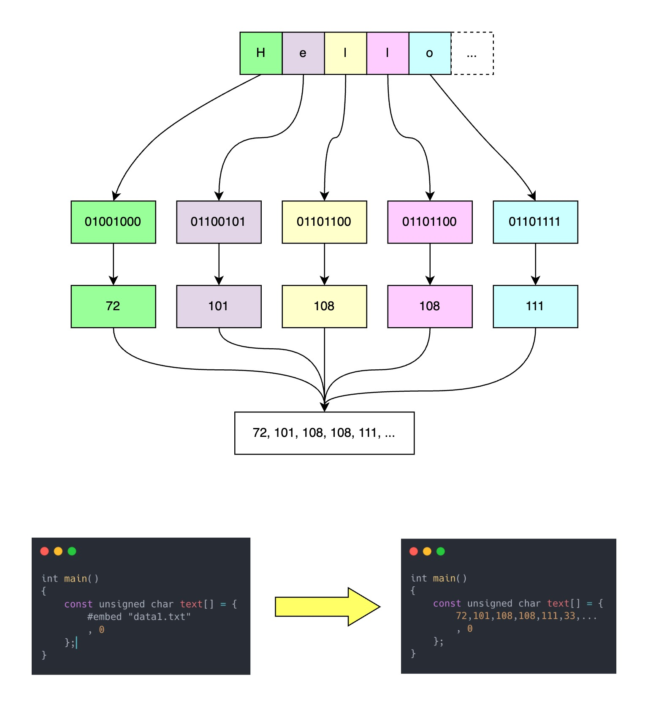

c++26最近刚敲定标准，新增了许多重量级特性。

不过目前能实际上手测试的特性不多，毕竟标准刚刚确定，比较大的变更里只有“资源嵌入”或者用标准文档里英文名“resource inclusion”这个新特性可以尝鲜。

虽然这篇文章标题叫指南，但实际上更像实验记录，而且现在属于早期阶段编译器对资源嵌入的处理有可能会有改变（不过语法不会改了），所以把这篇文章当教程看也行但得注意文章内容与实际使用上可能存在差别。

测试环境：

- 操作系统：macOS 15 和 Fedora 42
- 编译器：GCC 15.1
- 测试文本数据编码：UTF-8

网站上显示GCC15是完全支持`#embed`资源嵌入的，本来还想测试一下clang20，遗憾的是gcc测下来还有点小bug，况且clang在网站上显示只支持部分embed功能，因此我就不蹚雷了。

准备好环境之后我们来了解一下基础语法。

## 为什么需要embed

把数据嵌入到代码里有不少好处，比如：

1. 部署更简单，不需要额外捆绑资源文件
2. 程序可以更健壮，无需额外处理资源文件缺失或数据读取失败等意外情况
3. 能避免一些权限问题，一些系统上对文件的存放和读写有比较严格的限制

市面上也有很多工具可以完成资源/数据的嵌入，有些工具还提供灵活的数据查找功能，比如Qt的rcc。但这些工具一直有如下几个缺点：

1. 需要安装额外工具。这会增加项目的复杂性和管理成本，比如如何在CI里使用这些工具
2. 显著增加代码体积。众所周知二进制数据很难直接原样放进文本格式的代码里，所以要么对数据序列化要么对数据进行编码（比如base64），不管那种都会让二进制数据体积膨胀
3. 学习成本高。市面上的工具用法看似类似，实则差异明显，导致工具A的经验在工具B或C中难以通用

因此我们需要一种易学、通用、无需额外编解码或序列化即可嵌入二进制数据的方案。于是`#embed`就诞生了。

在正式进入C++26的embed提案里有一组性能对比测试，我们只看GCC相关的：

执行速度：

| Strategy             | 40 KB    | 400 KB   | 4 MB     | 40 MB     |
|----------------------|----------|----------|----------|-----------|
| #embed GCC           | 0.236 s  | 0.231 s  | 0.300 s  | 1.069 s   |
| xxd-generated GCC    | 0.406 s  | 2.135 s  | 23.567 s | 225.290 s |

内存占用：

| Strategy             | 40 KB    | 400 KB    | 4 MB       | 40 MB        |
|----------------------|----------|-----------|------------|--------------|
| #embed GCC           | 17.26 MB | 17.96 MB  | 53.42 MB   | 341.72 MB    |
| xxd-generated GCC    | 24.85 MB | 134.34 MB | 1,347.00 MB| 12,622.00 MB |

看着相当不错。美中不足的是缺少可执行文件体积对比，这个在我们学完了embed的用法之后可以额外做个测试。


## 基础语法

这次没有基础回顾环节，因为是全新的语法，直接学就完事了。

c和c++的embed语法形式差不多，所以放一起讲了。顺便我也不做标准文档的复读机，否则仅解释一个`pp-token`（预处理器可以接受的token）就可能占用大量篇幅，我会用简单的语言配上简单的例子做解释。

embed指令是预处理器的一种，语法如下：

```c++
# embed <header-name>|"header-name" parameters... new-line
```

`#embed`是指令名部分，这个很容易理解。

`<header-name>|"header-name"`是要嵌入的资源文件的名字，正如其中“header name”所暗示的，嵌入的资源文件搜索路径和头文件一样，引号代表优先搜索当前目录之后搜索编译器的头文件目录；尖括号则表示只搜索编译器限定的头文件存放目录。嵌入资源文件还可以使用绝对路径，比如`#embed "/dev/urandom"`，注意要用引号。所以最基础的嵌入资源的语法是这样的：

```c++
#embed <my-data> // linux GCC 会去/usr/include和通过-I参数传给编译器的目录下查找有没有一个叫 my-data 的文件

#embed "data1.bin" // 先在源文件所在的当前目录下寻找 data1.bin，找不到则去编译器的搜索路径里查找
```

`parameters...`是一组形式类似`选项A 选项B`或者`选项A(参数1) 选项B(参数1, 参数2, ...)`的东西，学名叫`embed-parameter`，中译名还没有，暂且就叫嵌入参数好了。嵌入参数主要用于给嵌入的资源做一些限制或者添加某些属性，后面会单独开一节内容细讲。嵌入参数也可以有自己的参数，这些参数必须是编译期常量。比如：

```c++
#embed "data1.bin" limit(32) // limit是embed-parameters之一，用于限制数据长度

#embed <data-1> if_empty(0) // 如果文件是空的，则用0来替代嵌入内容
```

嵌入参数目前只有标准规定的几个可以用，但c++在这里做了扩展，允许编译器自己实现一些`parameters`，语法形式是`A::B`或者带参数的`A::B(...)`。

`new-line`就不需要我多解释了吧，就和宏定义一样每一个`#embed`指令都以换行符结束，如果指令很长想拆分到多行，也需要像`#define`一样使用反斜杠`\`。

另外从资源文件名开始到各种`parameters`的位置上都可以使用宏，预处理器会进行宏展开，举个例子：

```c++
#define FILE_NAME "data1.bin"
#define DATA_LEN 32
#define PARAM1 limit
#define PARAM2 limit(LEN)

constexpr unsigned char* data1[] = {
#embed "data1.bin" limit(32) // 从data1.bin读一定长度的数据进来
}

constexpr unsigned char* data2[] = {
#embed FILE_NAME limit(32) // 和上面data1等价，但文件名用了宏
}

constexpr unsigned char* data3[] = {
#embed FILE_NAME PARAM1(32) // 等价，parameter用了宏，但参数没有
}

constexpr unsigned char* data4[] = {
#embed FILE_NAME PARAM2 // 等价，parameter和参数都依赖宏替换
}
```

现在看不懂也没关系，只要知道宏展开和替换也会在`#embed`中进行就够了。

编译代码需要使用`gcc -std=c23`以及`g++ -std=c++26`，否则会报错。

和`#include`一样，如果文件不存在或者不能正常读取的话编译器会报错。

## embed的工作原理

到目前为止，我们还不知道 embed 会做什么，也不清楚如何使用。本节先带你了解 embed 的工作原理，下一节再讲具体用法。

在这之前需要了解两个新概念和一个旧知识点。

第一个新概念是`implementation-resource-width`，我叫它资源宽度，单位是bit，没错是“位”。它表示要嵌入的资源一共有多少“位”，恐怕没多少人会这么计算文件大小，不过标准是有意为之的。

第二个要了解的是旧知识点，`CHAR_BIT`，这是一个宏，在头文件`<climits>/<limits.h>`里，代表当前环境上一个“字节byte”有多少“位bit”。比如在macOS和linux上gcc给出的`CHAR_BIT`值都是8，代表在这些平台上至少在c/c++代码中一个字节有8位。现代的主流平台几乎都是8位一字节，但过去并不是这样，而且总有些奇妙的嵌入式环境会打破这一常识。

最后一个概念是`resource-count`，计算公式是`implementation-resource-width / CHAR_BIT`，或者是嵌入参数`limit`中指定的那个值。这个值必须是整数。这个东西起个像样的中文名很难，但也暂且允许我叫它资源长度吧。

如果资源长度不是整数，比如你的资源宽度是32位，但`CHAR_BIT`的值不巧是7，那么编译会报错。遗憾的是我手上没这种设备，所以报错就不演示了。

这三个概念说了半天有什么用？答案是这和embed的工作原理有关：**`#embed`会把资源文件的内容替换成`resource-count`个整数字面量，这些字面量之间以半角逗号分隔**。

以c语言为例，c++也差不多：

```c
#include <stdio.h>

int main()
{
    const unsigned char text[] = {
        #embed "data1.txt"
        , 0
    };
    printf("embed: %s\n", text);
}

// 下面是data1.txt的内容：
// Hello! こんにちは、你好
```

可以算一下文件的资源宽度，在utf8下英语字母和半角标点还有空格是1字节，汉字、日语片假名和全角标点是3字节，所以资源一共有31字节，换算一下资源长度也正好是31。

我们可以用`gcc -std=c23 -E main.c`来查看完成预处理的源代码文件：

```console

......
# 3 "main.c"
int main()
{
    const unsigned char text[] = {
               72,101,108,108,111,33,32,227,129,147,227,130,147,227,129,171,227,129,161,227,129,175,227,128,129,228,189,160,229,165,189,10
        , 0
    };
    printf("embed: %s\n", text);
}
```

输出会非常长，所以我截取了有用的部分。这样看很明显，`#embed "data1.txt"`被替换成了`72,101,108,108,111,33,32,227,129,147,227,130,147,227,129,171,227,129,161,227,129,175,227,128,129,228,189,160,229,165,189,10`，数一数正好31个整数字面量。

而且可以看到前六个整数正好是`Hello!`每个字符对应的ASCII码。因为把数据转换成整数字面的过程类似于运行时不断调用`std::fgetc`，然后再将结果转换成整数字面量。也就是说如果你用`fopen("data1.txt", "rb")`在运行时打开资源文件，然后循环调用`fgetc`，会得到和`#embed`替换后一样的整数序列。c++里规定了必须是`int`类型的字面量，而c里只要求类型能完全兼容`unsigned char`即可，不过看上去GCC两边替换后的内容没什么区别。

如果embed发现给出的文件是空的，那么什么也不会生成，预处理器并不进行c++的语法检查，如果预期有数据的地方在替换完成后什么东西都没有，那编译的时候有可能爆出非常难以理解的错误，所以要注意处理这种情况。

这就是embed全部的工作原理。简单地说：资源文件的二进制数据 -> 用与fgetc相同的规则转换成一个逗号分隔的整数字面量序列。

顺带一提c和c++的整数字面量只有0和范围内的正整数，没有负数，所以如果想用字符类型接这些嵌入数据的话，最好使用`unsigned char`，这也是c标准里要求替换出来的字面量的类型要兼容`unsigned char`的原因之一。

另一种不标准但简单的理解是：想象资源文件是一个有n个bit的连续的二进制数据流，从数据流的开始处每次取`CHAR_BIT`个bit，然后把这些bit整体转换成一个符合规则要求的整数字面量，转换完成后按顺序接着处理下面`CHAR_BIT`个bit，循环这一过程直到资源文件处理完成或者循环次数达到limit的限制。循环结束后一样会得到一个以逗号分隔的整数数列。

如果觉得文字描述比较抽象，这里还有图解：



## embed参数

在弄清楚了embed是如何处理嵌入数据的之后，我们再来看看嵌入参数。

`#embed`负责把指定的数据源转换成整数字面量序列，而embed参数则对这些整数字面量序列产生影响。

每种参数都有不同的效果，有些可以在序列开头结尾添加内容，有的可以限制序列长度，还有的可以在序列为空时做特殊处理，不一而足。参数之间还可以组合发挥效力。每个参数自身只能在同一条`#embed`指令中出现一次。

下面我们来看看这些参数的具体功能和用法。

### limit

语法：`#embed "data" limit(预处理器能识别出来的数字常量)`

limit顾名思义就是用来限制整数字面量序列长度的。

必须给limit一个0或者正整数参数。例子：

```c
#define LENGTH 4
int main()
{
    const unsigned char text1[] = {
        #embed "data.txt" limit(2)
        , 0
    };
    const unsigned char text2[] = {
        #embed "data.txt" limit(LENGTH)
        , 0
    };
    printf("embed: %s\n", text1); // 输出：He
    printf("embed: %s\n", text2); // 输出：Hell
}
```

参数也可以是表达式，比如`limit(1+1)`，但不可以出现`#define`。

当输入参数为0时，embed会产生空序列，而输入负数会产生编译错误：`error: negative embed parameter operand`。

如果输入参数的值大于嵌入数据的`resource count`，标准要求预处理器把输入值改为`resource count`，相当于`std::min(resource-count, limit-operand)`。

在c语言中limit还有一个别名叫`__limit__`。

### prefix

语法：`#embed "data" prefix(token序列)`

token序列是一个或多个符合语法的预处理器token的组合，后面讲的`suffix`和`if_empty`的参数形式与此相同。通俗地说只要括号里的东西预处理器可以正常识别，那么就可以作为prefix的参数。

如果`prefix`的括号里是空的，则什么都不会做，否则会把括号里的token序列添加到整数序列的最前面。要注意的是它是把括号内的内容原样复制黏贴上去的，因此你需要在最后一个token后面加上逗号或者其他符号让整个处理后的序列符合c/c++语法规则，举个例子：

```c
// data.txt内容：Hello

#define ALPHABET 't'
int main()
{
    const unsigned char text1[] = {
        #embed "data.txt" prefix(1+)
        , 0
    };
    const unsigned char text2[] = {
        #embed "data.txt" prefix(ALPHABET, 'e', 's', ALPHABET, 0x20, )
        , 0
    };
    printf("embed: %s\n", text1); // 输出：Iello
    printf("embed: %s\n", text2); // 输出：test Hello
}
```

其中`#embed "data.txt" prefix(1+)`被替换为`1+72, 101, 108, 108, 111`；而`#embed "data.txt" prefix(ALPHABET, 'e', 's', ALPHABET, 0x20, )`替换成了`'t', 'e', 's', 't', 0x20, 72, 101, 108, 108, 111`。

如果序列本身是空的，则`prefix`不生效。

prefix通常用于在embed进来的数据前加一些标记，因此参数多是一个或多个字符/整数常量，但如例子所示，任何合法的表达式也可以作为参数。

在c语言中prefix还有一个别名叫`__prefix__`。

### suffix

语法：`#embed "data" suffix(token序列)`

`suffix`是`prefix`的对称操作，它会把token序列原样添加到整数序列的尾部。看个例子：

```c
// data.txt内容：Hello

#define ALPHABET 't'
int main()
{
    const unsigned char text1[] = {
        #embed "data.txt" suffix(, 0) // 注意那个逗号，字符串以\x00结尾
    };
    const unsigned char text2[] = {
        #embed "data.txt" suffix(-10, 0x20, ALPHABET, 'e', 's', ALPHABET,)
        0 // 注意0前面没有逗号了
    };
    printf("embed: %s\n", text1); // 输出：Hello
    printf("embed: %s\n", text2); // 输出：Helle test
}
```

和prefix一样，如果整数字面量序列是空的，则什么也不做。

c语言中还可以使用它的别名`__suffix__`。

### if_empty

语法：`#embed "data" if_empty(token序列)`

如果嵌入的整数序列为空（资源不存在或者通过`limit(0)`使得序列长度为0），则会用括号内的内容替换整条embed指令，否则不生效。

看示例代码辅助理解：

```c
// data.txt内容：Hello
// data2.txt长度为0

int main()
{
    const unsigned char text1[] = {
        #embed "data.txt" if_empty('e', 'm', 'p', 't', 'y')
        , 0
    };
    const unsigned char text2[] = {
        #embed "data2.txt" if_empty('e', 'm', 'p', 't', 'y')
        , 0
    };
    const unsigned char text3[] = {
        #embed "data.txt" limit(0) if_empty('e', 'm', 'p', 't', 'y')
        , 0
    };
    printf("embed: %s\n", text1); // 输出：Hello，因为data.txt里有内容，所以if_empty不生效
    printf("embed: %s\n", text2); // 输出：empty，因为data2.txt里没有数据
    printf("embed: %s\n", text3); // 输出：empty，因为limit(0)使得整数序列为空
}
```

c语言中if_empty的别名是`__if_empty__`。

## __has_embed

`__has_embed`用来检查embed指令是否有效以及嵌入的资源是否为空。它的语法形式是：`__has_embed(<header-name>|"header-name" parameters...)`。

其实就是把embed指令中的换行符和`#embed`去掉，其余部分放进括号里。

如果资源能正常嵌入且不为空，`__has_embed`返回`__STDC_EMBED_FOUND__`；如果资源正常嵌入但是空的，返回`__STDC_EMBED_EMPTY__`；其余情况返回`__STDC_EMBED_NOT_FOUND__`。

`__has_embed`可以配合条件编译指令使用，比如：

```cpp
#if __has_embed("data.txt" limit(2))
doing A
#else
doing B
#endif
```

不过要注意，`__has_embed`有TOCTOU问题，也就是说检测是否能嵌入和实际读取资源进行嵌入之间有时间间隔，可能会导致检测通过但实际执行嵌入时文件被改变导致不再满足前面的条件要求。c++的提案里说因为这个问题本来不想添加这个表达式，但考虑到c里已经有这个了，再加上存在同样问题的`__has_include`已经包含在c++里，所以考虑再三还是提供了`__has_embed`。

我的建议是尽量少用这个，`if_empty`可以料理一部分文件为空的情况，资源文件不存在或者无法访问更应该视为fatal error而不是采用一些迂回绕过手段掩盖问题。当然一切以实际需求为准，想利用TOCTOU进行攻击的操作难度很大，通常也不用过份担心。

## 如何使用

现在我们知道了embed语法规则和控制它行为的方法，但除了embed会产生一串整数之外我们还不知道具体的用法。

其实用法也没啥好讲的——就把它当成一串整数构成的序列来用就行了。当然如果这么说的话那这篇指南就有点潦草了，所以我会列举几个常见的用法给大家做参考。由于embed指令配合参数可以生成各种各样奇形怪状的内容，我这罗列出来的肯定只是用法中的一小部分，但我还是得提醒一句，能力越大责任越大，不要滥用语言提供的功能。

第一种用法其实已经包含在例子里了，那就是把嵌入的数据存进`unsigned char`或者其他整数类型的数组里：

```c++
const unsigned char text1[] = {
    #embed "data.txt" limit(3) // 数组长度自动推导，为3 + 1 = 4
    , 0
};
const unsigned char text2[] = {
    #embed "data2.txt" if_empty('e', 'm', 'p', 't', 'y')
    , 0
};
const unsigned char text3[10] = { // 只有五个字符能嵌入，剩下的部分会被0值初始化
    #embed "data.txt" limit(0) if_empty('e', 'm', 'p', 't', 'y')
};
```

在这种用法下，嵌入资源生成的整数序列只能小于等于数组的长度要求，大于的话会报错。这也是使用嵌入资源的常见形式，别的工具比如`xxd`或者`Qt rcc`也是这样组织被嵌入的数据的。

第二种用法是用来聚合初始化c++的聚合类型或者c的结构体：

```c
typedef struct A {
    int a;
    int b;
    long long c;
    unsigned long d;
    unsigned char e;
} A;

int main()
{
    A a_obj = { #embed "data.txt" }; // 被替换为 { 72,101,108,108,111 }
}
```

与数组相同，这种使用方式整数序列中数字的数量必须小于等于字段的数量，否则是语法错误。

第三种用法是拿来做函数参数或者模板非类型参数，不知道你们看到整数序列时第一想法是什么，但我第一个冒出来的念头是这个形式和参数列表太像了。用法可以是：

```cpp
template <int... nums>
void calcAvg()
{
    long sum = (... + nums);
    std::cout << (sizeof...(nums) != 0 ? static_cast<double>(sum) / sizeof...(nums) : 0) << '\n';
}

void avg(int count, ...)
{
    long sum = 0;
    va_list args;

    va_start(args, count);
    
    for (int i = 0; i < count; i++) {
        sum += va_arg(args, int);
    }
    
    va_end(args);
    
    std::cout << (count ? static_cast<double>(sum) / count : 0.0) << '\n';
}

int main()
{
    calcAvg<
        #embed "data.txt"
    >();
    avg(5,
        #embed "data.txt"
    );
}
```

embed指令需要独占一行，所以要注意代码的格式。作为函数或者模板参数时，生成的整数序列元素数量必须等于要求的参数数量。这种做法已经有点偏向于杂耍了。

其他方式就不列举了，最常见的就是上面这两种。鉴于embed指令的灵活性，想必将来一定会出现很多体操式玩法吧。

## 生成文件大小测试

提案里有使用嵌入资源程序的性能对比，但没有生成文件大小的数据。

对于现代软硬件环境来说，可执行程序稍微大点其实也没有多大影响，或者看看日益流行的Electron程序，打包了大半个浏览器进去大家还不是用得乐此不疲。但知道一点基础数据总是没坏处的，它可以让我们估算程序的最终大小，以便采取合理的打包部署策略。

测试程序以c编写，编译的时候会从`/dev/urandom`读取指定长度的随机数据，然后以16进制格式打印每一个字节，程序不会真的执行，我们只测试编译出来的文件大小：

```c
#include <stdio.h>

int main()
{
    const unsigned char text[] = {
        #embed "/dev/urandom" limit(LEN)
    };
    printf("random: ");
    for (int i = 0; i < sizeof(text); i++) {
        printf("%02x", text[i]);
    }
    printf("\n");
}
```

测试用的编译器都是GCC 15.1，操作系统分别是macOS arm64和Linux x86_64。编译选项都是`gcc -std=c23 -Wall -O2 -DLEN=n`。下面是测试结果：

| 嵌入大小      | 40 KB | 400 KB | 4 MB    | 40 MB    | 400 MB    |
|--------------|-------|--------|---------|----------|-----------|
| Linux x86_64 | 70 KB | 454 KB | 4.07 MB | 40.07 MB | 400.07 MB |
| macOS arm64  | 65 KB | 436 KB | 4.06 MB | 40.34 MB | 403.15 MB |

嵌入的数据越大程序也就越大。

## 一些坑点

我们已经学习了embed指令的语法以及使用方法，在收尾前还有一些注意事项需要知道：

1. embed会拖慢编译时间并占用大量内存，拿上一节的程序测试4GB大小的嵌入数据，在16g Linux笔记本上OOM。
2. embed不限制嵌入资源的大小，比如/dev/urandom这种没有大小限制的文件会导致资源耗尽。
3. 文本编码问题，embed是把数据原样转换后写入程序的，因此它不知道你的文本是什么编码，理论上也不应该知道。
4. 文本数据的换行符问题，Windows上换行符是`\r\n`，而macOS和Linux上是`\n`，标准库的io很多时候帮我们处理掉了两者之间的差异，但embed并不会，它之后原样照搬数据，如果不注意这个问题可能会导致长度计算错误或者数据处理逻辑上出现缺陷。
5. 字节序问题，到目前为止还没有字节序问题出现，因为我们做测试的几个平台`CHAR_BIT`都是8，也就是八位一字节，在embed里就是8位转成一个整数，这是没有字节序问题的。然而一个`CHAR_BIT`大于8的平台，就可能会遇到16位甚至32位二进制数据转成一个整数的情况，这时候就会出现字节序问题。标准没有规定编译器用哪种字节序处理嵌入数据，只是建议采用和程序运行时一致的字节序来处理。这导致了理论上`#embed`的可移植性会比较弱。不过实际上现在大部分服务器和桌面环境里`CHAR_BIT`都是8，因此遇到问题的机会不多，但得了解到存在这种坑。
6. 编译错误可能很难理解，`#embed`是预处理器指令，预处理器处理完源代码还需要编译器进行编译，有时候预处理器能正确处理完成的数据在编译器那里不一定是合法的代码，这时候编译器在报错的东西是完成替换后的内容了，不是第一现场导致报错内容的有效信息不多。由于embed还支持大部分的宏扩展替换，导致代码进一步变形，最终有可能会找不到错误的源头所在（比如某个宏展开有问题导致生成的代码不能编译），你可以在介绍prefix的例子里删掉一个逗号体验一下。

不过目前只有少数编译器支持`#embed`特性，等支持更广泛之后其中一些坑可能会在后续的标准规范里修复或者交给编译器自己定夺。

## 总结

embed算是一个比较实用的功能，不过要等生态铺开可能还得好几年。

同样都是语言层面对内嵌数据的支持，c/c++相比golang的[嵌入资源](../golang/golang1.16内嵌静态资源指南.md)缺少了一些灵活性，但这也无可厚非。

总而言之，在看完这篇指南之后可以尝试使用一下`#embed`，说不定可以从项目中删掉一两个外部工具减轻负担。

##### 参考

[embed提案 p1967](https://www.open-std.org/jtc1/sc22/wg21/docs/papers/2025/p1967r14.html#intro-motivation)
