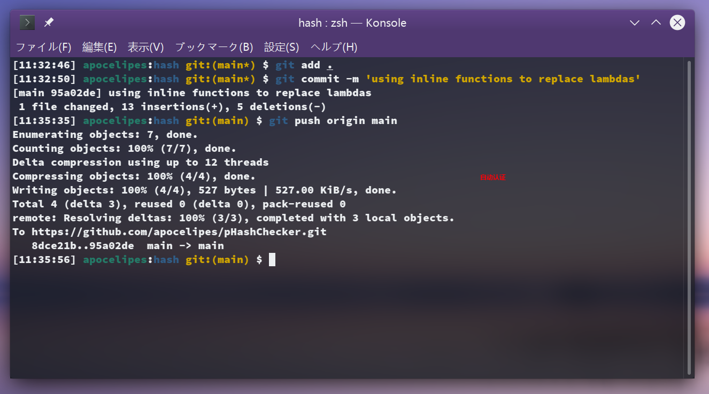
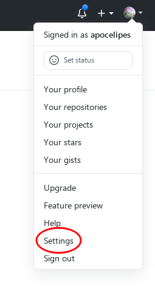
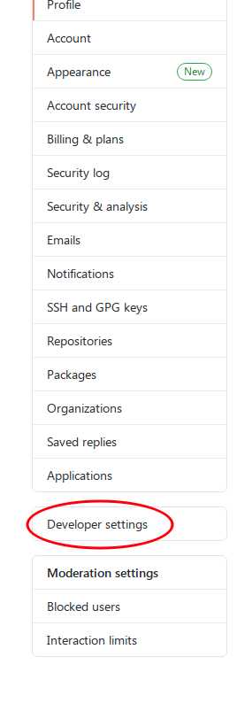
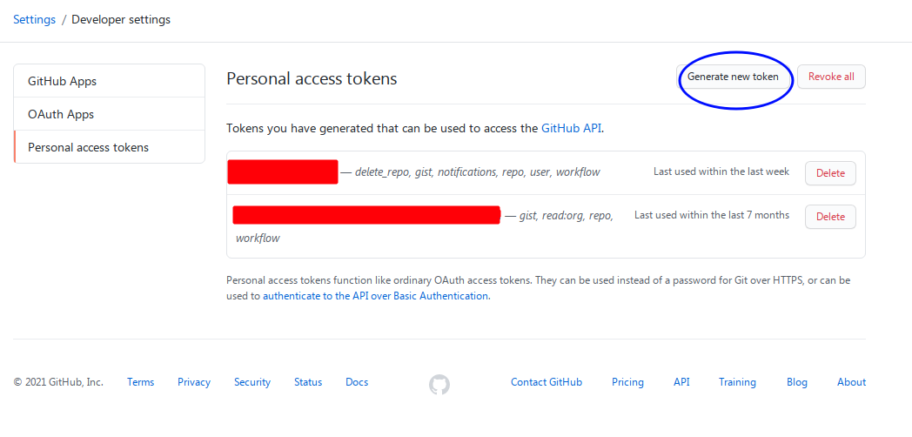
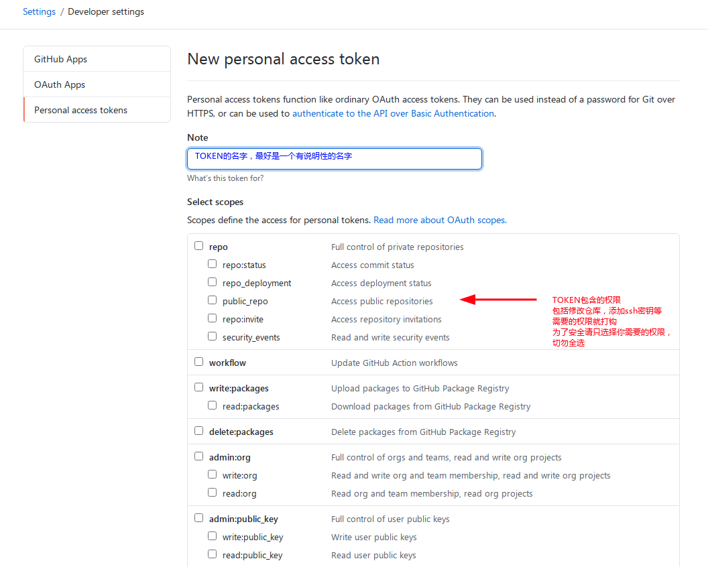
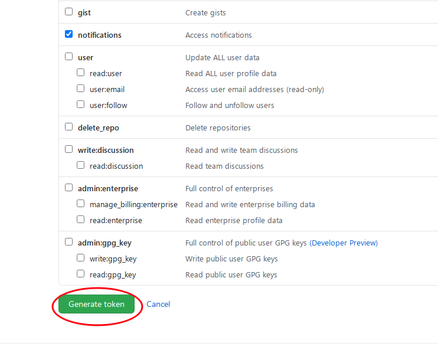
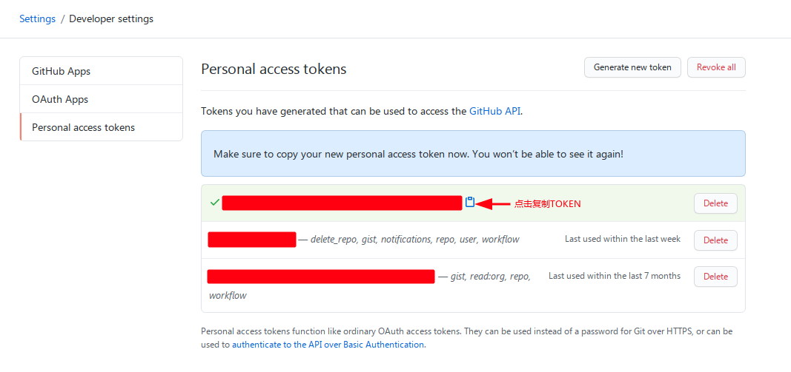
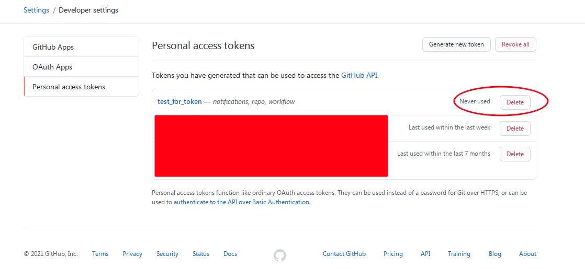
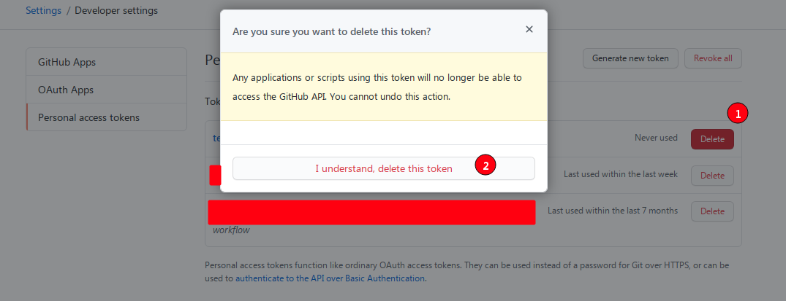
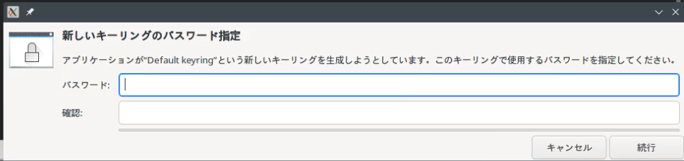

记录一下配置git操作远程仓库时的自动验证，效果如下图：



本文介绍的是Linux下的配置。Windows上默认已经启用凭证存储和自动验证（依靠wincred实现，以后会使用[GCM-Core](https://github.com/microsoft/Git-Credential-Manager-Core)）。

## 准备工作

首先需要Linux系统上安装了dbus或者是gnome-keyring（依赖于dbus），如果可能的话需要安装libsecret，这是一个更现代的用于凭证管理的库。因为我们需要借助dbus的service才行实现凭证存储:

```bash
# Ubuntu
# 如果使用 KDE 桌面环境，且 KDE Frameworks 版本在 5.97.0 及以上，则不需要gnome-keyring
sudo apt-get install libsecret-1-0 libsecret-1-dev gnome-keyring

# Arch Linux
sudo pacman -S libsecret gnome-keyring
```

其次你需要git 2.11+，一次make，pkg-config，gcc等编译工具，可以用下面的命令安装：

```bash
# Ubuntu
sudo apt install build-essential git pkg-config

# Arch Linux
sudo pacman pkg-config make gcc g++ git
```

最后，我们需要获取个人的ACCESS TOKEN，因为GitHub在2021年底将会废除git操作时的密码验证，所有密码验证需要转换为TOKEN验证，密码只能用于账户本身的登录。

首先我们要进设置界面，先打开github.com，然后跟着图里的步骤走：



然后点红圈里的开发者设置：



你会看到这样的界面，上面列出了已经创建的token和创建/删除按钮：



下面是如何创建token，这里建议只勾选你需要的权限，比如提交commit等，权限不是越多越好：





创建完成后会把token明文显示给你，一定要妥善保存，因为页面一旦关闭/刷新这串token就只有你一个人知道了：



一旦token遗失或者没用了，就要及时删除，比如我刚刚为了演示而创建的token演示结束就没用了，所以要删除：





有了access token，下面就可以配置自动登录验证了。

## 什么是凭证存储

就是字面意思，用某种方式把密码或者token存储起来，在需要的时候可以获取这些被存储的凭证。

git内置了对凭证存储的支持，通过配置进行：

```bash
git config --global credential.helper xxx
```

如果没有设置那么默认不进行存储，这个`xxx`默认有2个选项：

1. store 把凭证用明文存储在$HOME目录下，为了安全建议不要设置它
2. cache 把凭证存储在内存里15分钟，15分钟后删除

除此之外还支持符合接口规范的第三方应用程序：

```bash
git config --global credential.helper your-tool

git config --global credential.helper /path/to/your-tool
```

对于第一种形式，git会去`$PATH`里找名字叫`git-credential-your-tool`的程序，在设置的时候不用写出前缀。第二种会直接调用绝对路径指定的程序。

选用第三方工具是理由是安全：这些工具通常会加密你的凭证，并且存储在一个不容易导致恶意访问的地方，另外还可以和系统功能集成。

那么从哪找这么好的第三方管理程序呢？别着急，git自带了。

在Ubuntu系统上，git把这些程序的源码存储在：`/usr/share/doc/git/contrib/credential/`这里。在Arch Linux上则是`/usr/share/git/credential`：


上图是Arch Linux上的情况，gnome-keyring和libsecret、netrc是Linux上可以使用的工具。

因为都是源码，所以我们得先进行编译。

## 配置

我们选择libsecret，因为gnome-keyring未来会被废弃。

采用下面的命令编译，以Ubuntu为例子：

```bash
cd /usr/share/doc/git/contrib/credential/libsecret
# Arch Linux: cd /usr/share/git/credential/libsecret
sudo make

# 如果目录所在的文件系统是ext4，xfs，btrfs，还可以用下面的命令禁止对程序的任何修改
sudo chattr +i git-credential-libsecret
```

你可以把该目录添加进$PATH，然后指定`credential.helper`：

```bash
echo '$PATH=$PATH:/usr/share/doc/git/contrib/credential/libsecret' >> ~/.bashrc
git config --global credential.helper libsecret
```

或者你不想修改$PATH，可以这样配置：

```bash
# Ubuntu
git config --global credential.helper /usr/share/doc/git/contrib/credential/libsecret/git-credential-libsecret

# Arch Linux
git config --global credential.helper /usr/share/git/credential/libsecret/git-credential-libsecret
```

这样就大功告成了。

## 运行

为了测试，我们随便选择一个自己的项目，先clone到本地，然后做些修改后commit。

只有在修改远程仓库的时候才会进行凭证验证，比如push。通常的过程是这样的：

```bash
$ git push origin dev
Username for 'https://github.com': apocelipes
Password for 'https:/apocelipes@github.com':
```

虽然提示的文字仍然使用的密码，但输入的应该是我们之前创建的access token。

验证通过后就会把变更push到origin，但配置自动验证后第一次仍然需要输入凭证，然后现在会是这样：



需要为你的密钥环配置一个单独的密码，你也可以选择用户的默认密码，配置完成后凭证就会被安全地存储了。

下次push将不会再验证用户名和凭证，效果和文章开头的图片里一样。

这样自动登录认证就配置完成了。

##### 参考

<https://git-scm.com/book/zh/v2/Git-%E5%B7%A5%E5%85%B7-%E5%87%AD%E8%AF%81%E5%AD%98%E5%82%A8>
<https://stackoverflow.com/questions/36585496/error-when-using-git-credential-helper-with-gnome-keyring-as-sudo/40312117#40312117>
