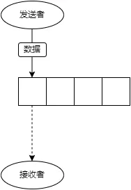
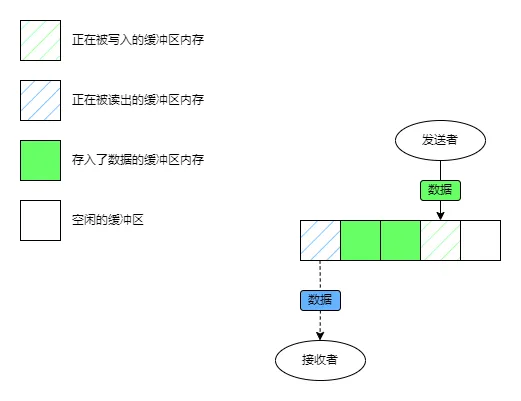
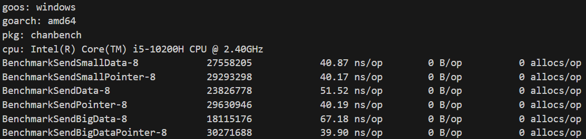
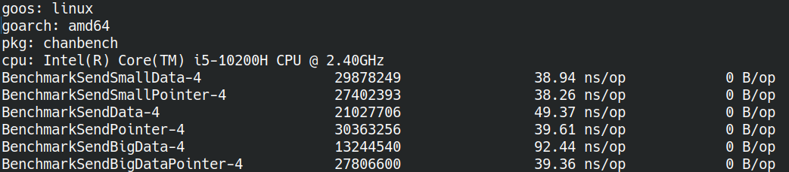

这篇并不讨论chan因为加锁解锁以及为了维持内存模型定义的行为而付出的运行时开销。

这篇文章要探讨的是chan在接收和发送数据时因为“复制”而产生的开销。

在做性能测试前先复习点基础知识。

## 数据是如何在chan里流动的

首先我们来看看带buffer的chan，这里要分成两类来讨论。那没buffer的chan呢？后面会细说。

### 情况1：发送的数据有读者在读取

可能需要解释一下这节的标题，意思是：发送者正在发送数据同时另一个接收者在等待数据，看图可能更快一些↓



图里的chan是空的，发送者协程正在发送数据到channel，同时有一个接收者协程正在等待从chan里接收数据。

如果你对chan的内存模型比较了解的话，其实可以发现此时是buffered chan的一种特例，他的行为和无缓冲的chan是一样的，事实上两者的处理上也是类似的。

所以向无缓冲chan发送数据时的情况可以归类到情况1里。

在这种情况下，虽然在图里我们仍然画了chan的缓冲区，但实际上go有优化：chan发现这种情况后会使用runtime api，直接将数据写入接收者的内存（通常是栈内存），跳过chan自己的缓冲区，只复制数据一次。

这种情况下就像数据**直接**从发送者流到了接收者那里一样。

### 情况2：发送的数据没有读者在读取

这个情况就简单多了，基本上除了情况1之外的所有情形都属于这种：



图里描述的是最常见的情况，读者和写者在操作不同的内存。写者将数据复制进缓冲区然后返回，如果缓冲满了就阻塞到有可用的空位为止；读者从缓冲区中将数据复制到自己的内存里然后把对应位置的内存标记为可写入，如果缓冲区是空的，就阻塞到有数据可读为止。

可能有人会问，如果缓冲区满了导致发送的一方被阻塞了呢？其实发送者从阻塞恢复后需要继续发送数据，这时是逃不出情况1和情况2的，所以是否会被阻塞在这里不会影响数据发送的方式，并不重要。

在情况2中，数据先要被复制进chan自己的缓冲区，然后接收者在读取的时候在从chan的缓冲区把数据复制到自己的内存里。总体来说数据要被复制两次。

情况2中chan就像这个水池，数据先从发送者那流进水池里，过了一段时间后再从水池里流到接收者那里。

### 特例中的特例

这里要说的是空结构体：`struct{}`。在chan直接传递这东西不会有额外的内存开销，因为空结构体本身不占内存。和处理空结构体的map一样，go对这个特例做了特殊处理。

当然，虽然不会消耗额外的内存，但内存模型是不变的。为了方便起见你可以把这个特例想象成情况2，只是相比之下使用更少的内存。

## 为什么要复制

在情况1里我们看到了，runtime实际上有能力直接操作各个goroutine的内存，那么为什么不选择将数据“移动”到目标位置，而要选择复制呢？

我们先来看看如果是“移动”会发生什么。参考其他语言的惯例，被移动的对象将不可再被访问，它的数据也将处于一种不确定但可以被安全删除的状态，简单地说，一点变量里的数据被移动到其他地方，这个变量就不应该再被访问了。在一些语言里移动后变量将强制性不可访问，另一些语言里虽然可以访问但会产生“undefined behavior”使程序陷入危险的状态。go就比较尴尬了，既没有手段阻止变量在移动后继续被访问，也没有类似“undefined behavior”的手段兜底这些意外情况，随意panic不仅消耗性能更是稳定性方面的大忌。

因此移动在go中不现实。

再来看看在goroutine之间共享数据，对于可以操作goroutine内存的runtime来说，这个比移动要费事的多，但也可以实现。共享可能在cpu资源上会有些损耗，但确实能节约很多内存。

共享的可行性也比移动高一些，因为不会对现有语法和语言设计有较大的冲击，甚至可以说完全是在这套语法框架下合情合理的操作。但只要一个问题：不安全。chan的使用场景大部分情况下都是在并发编程中，共享的数据会带来严重的并发安全问题。最常见的就是共享的数据被意外修改。对于以便利且安全的并发操作为卖点的go语言来说，内置的并发原语会无时不刻生产出并发安全问题，无疑是不可接受的。

最后只剩下一个方案了，使用复制来传递数据。复制能在语法框架下使用，与共享相比也不容易引发问题（只是相对而言，chan的浅拷贝问题有时候反而是并发问题的温床）。这也是go遵循的CSP（Communicating Sequential Process）模型所提倡的。

## 复制导致的开销

既然复制有正当理由且不可避免，那我们只能选择接受了。因此复制会带来多大开销变得至关重要。

内存用量上的开销很简单就能计算出来，不管是情况1还是情况2，数据一个时刻最多只会有自己本体外加一个副本存在——情况1是发送者持有本体，接收者持有副本；情况2是发送者持有本体，chan的缓冲区或者接收者（从缓冲区复制过去后缓冲区置空）持有副本。当然，发送者完全可以将本体销毁这样只有一份数据留存在内存里。所以内存的消耗在最坏情况下会增加一倍。

cpu的消耗以及对速度的影响就没那么好估计了，这个只能靠性能测试了。

测试的设计很简单，选择大中小三组数据利用buffered chan来测试chan和协程直接复制数据的开销。

小的标准是2个`int64`，大小16字节，存进一个缓存行绰绰有余：

```golang
type SmallData struct {
    a, b int64
}
```

中型大小的数据更接近平常的业务对象，大小是144字节，包含十多个字段：

```golang
type Data struct {
	a, b, c, d     int64
	flag1, flag2   bool
	s1, s2, s3, s4 string
	e, f, g, h     uint64
	r1, r2         rune
}
```

最后是大对象，大对象包含十个中对象，大小1440字节，我知道也许没人会这么写，也许实际项目里还有笔者更重量级的，我当然只能选个看起来合理的值用于测试：

```golang
type BigData struct {
	d1, d2, d3, d4, d5, d6, d7, d8, d9, d10 Data
}
```

鉴于chan会阻塞协程的特殊性，我们只能发完数据后再把它从chan里取出来，不然就得反复创建和释放chan，这样代来的杂音太大，因此数据实际上要被复制上两回，这里我们只关注内存复制的开销，其他因素控制好变量就不会有影响。完整的测试代码长这样：

```golang
import "testing"

type SmallData struct {
	a, b int64
}

func BenchmarkSendSmallData(b *testing.B) {
	c := make(chan SmallData, 1)
	sd := SmallData{
		a: -1,
		b: -2,
	}
	for i := 0; i < b.N; i++ {
		c <- sd
		<-c
	}
}

func BenchmarkSendSmallPointer(b *testing.B) {
	c := make(chan *SmallData, 1)
	sd := &SmallData{
		a: -1,
		b: -2,
	}
	for i := 0; i < b.N; i++ {
		c <- sd
		<-c
	}
}

type Data struct {
	a, b, c, d     int64
	flag1, flag2   bool
	s1, s2, s3, s4 string
	e, f, g, h     uint64
	r1, r2         rune
}

func BenchmarkSendData(b *testing.B) {
	c := make(chan Data, 1)
	d := Data{
		a:     -1,
		b:     -2,
		c:     -3,
		d:     -4,
		flag1: true,
		flag2: false,
		s1:    "甲甲甲",
		s2:    "乙乙乙",
		s3:    "丙丙丙",
		s4:    "丁丁丁",
		e:     4,
		f:     3,
		g:     2,
		h:     1,
		r1:    '测',
		r2:    '试',
	}
	for i := 0; i < b.N; i++ {
		c <- d
		<-c
	}
}

func BenchmarkSendPointer(b *testing.B) {
	c := make(chan *Data, 1)
	d := &Data{
		a:     -1,
		b:     -2,
		c:     -3,
		d:     -4,
		flag1: true,
		flag2: false,
		s1:    "甲甲甲",
		s2:    "乙乙乙",
		s3:    "丙丙丙",
		s4:    "丁丁丁",
		e:     4,
		f:     3,
		g:     2,
		h:     1,
		r1:    '测',
		r2:    '试',
	}
	for i := 0; i < b.N; i++ {
		c <- d
		<-c
	}
}

type BigData struct {
	d1, d2, d3, d4, d5, d6, d7, d8, d9, d10 Data
}

func BenchmarkSendBigData(b *testing.B) {
	c := make(chan BigData, 1)
	d := Data{
		a:     -1,
		b:     -2,
		c:     -3,
		d:     -4,
		flag1: true,
		flag2: false,
		s1:    "甲甲甲",
		s2:    "乙乙乙",
		s3:    "丙丙丙",
		s4:    "丁丁丁",
		e:     4,
		f:     3,
		g:     2,
		h:     1,
		r1:    '测',
		r2:    '试',
	}
	bd := BigData{
		d1:  d,
		d2:  d,
		d3:  d,
		d4:  d,
		d5:  d,
		d6:  d,
		d7:  d,
		d8:  d,
		d9:  d,
		d10: d,
	}
	for i := 0; i < b.N; i++ {
		c <- bd
		<-c
	}
}

func BenchmarkSendBigDataPointer(b *testing.B) {
	c := make(chan *BigData, 1)
	d := Data{
		a:     -1,
		b:     -2,
		c:     -3,
		d:     -4,
		flag1: true,
		flag2: false,
		s1:    "甲甲甲",
		s2:    "乙乙乙",
		s3:    "丙丙丙",
		s4:    "丁丁丁",
		e:     4,
		f:     3,
		g:     2,
		h:     1,
		r1:    '测',
		r2:    '试',
	}
	bd := &BigData{
		d1:  d,
		d2:  d,
		d3:  d,
		d4:  d,
		d5:  d,
		d6:  d,
		d7:  d,
		d8:  d,
		d9:  d,
		d10: d,
	}
	for i := 0; i < b.N; i++ {
		c <- bd
		<-c
	}
}
```

我们选择传递指针作为对比，这是日常开发中另一种常见的作法。

Windows11上的测试结果：



Linux上的测试结果：



对于小型数据，复制带来的开销并不是很突出。

对于中型和大型数据就没那么乐观了，性能分别下降了**20%**和**50%**。

测试结果很清晰，但有一点容易产生疑问，为什么大型数据比中型大了10倍，但复制速度上只慢了2.5倍呢？

原因是golang会对大数据启用SIMD指令增加单位时间内的数据吞吐量，因此数据大了确实复制会更慢，但不是数据量大10倍速度就会慢10倍的。

由此可见复制数据带来的开销是很难置之不理的。

## 如何避免开销

既然chan复制数据会产生不可忽视的性能开销，我们得想些对策来解决问题才行。这里提供几种思路。

### 只传小对象

多小才算小，这个争议很大。我只能说说我自己的经验谈：1个缓存行里存得下的就是小。

一个缓存行有多大？现代的x64 cpu上L1D的大小通常是32字节，也就是4个普通数据指针/`int64`的大小。

从我们的测试来看小数据的复制开销几乎可以忽略不记，因此只在chan里传递这类小数据不会有什么性能问题。

唯一要注意的是string，目前的实现一个字符串本身的大小是16字节，但这个大小是没算字符串本身数据的，也就是说一个长度256的字符串和一个长度1的字符串，自身的结构都是16字节大，但复制的时候一个要拷贝256个字符一个只用拷贝一个字符。因此字符串经常出现看着小但实际大小很大的实例。

### 只传指针

32字节实在是有点小，如果我需要传递2-3个缓存行大小的数据怎么办？这个也是实际开发中的常见需求。

答案实际上在性能测试的对照组里给出了：传指针给chan。

从性能测试的结果来看，只传指针的情况下，无论数据多大，耗时都是一样的，因为我们只复制了一份指针——8字节的数据。

这个作法也能节约内存：只复制了指针，指针引用的数据没有被复制。

看起来我们找到了向chan传递数据的银弹——只传指针，然而世界上并没有银弹——

1. 传指针相当于上一节说的“共享”数据，很容易带来并发安全问题；
2. 对于发送者，传指针给chan很可能会影响逃逸分析，不仅会在堆上分配对象，还会使情况1中的优化失去意义（调用runtime就为了写入一个指针到接收者的栈上）
3. 对于接收者来说，操作指针引用的数据需要一次或多次的解引用，而这种解引用很难被优化掉，因此在一些热点代码上很可能会带来可见的性能影响（通常不会有复制数据带来的开销大，但一切得以性能测试为准）。
4. 太多的指针会加重gc的负担

使用指针传递时切记要充分考虑上面列出的缺点。

### 使用lock-free数据结果替代chan

chan大部分时间都被用作并发安全的队列，如果chan只有固定的一个发送者和固定一个的接收者，那么可以试试这种无锁数据结构：[SPSCQueue](https://www.boost.org/doc/libs/1_76_0/doc/html/boost/lockfree/spsc_queue.html)。

无锁数据结构相比chan好处在于没有mutex，且没有数据复制的开销。

缺点是只支持单一接收者和单一发送者，实现也相对复杂所以需要很高的代码质量来保证使用上的安全和运行结果的正确，找不到一个高质量库的时候我建议是最好别尝试自己写，也最好别用。（一个坏消息，go里可靠的无锁数据结构库不是很多）

### 开销可以接受的时候

有一类系统追求正确性和安全性，对性能损耗和资源消耗有较高的容忍度。对于这类系统来说，复制数据带来的开销一般是可接受的。

这时候明显复制传递比传指针等操作简单而安全。

另一种常见情形是：chan并不是性能瓶颈，复不复制对性能的影响微乎其微。这时候我也倾向于选择复制传递数据。

## 总结

总体来说chan还是很方便的，在go里又是还不得不用。

我写这篇文章不是为了吓唬大家，只是提醒大家一些使用chan时可能发生的性能陷阱和对应的解决办法。

至于你怎么用chan，除了要结合实际需求之外，性能测试是另一个重要的参考标准。

如果问我，那么我倾向于复制数据优先于指针传递，除非数据十分巨大/性能瓶颈在复制上/接收方发送方需要在同一个对象上做些协同作业。同样性能测试和profile是我采用这些方式的参考标准。
