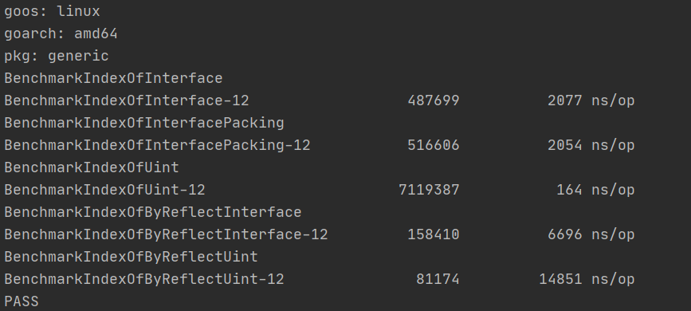

从golang诞生起是否应该添加泛型支持就是一个热度未曾消减的议题。泛型的支持者们认为没有泛型的语言是不完整的，而泛型的反对者们则认为接口足以取代泛型，增加泛型只会徒增语言的复杂度。双方各执己见，争执不下，直到官方最终确定泛型是go2的发展路线中的重中之重。

今天我们就来看看为什么我们需要泛型，没有泛型时我们在做什么，泛型会带来哪些影响，泛型能拯救我们吗？

<blockquote id="bookmark">
  <h4>本文索引</h4>
  <ul>
    <li>
      <a href="#%E6%B2%A1%E6%9C%89%E6%B3%9B%E5%9E%8B%E7%9A%84%E4%B8%96%E7%95%8C">没有泛型的世界</a>
      <ul>
        <li><a href="#%E6%9A%B4%E5%8A%9B%E7%A9%B7%E4%B8%BE">暴力穷举</a></li>
        <li><a href="#%E4%BE%9D%E9%9D%A0%E9%80%9A%E7%94%A8%E5%BC%95%E7%94%A8%E7%B1%BB%E5%9E%8B">依靠通用引用类型</a></li>
        <li><a href="#%E5%8A%A8%E6%80%81%E7%B1%BB%E5%9E%8B%E8%AF%AD%E8%A8%80%E7%9A%84%E7%89%B9%E4%BE%8B">动态类型语言的特例</a></li>
      </ul>
    </li>
    <li>
      <a href="#%E5%8A%A8%E9%9D%99%E7%BB%93%E5%90%88">动静结合</a>
      <ul>
        <li><a href="#%E4%BD%BF%E7%94%A8interface%E6%A8%A1%E6%8B%9F%E6%B3%9B%E5%9E%8B">使用interface模拟泛型</a></li>
        <li><a href="#interface%E4%BC%9A%E8%BF%9B%E8%A1%8C%E4%B8%A5%E6%A0%BC%E7%9A%84%E7%B1%BB%E5%9E%8B%E6%A3%80%E6%9F%A5">interface会进行严格的类型检查</a></li>
        <li><a href="#%E5%86%85%E7%BD%AE%E7%B1%BB%E5%9E%8B%E4%BD%95%E5%8E%BB%E4%BD%95%E4%BB%8E">内置类型何去何从</a></li>
        <li><a href="#%E6%80%A7%E8%83%BD%E9%99%B7%E9%98%B1">性能陷阱</a></li>
        <li><a href="#%E5%A4%8D%E5%90%88%E7%B1%BB%E5%9E%8B%E7%9A%84%E8%BF%B7%E6%80%9D">复合类型的迷思</a></li>
        <li><a href="#%E6%9C%80%E5%90%8E%E4%B9%9F%E6%98%AF%E6%9C%80%E9%87%8D%E8%A6%81%E7%9A%84">最后也是最重要的</a></li>
      </ul>
    </li>
    <li>
      <a href="#%E6%B3%9B%E5%9E%8B%E5%B8%A6%E6%9D%A5%E7%9A%84%E5%BD%B1%E5%93%8D%E4%BB%A5%E5%8F%8A%E6%8B%AF%E6%95%91">泛型带来的影响，以及拯救</a>
      <ul>
        <li><a href="#%E5%BD%BB%E5%BA%95%E4%BB%8E%E6%B2%A1%E6%9C%89%E6%B3%9B%E5%9E%8B%E7%9A%84%E6%B3%A5%E6%B2%BC%E4%B8%AD%E8%A7%A3%E6%94%BE">彻底从没有泛型的泥沼中解放</a></li>
        <li><a href="#%E6%B3%9B%E5%9E%8B%E7%9A%84%E4%BB%A3%E4%BB%B7">泛型的代价</a></li>
      </ul>
    </li>
  </ul>
</blockquote>

## 没有泛型的世界

泛型最常见也是最简单的需求就是创建一组操作相同或类似的算法，这些算法应该是和数据类型无关的，不管什么数据类型只要符合要求就可以操作。

看起来很简单，我们只需要专注于算法自身的实现，而不用操心其他细枝末节。然而现实是骨感的，想要实现类型无关算法在没有泛型的世界里却是困难的，需要在许多条件中利弊取舍。

下面我们就来看看在没有泛型的参与下我们是如何处理数据的。

### 暴力穷举

这是最简单也是最容易想到的方法。

既然算法部分的代码是几乎相同的，那么就copy几遍，然后把数据类型的地方做个修改替换，这样的工作甚至可以用文本编辑器的代码片段+查找替换来快速实现。比如下面的c代码：

```c++
float a = logf(2.0f);
double b = log(2.0);

typedef struct {
    int *data;
    unsigned int max_size;
} IntQueue;

typedef struct {
    double *data;
    unsigned int max_size;
} DoubleQueue;

IntQueue* NewIntQueue(unsigned int size)
{
    IntQueue* q = (IntQueue*)malloc(sizeof(IntQueue));
    if (q == NULL) {
        return NULL;
    }
    q->max_size = size;
    q->data = (int*)malloc(size * sizeof(int));
    return q;
}

DoubleQueue* NewDoubleQueue(unsigned int size)
{
    DoubleQueue* q = (DoubleQueue*)malloc(sizeof(DoubleQueue));
    if (q == NULL) {
        return NULL;
    }
    q->max_size = size;
    q->data = (double*)malloc(size * sizeof(double));
    return q;
}
```

问题看上去解决了，除了修改和复查比较麻烦之外。做程序员的谁还没有cv过呢，然而这种方法缺点很明显：

- 严重违反DRY（don't repeat yourself），数据结构的修改和扩展极其困难
- 复制粘贴修改中可能会出现低级的人力错误，并且耗费精力
- 最关键的一点，我们不可能针对所有类型去写出特定的算法，因为这些类型的数量少则5,6种，多则上不封顶。

当然，好处也不是没有：

- 保证了类型安全，任何类型问题都能在编译期暴露
- 更灵活，对于某些特定类型我们还可以做出非常细致的优化工作（比如对于bool类型我们可以使用unsigned int这个一般来说4字节大小的类型存放32个bool值，而不是用32个bool变量消耗32字节内存）

然而缺点1和缺点3给予的是致命打击，因此通常我们不会用这种方法实现通用算法和数据结构。（然而不幸的是golang中的math/rand就是这么实现的）

### 依靠通用引用类型

其实方案1还可以依靠宏来实现，linux内核就是这么做的，不过宏这个机制不是每个语言都有的，因此参考价值不是很高。

既然明确指出数据的类型不可行，那我们还有其他的办法。比如马上要介绍的使用通用类型引用数据。

通用的引用类型，表示它可以引用其他不同类型的数据而自身的数据类型不会改变，比如c中的`void *`：

```c++
void *ptr = NULL;
ptr = (void*)"hello";
int a = 100;
ptr = (void*)&a;
```

c语言允许非函数指针的数据类型指针转换为`void *`，因此我们可以用它来囊括几乎所有的数据（函数除外）。

于是Queue的代码就会变成如下的画风：

```c++
typedef struct {
    void *data;
    unsigned int max_size;
} Queue;

Queue* NewQueue(unsigned int size)
{
    Queue* q = (Queue*)malloc(sizeof(Queue));
    if (q == NULL) {
        return NULL;
    }
    q->max_size = size;
    q->data = // 这里填什么呢？
}
```

代码写了一半发现写不下去了？放心，这不是你的问题。在c语言里我们不能创建`void`类型的变量，所以我们不可能给data预先分配内存。

那么退一步考虑，如果引入一个java那样的类似`void*`的`Object`类型，是否就能解决内存分配呢？答案是否定的，假设Object大小是8字节，如果我们放一个通常只有一字节大小的bool进去就会有7字节的浪费，如果我们放一个32字节的自定义类型，那么很显然一个Object的空间是远远不够的。在c这样的语言中我们想要使用数据就需要知道该数据的类型，想要确定类型就要先确定它的内存布局，而要能确定内存布局第一步就是要知道类型需要的内存空间大小。

遗憾的是通用引用类型帮我们把具体的类型信息全部擦除了。

写程序最重要的就是发散型的思维，如果你看到这里觉得本方案不行了的话你就太天真了。别的不说，java能用Object实现泛用容器，c也可以。秘诀很简单，既然我们不能准确创建类型的实例，那不创建不就行了嘛。队列本来就是负责存取数据的，创建这种工作外包给其他代码就行了：

```c++
typedef struct {
    unsigned int max_size;
    unsigned int current;
    void **data;
} Queue;

Queue* NewQueue(unsigned int size)
{
    Queue* q = (Queue*)malloc(sizeof(Queue));
    if (q == NULL) {
        return NULL;
    }
    q->max_size = size;
    q->size = 0;
    q->data = (void **)malloc(size*sizeof(void*));
}

bool QueuePush(Queue* q, void* value)
{
    if (q == NULL || value == NULL || q->current == q->max_size-1) {
        return false;
    }

    q->data[q->current++] = value;
    return true;
}
```

It works! 但是我们需要队列中的类型有特定操作呢？把操作抽象形成函数再传递给队列的方法就行了，可以参考c的qsort和bsearch：

```c++
#include <stdlib.h>

void qsort(void *base, size_t nmemb, size_t size,
                  int (*compar)(const void *, const void *));

void *bsearch(const void *key, const void *base,
                     size_t nmemb, size_t size,
                     int (*compar)(const void *, const void *));
```

更普遍的，你可以用链表去实现队列：

```c++
typedef struct node {
   int val;
   struct node *next;
} node_t;

void enqueue(node_t **head, int val) {
   node_t *new_node = malloc(sizeof(node_t));
   if (!new_node) return;

   new_node->val = val;
   new_node->next = *head;

   *head = new_node;
}
```

原理同样是将创建具体的数据的任务外包，只不过链表额外增加了一层node的包装罢了。

那么这么做的好处和坏处是什么呢？

好处是我们可以遵守DRY原则了，同时还能专注于队列本身的实现。

坏处那就有点多了：

- 首先是类型擦除的同时没有任何类型检测的手段，因此类型安全无从保证，比如存进去的可以是`int`，取出来的时候你可以转换成`char*`，程序不会给出任何警告，等你准备从这个`char*`里取出某个位置上的字符的时候就会引发未定义行为，从而出现许许多多奇形怪状的bug
- 只能存指针类型
- 如何确定队列里存储数据的所有权？交给队列管理会增加队列实现的复杂性，不交给队列管理就需要手动追踪N个对象的生命周期，心智负担很沉重，并且如果我们是存入的局部变量的指针，那么交给队列管理就一定会导致free出现未定义行为，从代码层面我们是几乎不能区分一个指针是不是真的指向了堆上的内容的
- 依旧不能避免书写类型代码，首先使用数据时要从`void*`转换为对应类型，其次我们需要书写如qsort例子里那样的帮助函数。

### 动态类型语言的特例

在真正进入本节的主题之前，我想先介绍下什么是动态类型，什么是静态类型。

所谓静态类型，就是在编译期能够确定的变量、表达式的数据类型，换而言之，编译期如果就能确定某个类型的内存布局，那么它就是静态类型。举个c语言的例子：

```c
int a = 0;
const char *str = "hello generic";
double values[] = {1., 2., 3.};
```

上述代码中`int`、`const char *`、`double[3]`都是静态类型，其中`int`和`const char *`（指针类型不受底层类型的影响，大家有着相同的大小）标准中都给出了类型所需的最小内存大小，而数组类型是带有长度的，或者是在表达式和参数传递中退化（decay）为指针类型，因此编译器在编译这些代码的时候就能知道变量所需的内存大小，进而确定了其在内存中的布局。当然静态类型其中还有许多细节，这里暂时不必深究。

回过来看动态类型就很好理解了，编译期间无法确定某个变量、表达式的具体类型，这种类型就是动态的，例如下面的python代码：

```python
name = 'apocelipes'
name = 12345
```

name究竟是什么类型的变量？不知道，因为name实际上可以赋值任意的数据，我们只能在运行时的某个点做类型检测，然后断言name是xxx类型的，然而过了这个时间点之后name还可以赋值一个完全不同类型的数据。

好了现在我们回到正题，可能你已经猜到了，我要说的特例是什么。没错，因为动态类型语言实际上不关心数据的具体类型是什么，所以即使没有泛型你也可以写出类似泛型的代码，而且通常它们工作得很好：

```python
class Queue:
    def __init__(self):
        self.data = []
    
    def push(self, value):
        self.data.append()
    
    def pop(self):
        self.data.pop()
    
    def take(self, index):
        return self.data[index]
```

我们既能放字符串进`Queue`也能放整数和浮点数进去。然而这并不能称之为泛型，使用泛型除了因为可以少写重复的代码，更重要的一点是可以确保代码的类型安全，看如下例子，我们给Queue添加一个方法：

```python
def transform(self):
    for i in range(len(self.data)):
        self.data[i] = self.data[i].upper()
```

我们提供了一个方法，可以将队列中的字符串从小写转换为大写。问题发生了，我们的队列不仅可以接受字符串，它还可以接受数字，这时候如果我们调用`transform`方法就会发生运行时异常：`AttributeError: 'int' object has no attribute 'upper'`。那么怎么避免问题呢？添加运行时的类型检测就可以了，然而这样做有两个无法绕开的弊端：

- 写出了类型相关的代码，和我们本意上想要实现类型无关的代码结构相冲突
- 限定了算法只能由几种数据类型使用，但事实上有无限多的类型可以实现upper方法，然而我们不能在类型检查里一一列举他们，从而导致了我们的通用算法变为了限定算法。

## 动静结合

没有泛型的世界实在是充满了煎熬，不是在违反DRY原则的边缘反复试探，就是冒着类型安全的风险激流勇进。有什么能脱离苦海的办法吗？

作为一门静态强类型语言，golang提供了一个不是太完美的答案——interface。

### 使用interface模拟泛型

interface可以接受任何满足要求的类型的数据，并且具有运行时的类型检查。双保险很大程度上提升了代码的安全性。

一个典型的例子就是标准库里的containers：

```golang
package list // import "container/list"

Package list implements a doubly linked list.

To iterate over a list (where l is a *List):

    for e := l.Front(); e != nil; e = e.Next() {
        // do something with e.Value
    }

type Element struct{ ... }
type List struct{ ... }
    func New() *List

type Element struct {

        // The value stored with this element.
        Value interface{}
        // Has unexported fields.
}
    Element is an element of a linked list.

func (e *Element) Next() *Element
func (e *Element) Prev() *Element

type List struct {
        // Has unexported fields.
}
    List represents a doubly linked list. The zero value for List is an empty
    list ready to use.

func New() *List
func (l *List) Back() *Element
func (l *List) Front() *Element
func (l *List) Init() *List
func (l *List) InsertAfter(v interface{}, mark *Element) *Element
func (l *List) InsertBefore(v interface{}, mark *Element) *Element
func (l *List) Len() int
func (l *List) MoveAfter(e, mark *Element)
func (l *List) MoveBefore(e, mark *Element)
func (l *List) MoveToBack(e *Element)
func (l *List) MoveToFront(e *Element)
func (l *List) PushBack(v interface{}) *Element
func (l *List) PushBackList(other *List)
...
```

这就是在上一大节中的方案2的类型安全强化版。接口的工作原理本文不会详述。

但事情远没有结束，假设我们要对一个数组实现indexOf的通用算法呢？你的第一反应大概是下面这段代码：

```golang
func IndexOfInterface(arr []interface{}, value interface{}) int {
	for i, v := range arr {
		if v == value {
			return i
		}
	}

	return -1
}
```

这里你会接触到interface的第一个坑。

### interface会进行严格的类型检查

看看下面代码的输出，你能解释为什么吗？

```golang
func ExampleIndexOfInterface() {
    arr := []interface{}{uint(1),uint(2),uint(3),uint(4),uint(5)}
	fmt.Println(IndexOfInterface(arr, 5))
    fmt.Println(IndexOfInterface(arr, uint(5)))
    // Output:
    // -1
    // 4
}
```

会出现这种结果是因为interface的相等需要类型和值都相等，字面量5的值是int，所以没有搜索到相等的值。

想要避免这种情况也不难，创建一个`Comparable`接口即可：

```golang
type Comparator interface {
	Compare(v interface{}) bool
}

func IndexOfComparator(arr []Comparator, value Comparator) int {
	for i,v := range arr {
		if v.Compare(value) {
			return i
		}
	}
	return -1
}
```

这回我们不会出错了，因为字面量根本不能传入函数，因为内置类型都没实现`Comparator`接口。

### 内置类型何去何从

然而这是接口的第二个坑，我们不得不为内置类型创建包装类和包装方法。

假设我们还想把前文的`arr`直接传入`IndexOfComparator`，那必定得到编译器的抱怨：

```
cannot use arr (type []interface {}) as type []Comparator in argument to IndexOfComparator
```

为了使用这个函数我们不得不对代码进行修改：

```golang
type MyUint uint

func (u MyUint) Compare(v interface{}) bool {
	value := v.(MyUint)
	return u == value
}

arr2 := []Comparator{MyUint(1),MyUint(2),MyUint(3),MyUint(4),MyUint(5)}
fmt.Println(IndexOfComparator(arr2, MyUint(5)))
```

我们希望泛型能简化代码，但现在却反其道而行之了。

### 性能陷阱

第三个，也是被人诟病最多的，是接口带来的性能下降。

我们对如下几个函数做个简单的性能测试：

```golang
func IndexOfByReflect(arr interface{}, value interface{}) int {
	arrValue := reflect.ValueOf(arr)
	length := arrValue.Len()
	for i := 0; i < length; i++ {
		if arrValue.Index(i).Interface() == value {
			return i
		}
	}
	return -1
}

func IndexOfInterface(arr []interface{}, value interface{}) int {
	for i, v := range arr {
		if v == value {
			return i
		}
	}

	return -1
}

func IndexOfInterfacePacking(value interface{}, arr ...interface{}) int {
	for i, v := range arr {
		if v == value {
			return i
		}
	}

	return -1
}
```

这是测试代码（golang1.15.2）：

```golang
const ArrLength = 500
var _arr []interface{}
var _uintArr []uint

func init() {
	_arr = make([]interface{}, ArrLength)
	_uintArr = make([]uint, ArrLength)
	for i := 0; i < ArrLength - 1; i++ {
		_uintArr[i] = uint(rand.Int() % 10 + 2)
		_arr[i] = _uintArr[i]
	}
	_arr[ArrLength - 1] = uint(1)
	_uintArr[ArrLength - 1] = uint(1)
}

func BenchmarkIndexOfInterface(b *testing.B) {
	for i := 0; i < b.N; i++ {
		IndexOfInterface(_arr, uint(1))
	}
}

func BenchmarkIndexOfInterfacePacking(b *testing.B) {
	for i := 0; i < b.N; i++ {
		IndexOfInterfacePacking(uint(1), _arr...)
	}
}

func indexOfUint(arr []uint, value uint) int {
	for i,v := range arr {
		if v == value {
			return i
		}
	}

	return -1
}

func BenchmarkIndexOfUint(b *testing.B) {
	for i := 0; i < b.N; i++ {
		indexOfUint(_uintArr, uint(1))
	}
}

func BenchmarkIndexOfByReflectInterface(b *testing.B) {
	for i := 0; i < b.N; i++ {
		IndexOfByReflect(_arr, uint(1))
	}
}

func BenchmarkIndexOfByReflectUint(b *testing.B) {
	for i := 0; i < b.N; i++ {
		IndexOfByReflect(_uintArr, uint(1))
	}
}
```



我们吃惊地发现，直接使用interface比原生类型慢了10倍，如果使用反射并接收原生将会慢整整100倍！

另一个使用接口的例子是比较slice是否相等，我们没有办法直接进行比较，需要借助辅助手段，在我以前的[这篇博客](https://www.cnblogs.com/apocelipes/p/11116725.html)有详细的讲解。性能问题同样很显眼。

### 复合类型的迷思

`interface{}`是接口，而`[]interface{}`只是一个普通的slice。复合类型中的接口是不存在协变的。所以下面的代码是有问题的：

```golang
func work(arr []interface{}) {}

ss := []string{"hello", "golang"}
work(ss)
```

类似的问题其实在前文里已经出现过了。这导致我们无法用interface统一处理slice，因为`interface{}`并不是slice，slice的操作无法对interface使用。

为了解决这个问题，golang的sort包给出了一个颇为曲折的方案：


sort为了能处理slice，不得不包装了常见的基本类型的slice，为了兼容自定义类型包里提供了`Interface`，需要你自己对自定义类型的slice进行包装。

这实现就像是千层饼，一环套一环，即使内部的quicksort写得再漂亮性能也是要打不少折扣的。

### 最后也是最重要的

对于获取接口类型变量的值，我们需要类型断言，然而类型断言是运行时进行的：

```golang
var i interface{}
i = 1
s := i.(string)
```

这会导致panic。如果不想panic就需要第二个变量去获取是否类型断言成功：`s, ok := i.(string)`。

然而真正的泛型是在编译期就能发现这类错误的，而不是等到程序运行得如火如荼时突然因为panic退出。

## 泛型带来的影响，以及拯救

### 彻底从没有泛型的泥沼中解放

同样是上面的IndexOf的例子，有了泛型我们可以简单写为：

```golang
package main

import (
	"fmt"
)

func IndexOf[T comparable](arr []T, value T) int {
    for i, v := range arr {
        if v == value {
            return i
        }
    }

    return -1
}

func main() {
	q := []uint{1,2,3,4,5}
	fmt.Println(IndexOf(q, 5))
}
```

`comparable`是go2提供的内置设施，代表所有可比较类型，你可以在[这里](https://go2goplay.golang.org/)运行上面的测试代码。

泛型函数会自动做类型推导，字面量可以用于初始化uint类型，所以函数正常运行。

代码简单干净，而且没有性能问题（至少官方承诺泛型的绝大部分工作会在编译期完成）。

再举个slice判断相等的例子：

```golang
func isEqual[T comparable](a,b []T) bool {
    if len(a) != len(b) {
        return false;
    }

    for i := range a {
        if a[i] != b[i] {
            return false
        }
    }

    return true
}
```

除了大幅简化代码之外，泛型还将给我们带来如下改变：

- 真正的类型安全，像`isEqual([]int, []string)`这样的代码在编译时就会被发现并被我们修正
- 虽然泛型也不支持协变，但slice等复合类型只要符合参数推导的规则就能被使用，限制更少
- 没有了接口和反射，性能自不必说，编译期就能确定变量类型的话还可以增加代码被优化的机会

可以说泛型是真正救人于水火。这也是泛型最终能进入go2提案的原因。

### 泛型的代价

最后说了这么多泛型的必要性，也该是时候谈谈泛型之暗了。

其实目前golang的泛型还在提案阶段，虽然已经有了预览版，但今后变数还是很多，所以这里只能针对草案简单说说两方面的问题。

第一个还是类型系统的割裂问题，golang使用的泛型系统比typwscript更加严格，any约束的类型甚至无法使用赋值运算之外的其他内置运算符。因此想要类型能比较大小的时候必定创建自定义类型和自定义的类型约束，内置类型是无法添加方法的，所以需要包装类型。

解决这个问题不难，一条路是golang官方提供内置类型的包装类型，并且实现java那样的自动拆装箱。另一条路是支持类似rust的运算符重载，例如`add`代表`+`，`mul`代表`*`，这样只需要将内置运算符进行简单的映射即可兼容内置类型，同时又能满足自定义类型。不过鉴于golang官方一直对运算符重载持否定态度，方案2也只能想想了。

另一个黑暗面就是泛型如何实现，现有的主流方案不是类型擦除（java，typescript），就是将泛型代码看作模板进行实例化代码生成（c++，rust），另外还有个另类的c#在运行时进行实例化。

目前社区仍然偏向于模板替换，采用类型字典的方案暂时无法处理泛型struct，实现也非常复杂，所以反对声不少。如果最终敲定了模板方案，那么golang要面对的新问题就是链接时间过长和代码膨胀了。一份泛型代码可以生产数份相同的实例，这些实例需要在链接阶段被链接器剔除，这会导致链接时间爆增。代码膨胀是老生常谈的问题了，更大的二进制文件会导致启动更慢，代码里的杂音更多导致cpu缓存利用率的下降。

链接时间的优化社区有人提议可以在编译期标记各个实例提前去重，因为golang各个代码直接是有清晰的联系的，不像c++文件之间单独编译最终需要在链接阶段统一处理。代码膨胀目前没有办法，而且代码膨胀会不会对性能产生影响，影响多大能否限定在可接受范围都还是未知数。

但不管怎么说，我们都需要泛型，因为带来的远比失去的要多。

##### 参考

<https://colobu.com/2016/04/14/Golang-Generics-Proposal/>

<https://go.googlesource.com/proposal/+/refs/heads/master/design/go2draft-type-parameters.md>

<https://go.googlesource.com/proposal/+/refs/heads/master/design/go2draft-contracts.md>

<https://blog.golang.org/why-generics>

<https://blog.golang.org/generics-next-step>

<https://github.com/golang/proposal/blob/master/design/generics-implementation-gcshape.md>

<https://stackoverflow.com/questions/4184954/are-there-standard-queue-implementations-for-c>
