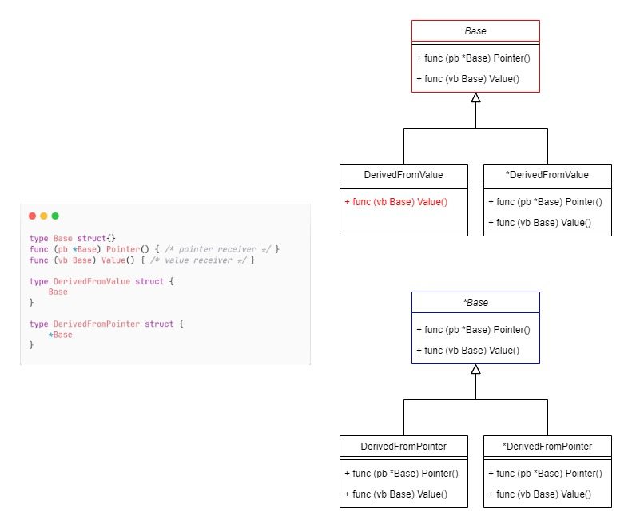

这里是golang拾遗系列的第三篇，前两篇可以点击此处链接跳转：

[golang拾遗：为什么我们需要泛型](./golang拾遗：为什么我们需要泛型.md)

[golang拾遗：指针和接口](./golang拾遗：指针和接口.md)

今天我们要讨论的是golang中的嵌入类型（embedding types），有时候也被叫做嵌入式字段（embedding fields）。

我们将会讨论为什么使用嵌入类型，以及嵌入类型的一些“坑”。

<blockquote id="bookmark">
  <h4>本文索引</h4>
  <ul>
    <li><a href="#%E4%BB%80%E4%B9%88%E6%98%AF%E5%B5%8C%E5%85%A5%E7%B1%BB%E5%9E%8B">什么是嵌入类型</a></li>
    <li>
      <a href="#%E5%B5%8C%E5%85%A5%E7%B1%BB%E5%9E%8B%E7%9A%84%E4%BD%BF%E7%94%A8">嵌入类型的使用</a>
      <ul>
        <li><a href="#%E5%B5%8C%E5%85%A5%E7%B1%BB%E5%9E%8B%E5%AD%97%E6%AE%B5%E5%BC%95%E7%94%A8">嵌入类型字段引用</a></li>
        <li><a href="#%E5%B5%8C%E5%85%A5%E7%B1%BB%E5%9E%8B%E7%9A%84%E5%88%9D%E5%A7%8B%E5%8C%96">嵌入类型的初始化</a></li>
      </ul>
    </li>
    <li>
      <a href="#%E5%B5%8C%E5%85%A5%E7%B1%BB%E5%9E%8B%E7%9A%84%E5%AD%97%E6%AE%B5%E6%8F%90%E5%8D%87">嵌入类型的字段提升</a>
      <ul>
        <li><a href="#%E4%BB%80%E4%B9%88%E6%98%AF%E5%AD%97%E6%AE%B5%E6%8F%90%E5%8D%87">什么是字段提升</a></li>
        <li><a href="#%E6%8F%90%E5%8D%87%E6%98%AF%E5%A6%82%E4%BD%95%E5%BD%B1%E5%93%8D%E5%AD%97%E6%AE%B5%E5%8F%AF%E8%A7%81%E6%80%A7%E7%9A%84">提升是如何影响字段可见性的</a></li>
        <li><a href="#%E6%8F%90%E5%8D%87%E6%98%AF%E5%A6%82%E4%BD%95%E5%BD%B1%E5%93%8D%E6%96%B9%E6%B3%95%E9%9B%86%E7%9A%84">提升是如何影响方法集的</a></li>
        <li><a href="#%E6%8F%90%E5%8D%87%E5%92%8C%E5%90%8D%E5%AD%97%E5%B1%8F%E8%94%BD">提升和名字屏蔽</a></li>
      </ul>
    </li>
    <li><a href="#%E6%80%BB%E7%BB%93">总结</a></li>
  </ul>
</blockquote>

## 什么是嵌入类型

鉴于可能有读者是第一次听说这个术语，所以容我花一分钟做个简短的解释，什么是嵌入类型。

首先参考以下代码：

```golang
type FileSystem struct {
    MetaData []byte
}

func (fs *FileSystem) Read() {}
func (fs *FileSystem) Write() {}

type NTFS struct {
    *FileSystem
}

type EXT4 struct {
    *FileSystem
}
```

我们有一个`FileSystem`类型作为对文件系统的抽象，其中包含了所有文件系统都会存在的元数据和读写文件的方法。接着我们基于此定义了Windows的NTFS文件系统和广泛应用于Linux系统中的EXT4文件系统。在这里的`*FileSystem`就是一个嵌入类型的字段。

一个更严谨的解释是：如果一个字段只含有字段类型而没有指定字段的名字，那么这个字段就是一个嵌入类型字段。

## 嵌入类型的使用

在深入了解嵌入类型之前，我们先来简单了解下如何使用嵌入类型字段。

### 嵌入类型字段引用

嵌入类型只有类型名而没有字段名，那么我们怎么引用它呢？

答案是嵌入类型字段的类型名会被当成该字段的名字。继续刚才的例子，如果我想要在`NTFS`中引用`FileSystem`的函数，则需要这样写：

```golang
type FileSystem struct {
    MetaData []byte
}

func (fs *FileSystem) Read() {}
func (fs *FileSystem) Write() {}

type NTFS struct {
    *FileSystem
}

// fs 是一个已经初始化了的NTFS实例
fs.FileSystem.Read()
```

要注意，指针的`*`只是类型修饰符，并不是类型名的一部分，所以对于形如`*Type`和`Type`的嵌入类型，我们都只能通过`Type`这个名字进行引用。

通过`Type`这个名字，我们不仅可以引用Type里的方法，还可以引用其中的数据字段：

```golang
type A struct {
    Age int
    Name string
}

type B struct {
    A
}

b := B{}
fmt.Println(b.A.Age, b.A.Name)
```

### 嵌入类型的初始化

在知道如何引用嵌入类型后我们想要初始化嵌入类型字段也就易如反掌了，嵌入类型字段只是普通的匿名字段，你可以放在类型的任意位置，也就是说嵌入类型可以不必作为类型的第一个字段：

```golang
type A struct {
    a int
    b int
}

type B struct {
    *A
    name string
}

type C struct {
    age int
    B
    address string
}
```

B和C都是合法的，如果想要初始化B和C，则只需要按字段出现的顺序给出相应的初始化值即可：

```golang
// 初始化B和C

b := &B{
    &A{1, 2},
    "B",
}

c := &C{
    30,
    B{
        &A{1, 2},
        "B in C",
    },
    "my address",
}
```

由于我们还可以使用对应的类型名来引用嵌入类型字段，所以初始化还可以写成这样：

```golang
// 使用字段名称初始化B和C

b := &B{
    A: &A{1, 2},
    name: "B",
}

c := &C{
    age: 30,
    B: B{
        A: &A{1, 2},
        name: "B in C",
    },
    address: "my address",
}
```

## 嵌入类型的字段提升

自所以会需要有嵌入类型，是因为golang并不支持传统意义上的继承，因此我们需要一种手段来把父类型的字段和方法“注入”到子类型中去。

所以嵌入类型就出现了。

然而如果我们只能通过类型名来引用字段，那么实际上的效果还不如使用一个具名字段来的方便。所以为了简化我们的代码，golang对嵌入类型添加了字段提升的特性。

### 什么是字段提升

假设我们有一个类型Base，它拥有一个Age字段和一个SayHello方法，现在我们把它嵌入进Derived类型中：

```golang
type Base struct {
    Age int
}

func (b *Base) SayHello() {
    fmt.Printf("Hello! I'm %v years old!", b.Age)
}

type Derived struct {
    Base
}

a := Derived{Base{30}}
fmt.Println(a.Age)
a.SayHello()
```

注意最后两行，a直接引用了Base里的字段和方法而无需给出Base的类型名，就像Age和SayHello是Derived自己的字段和方法一样，这就叫做“提升”。

### 提升是如何影响字段可见性的

我们都知道在golang中小写英文字母开头的字段和方法是*包*私有的，而大写字母开头的是可以在任意地方被访问的。

之所以要强调包私有，是因为有以下的代码：

```golang
package main

import "fmt"

type a struct {
    age int
    name string
}

type data struct {
    obj a
}

func (d *data) Print() {
    fmt.Println(d.obj.age, d.obj.name)
}

func main(){
    d := data{a{30, "hello"}}
    d.Print() // 30 hello
}
```

在同一个包中的类型可以任意操作其他类型的字段，包括那些出口的和不出口的，所以在golang中私有是package级别的。

为什么要提这一点呢？因为这一规则会影响我们的嵌入类型。考虑以下下面的代码能不能通过编译，假设我们有一个叫`a`的go module：

```golang
// package b 位于a/b目录下
package b

import "fmt"

type Base struct {
	A int
	b int
}

func (b *Base) f() {
	fmt.Println("from Base f")
}

// package main
package main

import (
	"a/b"
)

type Derived struct {
	*b.Base
}

func main() {
    obj := Derived{&b.Base{}}
    obj.f()
}
```

答案是不能，会收到这样的错误：`obj.f undefined (type Derived has no field or method f)`。

同样，如果我们想以`obj.b`的方式进行字段访问也会报出一样的错误。

那如果我们通过嵌入类型字段的字段名进行引用呢？比如改成`obj.Base.f()`。那么我们会收获下面的报错：`obj.Base.f undefined (cannot refer to unexported field or method b.(*Base).f)`。

因为Base在`package b`中，而我们的Derived在`package main`中，所以我们的Derived只能获得在`package main`中可以访问到的字段和方法，也就是那些从`package b`中出口的字段和方法。因此这里的Base的`f`在`package b`以外是访问不到的。

当我们把Base移动到`package main`之后，就不会出现上面的问题了，因为前面说过，同一个包里的东西是彼此互相公开的。

最后关于可见性还有一个有意思的问题：嵌入字段本身受可见性影响吗？

考虑如下代码：

```golang
package b

type animal struct {
    Name string
}

type Dog struct {
    animal
}

package main

import "b"

func main() {
    dog1 := b.Dog{} // 1
    dog2 := b.Dog{b.animal{"wangwang"}} // 2
    dog1.Name = "wangwang" // 3
}
```

猜猜哪行会报错？

答案是2。有可能你会觉得3应该也会报错的，毕竟如果2不行的话那么实际上代表着我们在main里应该也不能访问到animals的Name才对，因为正常情况下首先我们要能访问animal，其次才能访问到它的Name字段。

然而你错了，决定方法提升的是具体的类型在哪定义的，而不是在哪里被调用的，因为`Dog`和`animal`在同一个包里，所以它会获得所有animal的字段和方法，而其中可以被当前包以外访问的字段和方法自然可以在我们的main里被使用。

当然，这里只是例子，在实际开发中我不推荐在非出口类型中定义可公开访问的字段，这显然是一种破坏访问控制的反模式。

### 提升是如何影响方法集的

方法集（method sets）是一个类型的实例可调用的方法的集合，在golang中一个类型的方法可以分为指针接收器和值接收器两种：

```golang
func (v type) ValueReceiverMethod() {}
func (p *type) PointerReceiverMethod() {}
```

而类型的实例也分为两类，普通的类型值和指向类型值的指针。假设我们有一个类型T，那么方法集的规律如下：

- 假设obj的类型是`T`，则obj的方法集包含接收器是`T`的所有方法
- 假设obj是`*T`，则obj的方法集包含接收器是`T`和`*T`的所以方法

这是来自golang language spec的定义，然而直觉告诉我们还有点小问题，因为我们使用的obj是值的时候通常也可以调用接收器是指针的方法啊？

这是因为在一个为值类型的变量调用接收器的指针类型的方法时，golang会进行对该变量的取地址操作，从而产生出一个指针，之后再用这个指针调用方法。前提是这个变量要能取地址。如果不能取地址，比如传入interface（非整数数字传入interface会导致值被复制一遍）时的值是不可取地址的，这时候就会忠实地反应方法集的确定规律：

```golang
package main

import "fmt"

type i interface {
    method()
}

type a struct{}
func (_ *a) method() {}

type b struct{}
func (_ b) method() {}

func main() {
    var o1 i = a{} // a does not implement i (method method has pointer receiver)
    var o2 i = b{}
    fmt.Println(o1, o2)
}
```

那么同样的规律是否影响嵌入类型呢？因为嵌入类型也分为指针和值。答案是规律和普通变量一样。

我们可以写一个程序简单验证下：

```golang
package main

import (
	"fmt"
)

type Base struct {
	A int
	b int
}

func (b *Base) PointerMethod() {}
func (b Base) ValueMethod()    {}

type DerivedWithPointer struct {
	*Base
}

type DerivedWithValue struct {
	Base
}

type checkAll interface {
	ValueMethod()
	PointerMethod()
}

type checkValueMethod interface {
	ValueMethod()
}

type checkPointerMethod interface {
	PointerMethod()
}

func main() {
	var obj1 checkAll = &DerivedWithPointer{&Base{}}
	var obj2 checkPointerMethod = &DerivedWithPointer{&Base{}}
	var obj3 checkValueMethod = &DerivedWithPointer{&Base{}}
	var obj4 checkAll = DerivedWithPointer{&Base{}}
	var obj5 checkPointerMethod = DerivedWithPointer{&Base{}}
	var obj6 checkValueMethod = DerivedWithPointer{&Base{}}
	fmt.Println(obj1, obj2, obj3, obj4, obj5, obj6)

	var obj7 checkAll = &DerivedWithValue{}
	var obj8 checkPointerMethod = &DerivedWithValue{}
	var obj9 checkValueMethod = &DerivedWithValue{}
	fmt.Println(obj7, obj8, obj9)

	var obj10 checkAll = DerivedWithValue{} // error
	var obj11 checkPointerMethod = DerivedWithValue{} // error
	var obj12 checkValueMethod = DerivedWithValue{}
	fmt.Println(obj10, obj11, obj12)
}
```

如果编译代码则会得到下面的报错：

```text
# command-line-arguments
./method.go:50:6: cannot use DerivedWithValue literal (type DerivedWithValue) as type checkAll in assignment:
        DerivedWithValue does not implement checkAll (PointerMethod method has pointer receiver)
./method.go:51:6: cannot use DerivedWithValue literal (type DerivedWithValue) as type checkPointerMethod in assignment:
        DerivedWithValue does not implement checkPointerMethod (PointerMethod method has pointer receiver)
```

总结起来和变量那里的差不多，都是车轱辘话，所以我总结了一张图：



注意红色标出的部分。这是你会在嵌入类型中遇到的第一个坑，所以在选择使用值类型嵌入还是指针类型嵌入的时候需要小心谨慎。

### 提升和名字屏蔽

最后也是最重要的一点当嵌入类型和当前类型有同名的字段或方法时会发生什么？

答案是当前类型的字段或者方法会屏蔽嵌入类型的字段或方法。这就是名字屏蔽。

给一个具体的例子：

```golang
package main

import (
	"fmt"
)

type Base struct {
	Name string
}

func (b Base) Print() {
	fmt.Println("Base::Print", b.Name)
}

type Derived struct {
	Base
	Name string
}

func (d Derived) Print() {
	fmt.Println("Derived::Print", d.Name)
}

func main() {
	obj := Derived{Base: Base{"base"}, Name: "derived"}
	obj.Print() // Derived::Print derived
}
```

在这里Derived中同名的`Name`和`Print`屏蔽了Base中的字段和方法。

如果我们需要访问Base里的字段和方法呢？只需要把Base当成一个普通字段使用即可：

```golang
func (d Derived) Print() {
    d.Base.Print()
	fmt.Println("Derived::Print", d.Name)
}

func main() {
	obj := Derived{Base: Base{"base"}, Name: "derived"}
    obj.Print() 
    // Output:
    // Base::Print base
    // Derived::Print derived
}
```

同过嵌入类型字段的字段名访问的方法，其接收器是对于的嵌入类型，而不是当前类型，这也是为什么可以访问到`Base.Name`的原因。

如果我们的`Derived.Print`的签名和Base的不同，屏蔽也会发生。

还有另外一种情况，当我们有多个嵌入类型，且他们均有相同名字的成员时，会发生什么？

下面我们改进以下前面的例子：

```golang
type Base1 struct {
	Name string
}

func (b Base1) Print() {
	fmt.Println("Base1::Print", b.Name)
}

type Base2 struct {
	Name string
}

func (b Base2) Print() {
	fmt.Println("Base2::Print", b.Name)
}

type Derived struct {
	Base1
	Base2
	Name string
}

func (d Derived) Print() {
	d.Base1.Print()
	fmt.Println("Derived::Print", d.Name)
}

func main() {
	obj := Derived{Base1: Base1{"base1"}, Base2: Base2{"base2"}, Name: "derived"}
	obj.Print()
}
```

这样仍然能正常编译运行，所以我们再加点料，把Derived的Print注释掉，接着就会得到下面的错误：

```text
# command-line-arguments
./method.go:36:5: ambiguous selector obj.Print
```

如果我们再把Derived的Name也注释掉，那么报错会变成下面这样：

```text
# command-line-arguments
./method.go:37:17: ambiguous selector obj.Name
```

在没有发生屏蔽的情况下，Base1和Base2的Print和Name都提升到了Derived的字段和方法集里，所以在调用时发生了二义性错误。

要解决问题，加上嵌入类型字段的字段名即可：

```golang
func main() {
	obj := Derived{Base1: Base1{"base1"}, Base2: Base2{"base2"}}
	obj.Base1.Print()
    fmt.Println(obj.Base2.Name)
    // Output:
    // Base1::Print base1
    // base2
}
```

这也是嵌入类型带来的第二个坑，所以一个更有用的建议是最好不要让多个嵌入类型包含同名字段或方法。

## 总结

至此我们已经说完了嵌入类型的相关知识。

通过嵌入类型我们可以模仿传统oop中的继承，然而嵌入毕竟不是继承，还有许多细微的差异。

而在本文中还有一点没有被提及，那就是interface作为嵌入类型，因为嵌入类型字段只需要给出一个类型名，而我们的接口本身也是一个类型，所以可以作为嵌入类型也是顺理成章的。使用接口做为嵌入类型有不少值得探讨的内容，我会在下一篇中详细讨论。

##### 参考

<https://golang.org/ref/spec#Method_sets>
