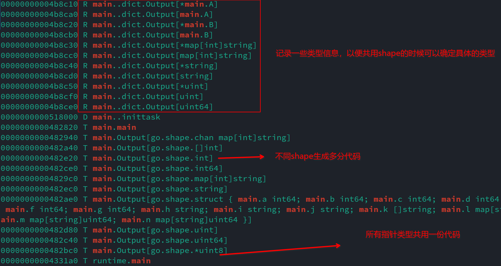
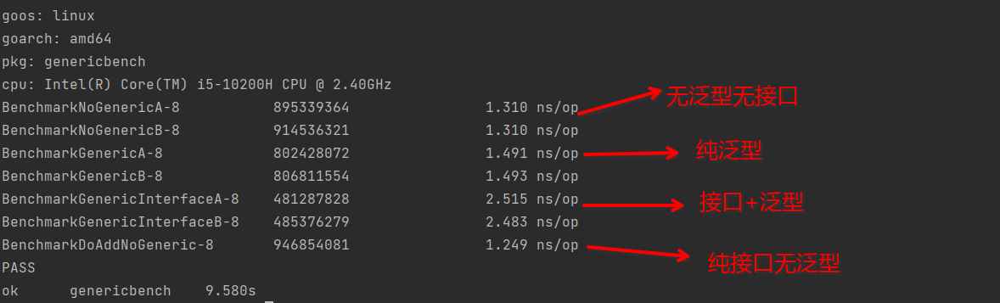
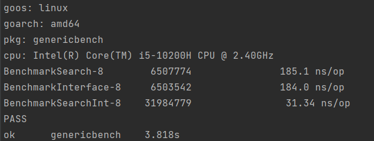
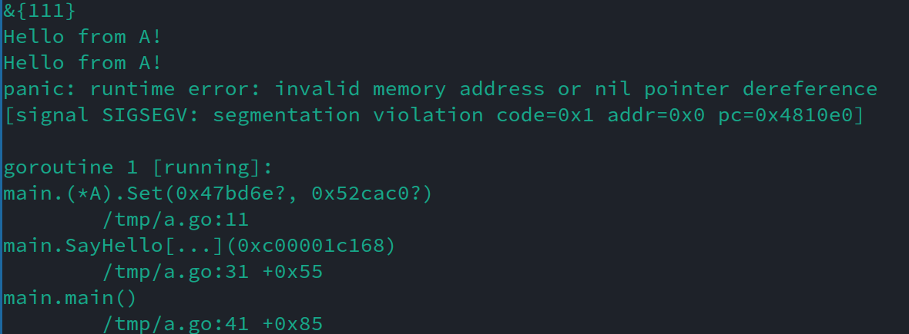

golang的泛型已经出来了一年多了，从提案被接受开始我就在关注泛型了，如今不管是在生产环境还是开源项目里我都写了不少泛型代码，是时候全面得回顾下golang泛型的使用体验了。

先说说结论，好用是好用，但问题也很多，有些问题比较影响使用体验，到了不吐不快的地步了。

这篇文章不会教你泛型的基础语法，并且要求你对golang的泛型使用有一定经验，如果你还是个泛型的新手，可以先阅读下官方的教程，然后再阅读本篇文章。

## 泛型的实现

实现泛型有很多种方法，常见的主流的是下面这些：

1. 以c++为代表的，类型参数就是个占位符，最后实际上会替换成实际类型，然后以此为模板生成实际的代码，生成多份代码，每份的类型都不一样
2. 以TypeScript和Java为代表的类型擦除，把类型参数泛化成一个满足类型约束的类型（Object或者某个interface），只生成一份代码
3. 以c#为代表，代码里表现的像类型擦除，但运行的时候实际上和c++一样采用模板实例化对每个不同的类型都生成一份代码

那么golang用的哪种呢？哪种都不是，golang有自己的想法：`gcshape`。

什么是`gcshape`？简单得说，所有拥有相同undelyring type的类型都算同一种`shape`，所有的指针都算一种`shape`，除此之外就算两个类型大小相同甚至字段的类型相同也不算同一个`shape`。

那么这个`shape`又是什么呢？gc编译器会根据每个shape生成一份代码，拥有相同shape的类型会共用同一份代码。

看个简单例子：

```golang
func Output[T any]() {
	var t T
	fmt.Printf("%#v\n", t)
}

type A struct {
	a,b,c,d,e,f,g int64
	h,i,j string
	k []string
	l, m, n map[string]uint64
}

type B A

func main() {
	Output[string]()
	Output[int]()
	Output[uint]()
	Output[int64]()
	Output[uint64]() // 上面每个都underlying type都不同，尽管int64和uint64大小一样，所以生成5份不同的代码
	Output[*string]()
	Output[*int]()
	Output[*uint]()
	Output[*A]() // 所有指针都是同一个shape，所以共用一份代码
	Output[A]()
	Output[*B]()
	Output[B]() // B的underlying tyoe和A一样，所以和A共用代码
	Output[[]int]()
	Output[*[]int]()
	Output[map[int]string]()
	Output[*map[int]string]()
	Output[chan map[int]string]()
}
```

验证也很简单，看看符号表即可：



为啥要这么做？按提案的说法，这么做是为了避免代码膨胀同时减轻gc的负担，看着是有那么点道理，有相同shape的内存布局是一样的，gc处理起来也更简单，生成的代码也确实减少了——如果我就是不用指针那生成的代码其实也没少多少。

尽管官方拿不出证据证明gcshape有什么性能优势，我们还是姑且认可它的动机吧。但这么实现泛型后导致了很多严重的问题：

1. 性能不升反降
2. 正常来说类型参数是可以当成普通的类型来用的，但golang里有很多时候不能

正因为有了gcshape，想在golang里用对泛型还挺难的。

## 性能问题

这一节先说说性能。看个例子：

```golang
type A struct {
	num  uint64
	num1 int64
}

func (a *A) Add() {
	a.num++
	a.num1 = int64(a.num / 2)
}

type B struct {
	num1 uint64
	num2 int64
}

func (b *B) Add() {
	b.num1++
	b.num2 = int64(b.num1 / 2)
}

type Adder interface {
	Add()
}

func DoAdd[T Adder](t T) {
	t.Add()
}

func DoAddNoGeneric(a Adder) {
	a.Add()
}

func BenchmarkNoGenericA(b *testing.B) {
	obj := &A{}
	for i := 0; i < b.N; i++ {
		obj.Add()
	}
}

func BenchmarkNoGenericB(b *testing.B) {
	obj := &B{}
	for i := 0; i < b.N; i++ {
		obj.Add()
	}
}

func BenchmarkGenericA(b *testing.B) {
	obj := &A{}
	for i := 0; i < b.N; i++ {
		DoAdd(obj)
	}
}

func BenchmarkGenericB(b *testing.B) {
	obj := &B{}
	for i := 0; i < b.N; i++ {
		DoAdd(obj)
	}
}

func BenchmarkGenericInterfaceA(b *testing.B) {
	var obj Adder = &A{}
	for i := 0; i < b.N; i++ {
		DoAdd(obj)
	}
}

func BenchmarkGenericInterfaceB(b *testing.B) {
	var obj Adder = &B{}
	for i := 0; i < b.N; i++ {
		DoAdd(obj)
	}
}

func BenchmarkDoAddNoGeneric(b *testing.B) {
	var obj Adder = &A{}
	for i := 0; i < b.N; i++ {
		DoAddNoGeneric(obj)
	}
}
```

猜猜结果，是不是觉得引入了泛型可以解决很多性能问题？答案揭晓：



哈哈，纯泛型和正常代码比有不到10%的差异，而接口+泛型就慢了接近100%。直接用接口是这里最快的，不过这是因为接口被编译器优化了，原因参加[这篇](./golang拾遗：指针和接口.md)。

你说谁会这么写代码啊，没事，我再举个更常见的例子：

```golang
func Search[T Equaler[T]](slice []T, target T) int {
	index := -1
	for i := range slice {
		if slice[i].Equal(target) {
			index = i
		}
	}
	return index
}

type MyInt int

func (m MyInt) Equal(rhs MyInt) bool {
	return int(m) == int(rhs)
}

type Equaler[T any] interface {
	Equal(T) bool
}

func SearchMyInt(slice []MyInt, target MyInt) int {
	index := -1
	for i := range slice {
		if slice[i].Equal(target) {
			index = i
		}
	}
	return index
}

func SearchInterface(slice []Equaler[MyInt], target MyInt) int {
	index := -1
	for i := range slice {
		if slice[i].Equal(target) {
			index = i
		}
	}
	return index
}

var slice []MyInt
var interfaces []Equaler[MyInt]

func init() {
	slice = make([]MyInt, 100)
	interfaces = make([]Equaler[MyInt], 100)
	for i := 0; i < 100; i++ {
		slice[i] = MyInt(i*i + 1)
		interfaces[i] = slice[i]
	}
}

func BenchmarkSearch(b *testing.B) {
	for i := 0; i < b.N; i++ {
		Search(slice, 99*99)
	}
}

func BenchmarkInterface(b *testing.B) {
	for i := 0; i < b.N; i++ {
		SearchInterface(interfaces, 99*99)
	}
}

func BenchmarkSearchInt(b *testing.B) {
	for i := 0; i < b.N; i++ {
		SearchMyInt(slice, 99*99)
	}
}
```

这是结果：



泛型代码和使用接口的代码相差无几，**比普通代码慢了整整六倍**！

为啥？因为gcshape的实现方式导致了类型参数`T`并不是真正的类型，所以在调用上面的方法的时候得查找一个叫`type dict`的东西找到当前使用的真正的类型，然后再把绑定在T上的变量转换成那个类型。多了一次查找+转换，这里的`MyInt`转换后还会被复制一次，所以能不慢么。

这也解释了为什么把接口传递给类型参数是最慢的，因为除了要查一次`type dict`，接口本身还得再做一次类型检查并查找对应的method。

所以想靠泛型大幅提升性能的人还是洗洗睡吧，只有一种情况泛型的性能不会更差：在类型参数上只使用内置的运算符比如加减乘除，不调用任何方法。

但也不该因噎废食，首先泛型struct和泛型interface受到的影响很小，其次如我所说，如果不使用类型约束上的方法，那性能损耗几乎没有，所以像lo、mo这样的工具库还是能放心用的。

这个问题1.18就有人提出来了，然而gcshape的实现在这点上太拉胯，小修小补解决不了问题，官方也没改进的动力，所以哪怕到了1.21还是能复现同样的问题。

不过噩梦才刚刚开始，更劲爆的还在后面呢。

## 如何创建对象

首先你不能这么写：`T{}`，因为int之类的内置类型不支持这么做。也不能这样：`make(T, 0)`，因为T不是类型占位符，不知道具体类型是什么，万一是不能用make的类型编译会报错。

那么对于一个类型`T`，想要在泛型函数里创建一个它的实例就只能这样了：

```golang
func F[T any]() T {
    var ret T
    // 如果需要指针，可以用new(T)，但有注意事项，下面会说
    return ret
}
```

So far, so good。那么我要把T的类型约束换成一个有方法的interface呢？

```golang
type A struct {i int}

func (*A)Hello() {
	fmt.Println("Hello from A!")
}
func (a *A) Set(i int) {
	a.i = i
}

type B struct{i int}
func (*B)Hello(){
	fmt.Println("Hello from B!")
}
func (b *B) Set(i int) {
	b.i = i
}

type API interface {
	Hello()
	Set(int)
}

func SayHello[PT API](a PT) {
	a.Hello()
	var b PT
	b.Hello()
	b.Set(222222)
	fmt.Println(a, b)
}

func main() {
	a := new(A)
	a.Set(111)
	fmt.Println(a)
	SayHello(&A{})
	SayHello(&B{})
}
```

运行结果是啥？啥都不是，运行时会奖励你一个大大的panic：



你懵了，如果T的约束是any的时候就是好的，虽然不能调用方法，怎么到这调Set就空指针错误了呢？

这就是我要说的第二点严重问题了，类型参数不是你期待的那种int，MyInt那种类型，类型参数有自己独有的类型，叫`type parameter`。有兴趣可以去看语言规范里的定义，没兴趣就这么简单粗暴的理解也够了：**这就是种会编译期间进行检查的interface**。

理解了这点你的问题就迎刃而解了，因为它类似下面的代码：

```golang
var a API
a.Set(1)
```

a没绑定任何东西，那么调Set百分百空指针错误。同理，`SayHello`里的`b`也没绑定任何数据，一样会空指针错误。为什么`b.Hello()`调成功了，因为这个方法里没对接收器的指针解引用。

同样`new(T)`这个时候是创建了一个`type parameter`的指针，和原类型的关系就更远了。

但对于像这样`~int`、`[]int`的有明确的core type的约束，编译器又是双标的，可以正常创建实例变量。

怎么解决？没法解决，当然不排除是我不会用golang的泛型，如果你知道在不使用unsafe或者给T添加创建实例的新方法的前提下满足需求的解法，欢迎告诉我。

目前为止这还不是大问题，一般不需要在泛型代码里创建实例，大部分需要的情况也可以在函数外创建后传入。而且golang本身没有构造函数的概念，怎么创建类型的实例并不是类型的一部分，这点上不支持还是可以理解的。

但下面这个问题就很难找到合理的借口了。

## 把指针传递给类型参数

最佳实践：永远不要把指针类型作为类型参数，就像永远不要获取interface的指针一样。

为啥，看看下面的例子就行：

```golang
func Set[T *int|*uint](ptr T) {
	*ptr = 1
}

func main() {
	i := 0
	j := uint(0)
	Set(&i)
	Set(&j)
	fmt.Println(i, j)
}
```

输出是啥，是编译错误：

```bash
$ go build a.go

# command-line-arguments
./a.go:6:3: invalid operation: pointers of ptr (variable of type T constrained by *int | *uint) must have identical base types
```

这个意思是T不是指针类型，没法解引用。猜都不用猜，肯定又是`type parameter`作怪了。

是的。T是`type parameter`，而`type parameter`不是指针，不支持解引用操作。

不过比起前一个问题，这个是有解决办法的，而且办法很多，第一种，明确表明ptr是个指针：

```golang
func Set[T int|uint](ptr *T) {
	*ptr = 1
}
```

第二种，投机取巧：

```golang
func Set[T int|uint, PT interface{*T}](ptr PT) {
	*ptr = 1
}
```

第二种为什么行，因为在类型约束里如果T的约束有具体的core type（包括any），那么在这里就会被当成实际的类型用而不是`type parameter`。所以PT代表的意思是“有一个类型，它必须是T代表的实际类型的指针类型”。因为PT是指针类型了，所以第二种方法也可以达到目的。

**但我永远只推荐你用第一种方法，别给自己找麻烦**。

## 泛型和类型的方法集

先看一段代码：

```golang
type A struct {i int}

func (*A)Hello() {
	fmt.Println("Hello from A!")
}

type B struct{i int}
func (*B)Hello(){
	fmt.Println("Hello from B!")
}

func SayHello[T ~*A|~*B](a T) {
	a.Hello()
}

func main() {
	SayHello(&A{})
	SayHello(&B{})
}
```

输出是啥？又是编译错误：

```bash
$ go build a.go

# command-line-arguments
./a.go:17:4: a.Hello undefined (type T has no field or method Hello)
```

你猜到了，因为T是类型参数，而不是(*A)，所以没有对应的方法存在。所以你这么改了：

```golang
func SayHello[T A|B](a *T) {
	a.Hello()
}
```

这时候输出又变了：

```bash
$ go build a.go

# command-line-arguments
./a.go:17:4: a.Hello undefined (type *T is pointer to type parameter, not type parameter)
```

这个报错好像挺眼熟啊，这不就是取了interface的指针之后在指针上调用方法时报的[那个错](./golang拾遗：指针和接口.md#指向interface的指针)吗？

对，两个错误都差不多，因为type parameter有自己的数据结构，而它没有任何方法，所以通过指针指向type parameter后再调用方法会报一模一样的错。

难道我们只能建个interface里面放上Hello这个方法了吗？虽然我推荐你这么做，但还有别的办法，我们可以利用上一节的PT，但需要给它加点method：

```golang
func SayHello[T A|B, PT interface{*T; Hello()}](a PT) {
	a.Hello()
}
```

原理是一样的，但现在a还同时支持指针的操作。

直接用`interface{Hello()}`不好吗？绝大部分时间都可以，但如果我只想限定死某些类型的话就不适用了。

## 如何复制一个对象

大部分情况下直接`b := a`即可，不过要注意这是浅拷贝。

对于指针就比较复杂了，因为type parameter的存在，我们得特殊处理：

```golang
type A struct {i int}

func (*A)Hello() {
	fmt.Println("Hello from A!")
}
func (a *A) Set(i int) {
	a.i = i
}

type B struct{i int/*j*/}
func (*B)Hello(){
	fmt.Println("Hello from B!")
}
func (b *B) Set(i int) {
	b.i = i
}

type API[T any] interface {
	*T
	Set(int)
}

func DoCopy[T any, PT API[T]](a PT) {
	b := *a
	(PT(&b)).Set(222222) // 依旧是浅拷贝
	fmt.Println(a, b)
}
```

PT是指针类型，所以可以解引用得到T的值，然后再赋值给b，完成了一次浅拷贝。

注意，拷贝出来的b是T类型的，得先转成`*T`再转成`PT`。

想深拷贝怎么办，那只能定义和实现这样的接口了：`CloneAble[T any] interface{Clone() T}`。这倒也没那么不合理，为了避免浅拷贝问题一般也需要提供一个可以复制自身的方法，算是顺势而为吧。

## 总结

目前我遇到的槽点就是这些，其中大部分是和指针相关的，如果你用泛型+interface也很容易遇到类似的问题，还要外加一个性能问题。

一些最佳实践：

1. 明确使用`*T`，而不是让`T`代表指针类型
2. 明确使用`[]T`和`map[T1]T2`，而不是让`T`代表slice或map
3. 少写泛型函数，可以多用泛型struct
4. 类型约束的core type直接影响被约束的类型可以执行哪些操作，要当心

如果是c++，那不会有这些问题，因为类型参数是占位符，会被替换成真实的类型；如果是ts，java也不会有这些问题，因为它们没有指针的概念；如果是c#，也不会有问题，至少在8.0的时候编译器不允许构造类似`T*`的东西，如果你这么写，会有清晰明确的错误信息。

而我们的golang呢？虽然不支持，但给的报错却是一个代码一个样，对golang的类型系统和泛型实现细节没点了解还真不知道该怎么处理呢。

我的建议是，在golang想办法改进这些问题之前，只用别人写的泛型库，只用泛型处理slice和map。其他的杂技我们就别玩了，容易摔着。
