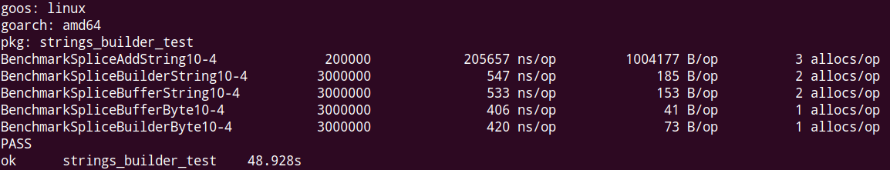

常用拼接方法

字符串拼接在日常开发中是很常见的需求，目前有两种普遍做法：

一种是直接用 += 来拼接

```golang
s1 := "Hello"
s2 := "World"
s3 := s1 + s2  // s3 == "HelloWorld"
s1 += s2       // s1 == "HelloWorld"
```

这是最常用也是最简单直观的方法，不过简单是有代价的，golang的字符串是不可变类型，也就是说每一次对字符串的“原地”修改都会重新生成一个string，再把数据复制进去，这样一来将会产生很可观的性能开销，稍后的性能测试中将会看到这一点。

第二种是使用`bytes.Buffer`:

```golang
// bytes.Buffer的0值可以直接使用
var buff bytes.Buffer

// 向buff中写入字符/字符串
buff.Write([]byte("Hello"))
buff.WriteByte(' ')
buff.WriteString("World")

// String() 方法获得拼接的字符串
buff.String() // "Hello World"
```

这种方法用于需要大量进行字符串拼接操作的场合，性能要大大优于第一种方法。

不过使用`bytes`模块来操作`string`难免让人产生迷惑，所以在go1.10中新增了第三种方法：`strings.Builder`，官方鼓励尽量在string的拼接时使用Builder，byte拼接时使用Buffer

```golang
// strings.Builder的0值可以直接使用
var builder strings.Builder

// 向builder中写入字符/字符串
builder.Write([]byte("Hello"))
builder.WriteByte(' ')
builder.WriteString("World")

// String() 方法获得拼接的字符串
builder.String() // "Hello World"
```

从上面的代码中可以看到，`strings.Builder`和`bytes.Buffer`的操作几乎一样，不过`strings.Builder`仅仅实现了`write`类方法，而`Buffer`是可读可写的。

所以`strings.Builder`仅用于拼接/构建字符串

性能

除了是否易用外，另一条参考标准就是性能，得益于golang自带的测试工具，我们可以大致对比一下三种方案的性能。

测试使用从26个大写和小写字母10个数字以及5个常用符号共67字符中随机取10个组成`string`或`[]byte`，再由`Buffer`和`Builder`进行拼接。

先上测试结果

```bash
go test -bench=. -benchmem
```



下面是测试代码

```golang
// BenchmarkSpliceAddString10 测试使用 += 拼接N次长度为10的字符串
func BenchmarkSpliceAddString10(b *testing.B) {
    s := ""
    for i := 0; i < b.N; i++ {
        s += GenRandString(10)
    }
}

// BenchmarkSpliceBuilderString10 测试使用strings.Builder拼接N次长度为10的字符串
func BenchmarkSpliceBuilderString10(b *testing.B) {
    var builder strings.Builder
    for i := 0; i < b.N; i++ {
        builder.WriteString(GenRandString(10))
    }
}

// BenchmarkSpliceBufferString10 测试使用bytes.Buffer拼接N次长度为10的字符串
func BenchmarkSpliceBufferString10(b *testing.B) {
    var buff bytes.Buffer
    for i := 0; i < b.N; i++ {
        buff.WriteString(GenRandString(10))
    }
}

// BenchmarkSpliceBufferByte10 测试使用bytes.Buffer拼接N次长度为10的\[\]byte
func BenchmarkSpliceBufferByte10(b *testing.B) {
    var buff bytes.Buffer
    for i := 0; i < b.N; i++ {
        buff.Write(GenRandBytes(10))
    }
}

// BenchmarkSpliceBuilderByte10 测试使用string.Builder拼接N次长度为10的\[\]byte
func BenchmarkSpliceBuilderByte10(b *testing.B) {
    var builder strings.Builder
    for i := 0; i < b.N; i++ {
        builder.Write(GenRandBytes(10))
    }
}
```

这是生成供拼接使用的随机字符串的代码（这里仍然使用了`bytes.Buffer`，推荐使用新的`strings.Builder`）

```golang
const (
    data = "abcdefghijklmnopqrstuvwxyzABCDEFGHIJKLMNOPQRSTUVWXYZ1234567890,.-=/"
)

func init() {
    rand.Seed(time.Now().Unix()) // 设置随机种子
}

// GenRandString 生成n个随机字符的string
func GenRandString(n int) string {
    max := len(data)
    var buf bytes.Buffer
    for i := 0; i < n; i++ {
        buf.WriteByte(data[rand.Intn(max)])
    }

    return buf.String()
}

// GenRandBytes 生成n个随机字符的\[\]byte
func GenRandBytes(n int) []byte {
    max := len(data)
    buf := make([]byte, n)
    for i := 0; i < n; i++ {
        buf[i] = data[rand.Intn(max)]
    }

    return buf
}
```

使用 `+=` 的方法性能是最慢的，性能和其他两种差了好几个数量级。

Buffer和Builder性能相差无几，Builder在内存的使用上要略优于`Buffer`

结论

`strings.Builder`在golang 1.10才引入标准库的，所以 version <= 1.9 的时候对于大量字符串的拼接操作推荐`bytes.Buffer`

如果你正在使用1.10+，那么建议使用`strings.Builder`，不仅是更好的性能，也是为了能使代码更清晰。

当然，对于简单的拼接，`+=` 就足够了
