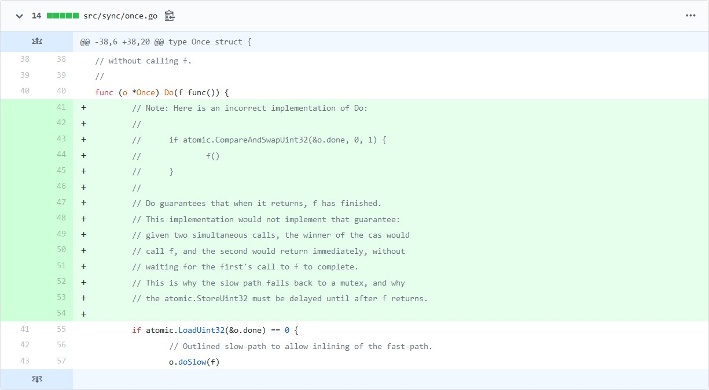

这几天我翻了翻golang的提交记录，发现了一条很有意思的提交：[bc593ea](https://github.com/golang/go/commit/bc593eac2dc63d979a575eccb16c7369a5ff81e0)，这个提交看似简单，但是引人深思。

## commit讲了什么

commit的标题是“sync: document implementation of Once.Do”，显然是对文档做些补充，然而奇怪的是为什么要对某个功能的实现做文档说明呢，难道不是配合代码+注释就能理解的吗？

根据commit的描述我们得知，Once.Do的实现问题在过去几个月内被问了至少两次，所以官方决定澄清：

> It's not correct to use atomic.CompareAndSwap to implement Once.Do,
> and we don't, but why we don't is a question that has come up
> twice on golang-dev in the past few months.
> Add a comment to help others with the same question.

不过这不是这个commit的精髓，真正有趣的部分是添加的那几行注释。

## 有趣的疑问

commit添加的内容如下：



乍一看可能平平无奇，然而仔细思考过后，我们就会发现问题了。

众所周知，`sync.Once`用于保证某个操作只会执行一次，因此我们首先考虑到的就是为了并发安全加mutex，但是once对性能有一定要求，所以我们选用原子操作。

这时候`atomic.CompareAndSwapUint32`很自然的就会浮现在脑海里，而下面的结构也很自然的就给出了：

```golang
func (o *Once) Do(f func()) {
    if atomic.CompareAndSwapUint32(&o.done, 0, 1) {
        f()
    }
}
```

然而正是这种自然联想的方案却是官方否定的，为什么？

原因很简单，举个例子，我们有一个模块，使用模块里的方法前需要初始化，否则会报错：

module.go:

```golang
package module

var flag = true

func InitModule() {
    // 这个初始化模块的方法不可以调用两次以上，以便于结合sync.Once使用
    if !flag {
        panic("call InitModule twice")
    }

    flag = false
}

func F() {
    if flag {
        panic("call F without InitModule")
    }
}
```

main.go:

```golang
package main

import (
    "module"
    "sync"
    "time"
)

var o = &sync.Once{}

func DoSomeWork() {
    o.Do(module.InitModule()) // 不能多次初始化，所以要用once
    module.F()
}

func main() {
    go DoSomeWork() // goroutine1
    go DoSomeWork() // goroutine2
    time.Sleep(time.Second * 10)
}
```

现在不管goroutine1还是goroutine2后运行，`module`都能被正确初始化，对于`F`的调用也不会panic，但我们不能忽略一种更常见的情况：两个goroutine同时运行会发生什么？

我们列举其中一种情况：

1. goroutine1先运行，这时如果按我们所想的once实现，CAS操作成功，`InitModule`开始执行
2. 这时goroutine2也在运行，但CAS因为别的routine操作成功，这里返回失败，`InitModule`执行被跳过
3. Once.Do返回就意味着我们需要的操作已经被执行，这时goroutine2开始执行`F()`
4. 但是我们的`InitModule`在goroutine1中因为某些原因没执行完，所以我们不能调用`F`
5. 于是问题发生了

你可能已经看出问题了，我们没有等到被调用函数执行完就返回了，导致了其他goroutine获得了一个不完整的初始化状态。

解决起来也很简单：

1. 我们先判断执行标志，如果已经执行过就直接返回
2. 因为是判断执行标志而不修改，就会有多个routine同时判断位true的情况，我们用mutex原子化对被调用函数`f`的操作
3. 获得mutex之后先检查执行标志，以免重复执行
4. 接着调用`f`
5. 然后我们把执行标志设置为1
6. 最后解除mutex，当其他进入判断的routine重复上述过程时就能保证`f`只会被调用一次了

这是代码：

```golang
func (o *Once) Do(f func()) {
    if atomic.LoadUint32(&o.done) == 0 {
        // Outlined slow-path to allow inlining of the fast-path.
        o.doSlow(f)
    }
}

func (o *Once) doSlow(f func()) {
    o.m.Lock()
    defer o.m.Unlock()
    if o.done == 0 {
        defer atomic.StoreUint32(&o.done, 1)
        f()
    }
}
```

## 结束语

从这个问题我们可以看到，并发编程其实并不难，我们给出的解决方案是相当简单的，然而难的在于如何全面的思考并发中会遇到的问题从而编写并发安全的代码。

golang的这个commit给了我们一个很好的例子，同时也是一个很好的启发。
