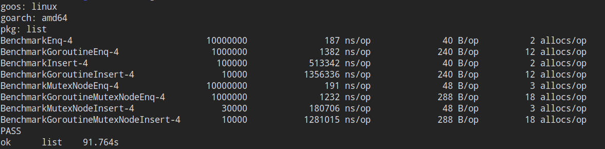

多核处理器日益普及的现在很多代码都得和并发/并行打交道，对于内置了并发支持（goroutine）的golang来说并发编程是必不可少的一环。

链表是我们再熟悉不过的数据结构，在并发编程中我们也时长需要用到，今天我们就来看两种带锁的并发安全的单项链表。

## 方案一：粗粒度锁，完全锁住链表

方案一的做法是将所有操作用锁——Mutex串行化处理。串行化处理是指锁和链表相关联，当需要修改或读取链表时就获取锁，只要该goroutine持有锁，那么其他goroutine就无法修改或读取链表，直到锁的持有者将其释放。

这样可以保证任何时间都只有一个goroutine能处理链表，如此一来也就避免了数据竞争。下面是链表结构的定义：

```golang
type MutexList struct {
    locker     *sync.Mutex
    head, tail *Node
    size       int64
}
```

size表示当前list的长度，head是一个哨兵节点，不存储实际的数值。

下面是节点的定义：

```golang
type Node struct {
    Value interface{} // 写这玩意儿的时候还没有泛型，将就着看吧
    Next  *Node
}

func NewNode(v interface{}) *Node {
    n := &Node{Value: v}
    n.Next = nil
    return n
}
```

节点和它的初始化不用多说，因为数据访问通过list来控制，所以节点里不需要再有mutex的存在。

好了我们进入正题，在粗粒度的解决方案里Enq方法负责将数据插入list的末尾，这是`O(1)`时间的操作，将list锁住然后更新`tail`即可，注意我们不允许插入`nil`：

```golang
func (l *MutexList) Enq(v interface{}) bool {
    if v == nil {
        return false
    }

    l.locker.Lock()
    node := NewNode(v)
    l.tail.Next = node
    l.tail = node
    l.size++
    l.locker.Unlock()
    return true
}
```

然后是insert，它将数据插入在给出的index处，index从0开始，同样我们不允许插入nil，同时会检查index，index不能超过size，当list只有size-1个节点时，新数据会插入在list的末尾：

```golang
func (l *MutexList) Insert(index int64, v interface{}) bool {
    l.locker.Lock()
    defer l.locker.Unlock()

    if index > l.size || index < 0 || v == nil {
        return false
    }

    current := l.head
    for i := int64(0); i <= index-1; i++ {
        // index - 1是最后一个节点时
        if current.Next == nil {
            break
        }
        current = current.Next
    }

    node := NewNode(v)
    node.Next = current.Next
    current.Next = node
    l.size++

    return true
}
```

这里我们使用了defer，那是因为只有一个mutex，而且函数有多个出口，容易在编码过程中漏掉对锁的释放。

节点的删除和查找也是类似的步骤，先给列表上锁，然后修改/读取，最后解锁，这里就不多讲解了。

然后是获取size的函数，后面的测试中要用，虽然我们以原子操作来获取了长度，但是仍然可能存在获得size之后其他goroutine进行了remove导致size改变进而引发Insert返回false，所幸的是我们的测试里并不会让remove和Insert同时出现，因此不会出现insert返回失败的问题，在实际使用时需要注意Insert的返回值，这一点在第二种方案中也是一样的：

```golang
func (l *MutexList) Length() int64 {
    return atomic.LoadInt64(&l.size)
}
```

方案二的`Length`实现是一样的，但理论上来说不管方案一还是方案二最好都别提供这个方法，因为拿到过期的长度去访问链表是会出问题的。

如你所见，方案一的优点在于实现起来简单，确点在于一次只有一个goroutine能处理list，几乎所有对list的操作都被串行化了。

方案一无疑能很好地工作，但是它的性能十分有限，所以我们来看看方案二。

## 方案二：细粒度锁，锁住需要修改的节点

方案二的做法是将锁放到node里，每次需要修改的仅仅是部分节点，而不用把整个list锁住，这样能保证互不干扰的goroutine们可以同时处理list，而会互相干扰的goroutine则会被节点的mutex阻塞，以保证不存在竟态数据。

当然，为了保证不会有多个goroutine同时处理一个节点，我们需要在取得要修改节点的锁之前先取得前项节点的锁，然后才能取得修改节点的锁。这个步骤很像交叉手，它被称为锁耦合。

另外一个需要注意的地方是加锁的顺序，所有操作的加锁顺序/方向必须相同，比如从head开始锁定到tail，如果不按统一的顺序加锁将会出现死锁。考虑如下情况，goroutine A锁住了节点1，正准备锁定节点2，这时goroutine B沿反方向加锁，它要锁住节点2然后再锁住节点1，如果B运气很好先于A取得了节点2的锁，那么它将一直等待锁住节点1，而A则会始终等待锁住节点2，出现了A等B，B等A的死锁。但是只要统一了加锁的顺序/方向，那么这种问题就不复存在了。

这是list和node的定义，可以看见锁已经移动到node结构里了：

```golang
type List struct {
    head, tail *MutexNode
    size int64
}

type MutexNode struct {
    Locker *sync.Mutex
    Value interface{}
    Next *MutexNode
}

func NewMutexNode(v interface{}) *MutexNode {
    n := &MutexNode{Value: v}
    n.Locker = &sync.Mutex{}
    n.Next = nil
    
    return n
}

func NewList() *List {
    l := &List{}
    l.head = NewMutexNode(nil)
    l.tail = l.head
    
    return l
}
```

下面我们来看Enq，功能与方案一一致，只是在处理锁的地方有所不同，因为tail节点总是在list末尾的元素，符合我们从head开始的加锁顺序，又因为l.tail的位置始终是确定的，所以可以省略锁住前项节点的步骤；然而l.tail会在我们等待锁的时间段里被更新，所以我们需要处理l.tail被更新的情况：

```golang
func (l *List) Enq(v interface{}) bool {
    if v == nil {
        return false
    }

    tail := l.tail
    tail.Locker.Lock()
    for tail.Next != nil {
        next := tail.Next
        next.Locker.Lock()
        tail.Locker.Unlock()
        tail = next
    }

    node := NewMutexNode(v)
    tail.Next = node
    l.tail = node
    l.size++
    tail.Locker.Unlock()
    
    return true
}
```

如果tail的next在取得锁时不为nil，说明tail被更新，在tail被更新之后我们需要找到当前的末尾节点，这时不能直接使用l.tail，有两点原因，一是因为这时的l.tail可能也已经被更新，二是在临时变量tail可能是非前驱节点时给l.tail加锁不能保证其一致性，而且如此一来会破坏加锁的顺序，会造成意想不到的问题。所以我们遵循加锁的顺序原则不断后推，直到找到真正的末尾节点。由此可见方案二的Enq操作最坏情况下是`O(n)`最好情况下是`O(1)`，而只要仔细想一想，在并发压力较大时这个操作几乎总是`O(n)`的时间开销（不过实际情况是方案二花费的时间与方案一差不多，原因在于方案一要锁住整个list开销实在太大了）

Insert的功能也与方案一一样，因为不是锁住整个list，所以光判断size是无意义的，需要处理list被中途修改的情况；而且因为是从head开始加锁，然后锁住节点1再解锁head，以此类推，所以不会有竞争，但同样存在remove和insert一起使用时insert会失败的情况，需要注意其返回值：

```golang
func (l *List) Insert(index int64, v interface{}) bool {
    if index < 0 || v == nil {
        return false
    }

    current := l.head
    current.Locker.Lock()
    for i := int64(0); i <= index-1; i++ {
        next := current.Next
    if next == nil {
      // 如果index前的某个节点为nil，那么说明链表可能被修改了，没有index个节点，insert失败
      if index < index - 1 {
        current.Locker.Unlock()
        return false
      }

      break
    }
    next.Locker.Lock()
    current.Locker.Unlock()
    current = next
    }

    node := NewMutexNode(v)
    node.Next = current.Next
    current.Next = node
    l.size++
    current.Locker.Unlock()

    return true
}
```

remove的做法和insert类似，不再赘述。

我们可以看到方案二锁的粒度确实变小了，但是实现变得十分复杂，而且需要同时考虑多个边界情况，对开发增加了很大的难度，而且分散的锁也会对调试带来一定的负面影响。

方案二的另一个缺点是每个节点都带有自己的mutex，当节点增多时内存的开销也会增大。

方案二的最后一个缺点是这种手拉手加锁解锁的方式实际上增加了单个线程的开销，我们在这里期望多个线程能并行地运行从而尽可能减小频繁加锁解锁带来的开销。

## 性能测试

说了这么多，方案一粗粒度锁和方案二细粒度锁在性能上孰优孰劣呢？毕竟方案二需要多次获取和释放锁而且需要额外处理很多边界情况，仔细想一下的话可能也是一笔不菲的开销，感谢golang自带的测试套件，我们可以方便的测试。

测试我们采用一组单goroutine+一组多goroutine测试一个功能的做法，测试机器是intel i5 6500 4核，为了模拟一般的工作负载，在多goroutine组我统一使用6个goroutine来并发操作list。

测试代码：

 
测试内容是将随机数插入两种不同的链表，然后对比插入性能:

```golang
import (
    "math/rand"
    "sync"
    "testing"
    "time"
)

func init() {
    rand.Seed(time.Now().Unix())
}

func BenchmarkEnq(b *testing.B) {
    list := NewMutexList()
    b.ResetTimer()

    for i := 0; i < b.N; i++ {
        if done := list.Enq(rand.Int()); !done {
            b.Error("Enq failed")
        }
    }
}

func BenchmarkGoroutineEnq(b *testing.B) {
    list := NewMutexList()
    wg := &sync.WaitGroup{}
    b.ResetTimer()

    for i := 0; i < 6; i++ {
        wg.Add(1)
        go func(n int) {
            for i := 0; i < n; i++ {
                if done := list.Enq(rand.Int()); !done {
                    b.Error("Enq by goroutines failed")
                }
            }
            wg.Done()
        }(b.N)
    }
    wg.Wait()
}

func BenchmarkInsert(b *testing.B) {
    list := NewMutexList()
    for i := 0; i < 5; i++ {
        list.Enq(i)
    }
    b.ResetTimer()

    for i := 0; i < b.N; i++ {
        if done := list.Insert(rand.Int63n(list.Length()), rand.Int()); !done {
            b.Error("Insert failed")
        }
    }
}

func BenchmarkGoroutineInsert(b *testing.B) {
    list := NewMutexList()
    for i := 0; i < 5; i++ {
        list.Enq(i)
    }
    wg := &sync.WaitGroup{}
    b.ResetTimer()

    for i := 0; i < 6; i++ {
        wg.Add(1)
        go func(n int) {
            for i := 0; i < n; i++ {
                if done := list.Insert(rand.Int63n(list.Length()), rand.Int()); !done {
                    b.Error("insert by goroutine failed")
                }
            }
            wg.Done()
        }(b.N)go test -bench=. -benchmem


    }
    wg.Wait()
}
```

```golang
import (
    "math/rand"
    "sync"
    "testing"
)

func BenchmarkMutexNodeEnq(b *testing.B) {
    list := NewList()
    b.ResetTimer()

    for i := 0; i < b.N; i++ {
        if done := list.Enq(rand.Int()); !done {
            b.Error("MutexNode Enq failed")
        }
    }
}

func BenchmarkGoroutineMutexNodeEnq(b *testing.B) {
    list := NewList()
    wg := &sync.WaitGroup{}
    b.ResetTimer()

    for i := 0; i < 6; i++ {
        wg.Add(1)
        go func(n int) {
            for i := 0; i < n; i++ {
                if done := list.Enq(rand.Int()); !done {
                    b.Error("MutexNode Enq by goroutines failed")
                }
            }
            wg.Done()
        }(b.N)
    }
    wg.Wait()
}

func BenchmarkMutexNodeInsert(b *testing.B) {
    list := NewList()
    for i := 0; i < 5; i++ {
        list.Enq(i)
    }
    b.ResetTimer()

    for i := 0; i < b.N; i++ {
        if done := list.Insert(rand.Int63n(list.Length()), rand.Int()); !done {
            b.Error("MutexNode Insert failed")
        }
    }
}

func BenchmarkGoroutineMutexNodeInsert(b *testing.B) {
    list := NewList()
    for i := 0; i < 5; i++ {
        list.Enq(i)
    }
    wg := &sync.WaitGroup{}
    b.ResetTimer()

    for i := 0; i < 6; i++ {
        wg.Add(1)
        go func(n int) {
            for i := 0; i < n; i++ {
                if done := list.Insert(rand.Int63n(list.Length()), rand.Int()); !done {
                    b.Error("MutexNode Insert by goroutine failed")
                }
            }
            wg.Done()
        }(b.N)
    }
    wg.Wait()
}
```

测试：

```bash
go test -bench=. -benchmem
```

这是测试结果，因为testing不能跟踪goroutine内部的操作，所以多goroutine组的单个op看上去比较吓人，其实这是一个goroutine运行完所有插入调用的时间：



可以看到，在Enq也就是在末尾插入上两者相差不多，方案二在所有多goroutine测试用例的表现都优于方案一；

对于有大量随机访问发生的Inser操作，方案二在性能上可以说是碾压的存在，这可能是方案二可以运行多个goroutine同时修改list而方案一只能同时有一个goroutine修改的原因；

而在并发的情况下方案二仍然比方案一快不少，但是差距缩小了，原因很可能是频繁的加锁加上goroutine之间互相干扰增多导致了性能的部分下降。

## 总结

如果追求性能，可以考虑方案二，或者使用第三方的无锁队列，不建议自己去实现无锁数据结构，因为 **太 复 杂** ！如果你觉得方案二已经想不明白了，那么无锁编程将会是天书一般的存在，不如复用大神们的劳动成果吧。如果链表并不是你程序的性能热点，那么就可以考虑方案一，稳定且易于开发和维护的代码永远都是好东西。
