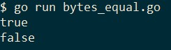
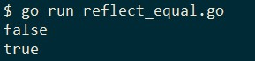
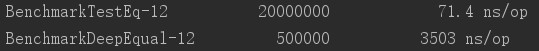
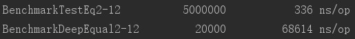

在golang中我们可以轻松地通过`==`来判断两个数组（array）是否相等，但遗憾的是slice并没有相关的运算符，当需要判断两个slice是否相等时我们只能另寻捷径了。

**从2023年开始你应该使用`golang.org/x/exp/slices.Equal`或者golang1.21的标准库函数`slices.Equal`来判断切片是否相等。**

## slice相等的定义

我们选择最常见的需求，也就是当两个slice的类型和长度相同，且相等下标的值也是相等的，比如：

```golang
a := []int{1, 2, 3}
b := []int{1, 2, 3}
c := []int{1, 2}
d := []int{1, 3, 2}
```

上述代码中`a`和`b`是相等的，`c`因为长度和`a`不同所以不相等，`d`因为元素的排列顺序和`a`不同所以也不相等。

## 判断两个[]byte是否相等

为什么要单独将[]byte列举出来呢？

因为标准库提供了优化的比较方案，不再需要我们造轮子了：

```golang
package main

import (
    "bytes"
    "fmt"
)

func main() {
    a := []byte{0, 1, 3, 2}
    b := []byte{0, 1, 3, 2}
    c := []byte{1, 1, 3, 2}

    fmt.Println(bytes.Equal(a, b))
    fmt.Println(bytes.Equal(a, c))
}
```

运行结果如下：



## 使用reflect判断slice是否相等

在判断类型不是[]byte的slice时，我们还可以借助`reflect.DeepEqual`，它用于深度比较两个对象包括它们内部包含的元素是否都相等：

```golang
func DeepEqual(x, y interface{}) bool
```

> DeepEqual reports whether x and y are “deeply equal,” defined as follows. Two values of identical type are deeply equal if one of the following cases applies. Values of distinct types are never deeply equal.
> ...
> Slice values are deeply equal when all of the following are true: they are both nil or both non-nil, they have the same length, and either they point to the same initial entry of the same underlying array (that is, &x[0] == &y[0]) or their corresponding elements (up to length) are deeply equal. Note that a non-nil empty slice and a nil slice (for example, []byte{} and []byte(nil)) are not deeply equal.

这段话的意思不难理解，和我们在本文最开始时讨论的如何确定slice相等的原则是一样的，只不过它借助了一点运行时的“黑魔法”。

看例子：

```golang
package main

import (
    "fmt"
    "reflect"
)

func main() {
    a := []int{1, 2, 3, 4}
    b := []int{1, 3, 2, 4}
    c := []int{1, 2, 3, 4}
    fmt.Println(reflect.DeepEqual(a, b))
    fmt.Println(reflect.DeepEqual(a, c))
}
```



## 手写判断

在golang中使用reflect通常需要付出性能代价，如果我们确定了slice的类型，那么自己实现slice的相等判断相对来说也不是那么麻烦：

```golang
func testEq(a, b []int) bool {
    // If one is nil, the other must also be nil.
    if (a == nil) != (b == nil) {
        return false;
    }

    if len(a) != len(b) {
        return false
    }

    for i := range a {
        if a[i] != b[i] {
            return false
        }
    }

    return true
}
```

测试代码：

```golang
package main

import "fmt"

func main() {
    a := []int{1, 2, 3, 4}
    b := []int{1, 3, 2, 4}
    c := []int{1, 2, 3, 4}
    fmt.Println(testEq(a, b))
    fmt.Println(testEq(a, c))
}
```

运行结果：


下面我们对后两种方案做个简单的性能测试，我们测试两个不相等但很相似的拥有20个元素的slice，这是在日常开发中较常见的情景：

```golang
func BenchmarkTestEq(b *testing.B) {
    a := []uint32{0, 1, 2, 3, 4, 5, 6, 7, 8, 9, 10, 11, 12, 13, 14, 15, 16, 17, 18, 19, 20}
    c := []uint32{0, 1, 2, 3, 4, 5, 6, 7, 8, 9, 10, 11, 12, 13, 14, 15, 16, 17, 18, 19, 21}
    b.ResetTimer()
    for i := 0; i < b.N; i++ {
        _ = testEq(a, c)
    }
}

func BenchmarkDeepEqual(b *testing.B) {
    a := []uint32{0, 1, 2, 3, 4, 5, 6, 7, 8, 9, 10, 11, 12, 13, 14, 15, 16, 17, 18, 19, 20}
    c := []uint32{0, 1, 2, 3, 4, 5, 6, 7, 8, 9, 10, 11, 12, 13, 14, 15, 16, 17, 18, 19, 21}
    b.ResetTimer()
    for i := 0; i < b.N; i++ {
        _ = reflect.DeepEqual(a, c)
    }
}
```

当然这个测试只能反应出有限的信息，正常情况下应该给出更全面的测试用例。不过在我们的演示中反射仍然付出了惊人的性能代价：



如果我们把slice的长度设为1000，那么差距就会更加明显：

```golang
func genDiffSlice(size int) ([]uint32, []uint32) {
    a := make([]uint32, 0, size)
    rand.Seed(time.Now().UnixNano())
    for i := 0; i < size; i++ {
        a = append(a, rand.Uint32())
    }
    b := make([]uint32, len(a))
    copy(b, a)
    b[len(b)-1] = rand.Uint32()
    return a, b
}

func BenchmarkTestEq2(b *testing.B) {
    a, c := genDiffSlice(1000)
    b.ResetTimer()
    for i := 0; i < b.N; i++ {
        _ = testEq(a, c)
    }
}

func BenchmarkDeepEqual2(b *testing.B) {
    a, c := genDiffSlice(1000)
    b.ResetTimer()
    for i := 0; i < b.N; i++ {
        _ = reflect.DeepEqual(a, c)
    }
}
```



自己手写判断的性能更好，但是有个显而易见的弊端，当我们有多种类型的slice时我们就不得不编写不同版本的`testEq`，而它们唯一的不同仅仅只有slice的类型。

不过等到go2的泛型可以使用的时候，这样的弊端也就不复存在了，现在我们需要的是在代码的复杂度和运行性能上做出权衡。

##### 参考

[Checking the equality of two slices](https://stackoverflow.com/questions/15311969/checking-the-equality-of-two-slices)
