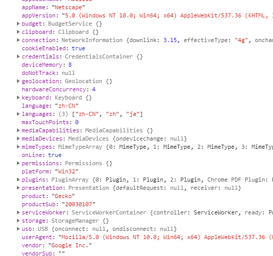
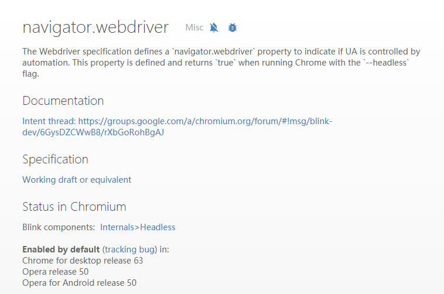

记录下使用headless Chrome时会遇到的反爬虫策略。

## 反爬和window.navigator对象

`navigator`对象，一个对大家来说既熟悉又陌生的名词，熟悉是因为在学BOM对象的时候或多或少都见过甚至在代码中使用过，陌生是因为对于`navigator`对象来说虽然各大浏览器都有实现却一直没有一个统一的标准，所以在不同浏览器上的`navigator`对象也可能是不一样的，所以不鼓励在生产环境使用，用得少，自然也就陌生了。

然而反爬就是要不从常规处下手，如果有某个特性比较冷僻，又可以用来区分人类用户和爬虫或者增加爬取难度，那么它就一定会被反爬工程师善加利用。今天我们的主角就是`navigator`对象了。

一般的反爬虫会有header验证，浏览器验证等等，这些在你使用headless browsers时都不成问题，所以反爬工程师们要如何阻止你的爬虫呢？不急，我们先看下正常浏览器里`navigator`对象的内容：



这是headless模式下的输出（其实不用headless模式也一样），篇幅原因做了些节选：

```diff
productSub: 20030107
vendor: Google Inc.
cookieEnabled: true
appCodeName: Mozilla
appName: Netscape
appVersion: 5.0 (Windows NT 10.0; Win64; x64) AppleWebKit/537.36 ...
...
+ webdriver: true
...
unregisterProtocolHandler: function unregisterProtocolHandler() { [native code] }
deviceMemory: 8
...
```

经常和爬虫打交道的可能已经看出了，**这是启用了webdriver协议之后会包含的字段**，可是我们使用的chrome headless使用的是devtools protocol啊，怎么也会有这个标志呢？

答案在这里：



没错，**当你指定了“--headless”参数的时候，不管是什么协议，都会带有该字段，且值为true。**

仔细想一想，正常的人类访问网页怎么可能用没有界面的headless模式嘛，这样如果你不当心的话一抓一个准。

## 解决方案

解决办法其实也不麻烦，大致有如下几点：

- 更换浏览器，如上图所示，这一特性是chrome 63以后添加的，那么只要用chrome 62即可，devtools protocol也支持chrome 62；
- 只对必要的页面使用headless，其余数据仍用httpclient模拟请求的方式获取，这也是最有效的方式，当然这样会极大的增加开发成本。
- chromedp可以加载一些js脚本在页面渲染前执行，可以人为修改webdriver字段的值

总之绕过这一检测机制的方法有很多，这篇文章仅仅是抛砖引玉而已，希望大家以后遇到类似的反爬措施时不要觉得束手无策。

最后希望大家在做爬虫时请遵守网络道德，不要给对方站点添麻烦。
