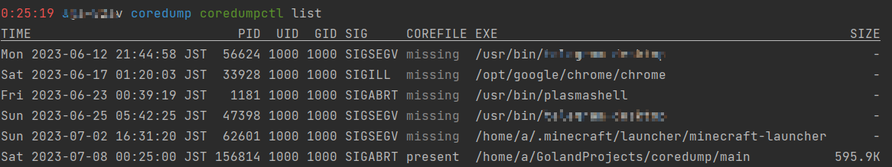
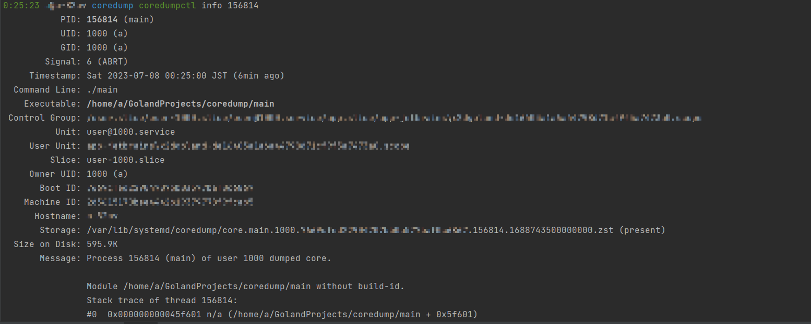
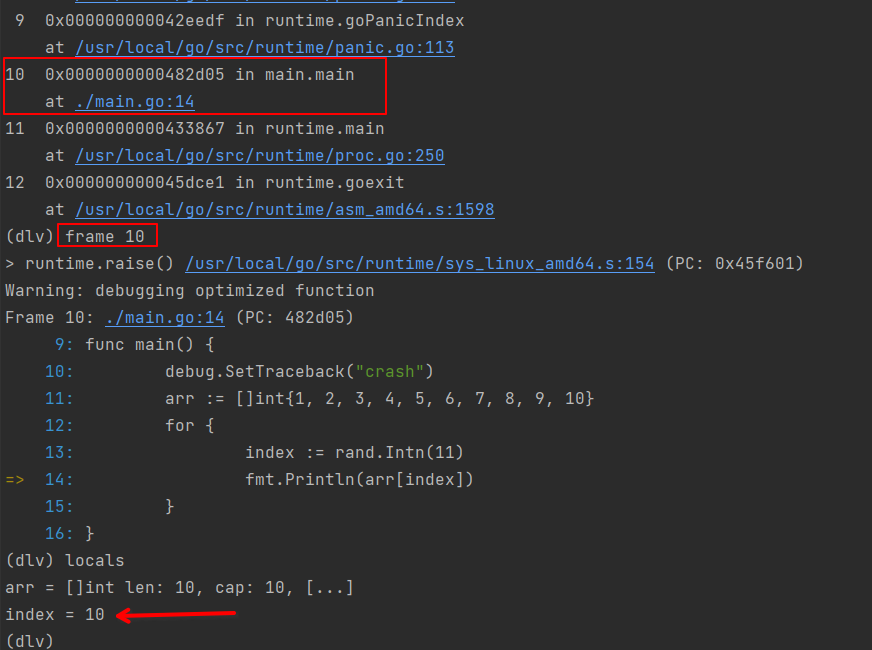

今天讲讲怎么让golang程序生成coredump文件，并且进行调试的。

别看我写了不少golang的博客，其实我平时写c++的时间更多，所以也算和coredump是老相识了。`core dump`文件实际上是进程在某个时间点时的内存映像，当时进程使用的内存是啥样就会被原样保存下来存在文件系统的某个位置上，这个时间点一般是触发了`SIGSEGV`或者`SIGABRT`这两个信号的时候，当进程的内存映像保存完毕后进程就会异常终止，也就是大家喜闻乐见的“程序崩了”和“段错误：核心已转储”。

因此coredump就像是程序出错崩溃后的“第一现场”，是用来排查错误的主要资源。

不过我很少在golang里调试coredump文件，通常来说可靠的日志和panic时打印的错误信息加堆栈就足够定位错误了。然而有时光靠这些信息还不够，不得不去求助老朋友coredump了。

下面我们主要针对这段代码调试，这只是个事例，所以你一眼看出问题在哪了也不要介意：

```golang
package main

import (
	"fmt"
	"math/rand"
)

func main() {
	arr := []int{1, 2, 3, 4, 5, 6, 7, 8, 9, 10}
	for {
		index := rand.Intn(11)
		fmt.Println(arr[index])
	}
}
```

编译并运行这段代码，运行上一小会儿就会看到程序panic了。假设报错信息没能帮助我们定位问题，接下来我们看看如何用coredump调试golang程序。

## 如何让golang程序生成coredump

首先，如果你不做任何额外的设置，那么golang程序崩溃的时候只会打印崩溃信息和简单的调用栈信息，并不会生成coredump文件。

想改变这个行为有两种方式：设置环境变量和在代码里调用相关的标准库接口。

在这之前先用ulimit命令检测下系统当前能不能生成coredump：

```bash
$ ulimit -c
unlimited
```

如果是unlimited就表示可以，如果是0那就不会生成，需要修改ulimit的设置。

### 修改GOTRACEBACK环境变量

我们先看修改环境变量的办法。

`GOTRACEBACK`是用来控制panic发生时golang程序行为的，值是字符串，具体内容如下：

| 值 | 行为 |
|---|---|
| none | 不打印任何堆栈跟踪信息，不过崩溃的原因和哪行代码触发的panic还是会打印 |
| single | 只打印当前正在运行的触发panic的goroutine的堆栈以及runtime的堆栈；如果panic是runtime里发出的，则打印所有goroutine的堆栈跟踪信息 |
| all | 打印所有用户创建的goroutine的堆栈信息（不包含runtime的） |
| system | 在前面`all`的基础上把runtime相关的所有协程的堆栈信息也一起打印出来 |
| crash | 打印的内容和前面`system`一样，但还会额外生成对应操作系统上的coredump文件 |

将这个环境变量设置成`crash`就可以获得信息最全面的coredump文件。所以我们要做的就是像下面这样：

```bash
go build main.go
GOTRACEBACK=crash ./main
```

或者你嫌麻烦，那就在服务器系统里做全局设置，一般是修改/etc/profile：

```bash
# 其他内容
# 全局设置，需要让所有已登录的用户注销会话重新登录或者干脆重启系统才会生效
export GOTRACEBACK=crash
```

上面的全局设置是针对Linux的，Windows就按正常设置环境变量那样操作，然后重新登录用户即可。

这样运行后就会生成coredump文件了。一般会生成在当前的工作目录里。

还有一点要注意：如果你正在使用较新的linux发行版，**那么coredump文件会被`coredumpctl`接管，并不会生成在当前目录**：



可以看到coredump文件被集中管理了，使用info子命令可以看到存放这些文件的路径和崩溃的进程的信息：



想要用dlv来调试的话得用这样的命令：

```bash
coredumpctl debug <list那给出的崩溃的进程的id> --debugger=<调试器程序的名字或路径> -A <传给调试器的参数>
```

填一下空就是这样：

```bash
coredumpctl debug 156814 --debugger=dlv -A core ./main
```

这样就能正常进行调试了。另外编译main程序的时候记得把优化关了，以免代码被优化得和写的不一样导致没法调试。

`coredumpctl`除了把coredump文件压缩了一下节约了一点硬盘空间之外没有什么优势，整个就体现了systemd家族的臭毛病：多管闲事。

### 使用标准库接口

没有标准库函数可以主动触发coredump生成，但有可以在代码里设置panic时候的行为的，使用的值和`GPTRACEBACK`一模一样：

[debug.SetTraceback](https://pkg.go.dev/runtime/debug#SetTraceback)

这个函数优先级比环境变量高，但有个限制，它只能设置比环境变量的值打印更多信息的值，也就是说如果环境变量是`all`，那么这个函数就只能设置`system`和`crash`，不能设置`none`和`single`。

代码例子：

```diff
package main

import (
	"fmt"
	"math/rand"
+   "runtime/debug"
)

func main() {
+	debug.SetTraceback("crash")
	arr := []int{1, 2, 3, 4, 5, 6, 7, 8, 9, 10}
	for {
		index := rand.Intn(11)
		fmt.Println(arr[index])
	}
}
```

效果和设置环境变量一样，这里就不展示了。

### 我该用哪个

没什么特别的需求的话，我推荐你只用`GOTRACEBACK`环境变量。

环境变量可以在不修改代码或者配置文件的情况下控制程序的行为，不需要花时间改代码改配置然后再编译运行。用标准库的接口想达到类似效果就得写不少代码了。

还有个好处是方便在容器里管理，也符合云原生十二要素。

## 调试coredump

coredump里保存了程序崩溃前的所有状态，包括执行到哪行代码了，各个变量的值是什么，还包含了runtime当前的状态等等。

仔细检查这些信息就可以发现程序崩溃的原因。

还是用这条命令打开调试器：

```bash
coredumpctl debug 156814 --debugger=dlv -A core ./main
```

然后按下面的步骤查看信息：

1. `bt`，查看当前的调用堆栈，找到触发panic的那行代码在哪个frame（栈帧）里
2. 看到是编号为10的frame，使用`frame 10`进入这个栈帧
3. 使用`locals`查看当前栈帧内变量的值
4. `p <变量名/表达式>`查看变量的具体内容，或者执行一些简单的表达式
5. 还可以修改变量的值，设置断点后再次运行查看结果，不过例子里的问题到第四步就已经明了了。



这里的问题很明显：数组长度是10，索引最大只有9，而index变量的值是10。所以索引访问越界，导致了panic。

## QA

Q: 上面只说了panic的时候生成coredump，如果我想要个程序正常运行时的快照该怎么做？

A: Linux上有不少进程内存快照生成工具，不过delve内置的交互式命令`dump`就可以满足需求。

具体方法是`dlv attach <pid>`之后直接运行`dump <输出coredump的文件名>`命令，然后退出。或者还有全自动化的：

```bash
$ echo 'dump coredump'|dlv attach <pid> ./main --allow-non-terminal-interactive
$ ls -lh

总计 47M
-rw-r--r-- 1 a a  45M  7月 8日 00:34 coredump
-rw-r--r-- 1 a a   25  7月 8日 00:20 go.mod
-rwxr-xr-x 1 a a 1.8M  7月 8日 00:31 main
-rw-r--r-- 1 a a  141  7月 8日 00:30 main.go
```

可以看到当前目录下生成了一个名为“coredump”的coredump文件。

这个命令本身比较耗时，**进程用的内存越多就越慢，请谨慎在生产环境使用**。

Q: 这个例子里没看出来有调试coredump的必要。

A: 是这个例子的问题，它不够好。我可以简单举一个以前遇到的真实情况：

以前有个处理用户输入的程序，用户可以输入任何utf8字符，程序会简单处理这些字符然后存到一块内存里，这东西上线后隔三差五就会panic，每次都是越界访问，但越界的值和发生的时间都没有规律可言。

最后实在没办法，抓了一次coredump，仔细检查了用户的输入，发现是我们的代码在处理某些特殊字符时想当然了，没能正确处理数据的长度。如果光看代码本身的话这个问题很难排查。

至于为什么不把用户输入打进日志，这涉及了隐私和权益问题，不能这么做，但调试完coredump后删除勉强能规避这些问题。

Q: 我有必要总是开启coredump吗？

A: 没有。正如我前面所说，一般日志和panic打印的信息就够用了。coredump本身会占据很多磁盘空间，而且在容器里dump下来的东西容器重启后就没了，除非单独设置数据卷但这非常复杂。

Q: 一些web框架会用recover处理panic，请问这时候还能获得coredump吗？

A: ***不能***。被recover的panic不会触发coredump。这时候你得想想其他办法了，比如用第一个QA那的办法生成个实时快照。

## 总结

coredump对于golang来说并不常用，但技多不压身，了解一下对以后处理各种问题总是有帮助的。

##### 参考

<https://github.com/go-delve/delve/blob/master/Documentation/usage/dlv_attach.md>

<https://pkg.go.dev/runtime>

<https://linderud.dev/blog/coredumpctl-delve-and-debug-packages-for-go/>
