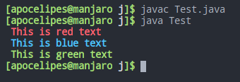

枚举在java里也算个老生长谈的内容了，每当遇到一组需要类举的数据时我们都会自然而然地使用枚举类型：

```java
public enum Color {
    RED, GREEN, BLUE, YELLOW;

    public static void main(String[] args) {
        Color red = Color.RED;
        Color redAnother = Color.RED;
        Color blue = Color.BLUE;

        System.out.println(red.equals(redAnother)); // true
        System.out.println(red.equals(blue)); // false
    }
}
```

当然今天我们要探讨的并非是java中enum的基础语法，本次的主题将会深入enum的本质，并探讨部分高阶用法。本文基于Oracle JDK 14.0.2和jad v1.5.8e（由于jad已经很久未进行更新，对于新版本的jdk支持不是很完善，但单纯分析enum和interface已经足够）。

## 自定义枚举值背后的秘密

枚举默认的值是从0开始递增的数值，通常来说这完全够用了。不过java中还允许我们对枚举的值做个性化定制，例如：

```java
// 我们不仅想用英语的方位，同时还想取得对应的本地化名称（这里是中文）
enum Direction {
    EAST("东"),
    WEST("西"),
    NORTH("北"),
    SOUTH("南");

    private final String name;

    // 注意是private
    private Direction(String name) {
        this.name = name;
    }

    public String getName() {
        return this.name;
    }
}

public class Test {
    public static void main(String[] args) {
        for (var v : Direction.values()) {
            System.out.println(v.toString() + "-->" + v.getName());
        }
    }
}
```

编译并运行程序，你将会得到下面这样的结果：

```text
EAST-->东
WEST-->西
NORTH-->北
SOUTH-->南
```

很多教程到此就结束了，点到为止，对于枚举值后面的圆括号有什么作用，为什么构造函数需要`private`修饰都一笔带过甚至连解释说明都没给出。然而理解这些却是我们进一步学习枚举的高阶用法的前提。

不过没关系，我们可以自己动手一探究竟，比如看看反编译后的代码，从编译器处理枚举类型的方法中一探究竟。这里我们将会利用jad，具体的使用教程参考园内其他优秀文章，本文不进行赘述，我们直接看反编译后的结果：

```java
final class Direction extends Enum
{

    /* 省略部分无关紧要的方法 */

    private Direction(String s, int i, String s1)
    {
        super(s, i);
        name = s1;
    }

    public String getName() // 这是我们自定义的getter
    {
        return name;
    }

    public static final Direction EAST;
    public static final Direction WEST;
    public static final Direction NORTH;
    public static final Direction SOUTH;
    private final String name;
    // 省略不重要的部分字段

    static 
    {
        EAST = new Direction("EAST", 0, "\u4E1C");
        WEST = new Direction("WEST", 1, "\u897F");
        NORTH = new Direction("NORTH", 2, "\u5317");
        SOUTH = new Direction("SOUTH", 3, "\u5357");
        // 省略部分字段的初始化
    }
}
```

首先看到我们的`enum`是一个类，其次它继承自`java.lang.Enum`（这意味着`enum`是无法显式指定基类的），而我们在`Direction`的构造函数中调用了其父类的构造函数，通过阅读[文档](https://docs.oracle.com/javase/8/docs/api/java/lang/Enum.html)可知，`java.lang.Enum`的构造函数是`protected`修饰的，也就是说对于`java.lang`包以外的使用者无法调用这个构造函数。同时文档也指出，该构造函数是由编译器自动调用的。因此我们自己定义的`enum`的构造函数也是无法正常调用的，只能由编译器用来初始化`enum`的枚举成员。既然本身无法被用户调用那么java干脆直接不允许`protected`和`public`（`default`和`private允许`）修饰自定义`enum类型`的构造函数以免造成误用。

另外我们的自定义构造函数其实是被编译器进行了合成，除了自定义参数之外还有枚举成员的字符串名称以及一个从0开始的序号（可用`ordinal`方法获取），前两个参数编译器会自动为我们添加，而自定义参数则是根据在我们给定的枚举成员后的圆括号里的值传递给构造函数，简单说就是：

```java
EAST("东"),
WEST("西"),
NORTH("北"),
SOUTH("南");

// 转换为（unicode字符被转码）
EAST = new Direction("EAST", 0, "\u4E1C");
WEST = new Direction("WEST", 1, "\u897F");
NORTH = new Direction("NORTH", 2, "\u5317");
SOUTH = new Direction("SOUTH", 3, "\u5357");
```

如果我需要更多字段，只需要像这样：

```java
public enum Planet {
    // 带有两个自定义数值
    MERCURY (3.303e+23, 2.4397e6),
    VENUS   (4.869e+24, 6.0518e6),
    EARTH   (5.976e+24, 6.37814e6),
    MARS    (6.421e+23, 3.3972e6),
    JUPITER (1.9e+27,   7.1492e7),
    SATURN  (5.688e+26, 6.0268e7),
    URANUS  (8.686e+25, 2.5559e7),
    NEPTUNE (1.024e+26, 2.4746e7);

    // 保存自定义值的字段，不使用final也可以，但枚举值一般不应该发生改变
    private final double mass;   // in kilograms
    private final double radius; // in meters
    // 在这里使用default的权限控制，即package-private
    Planet(double mass, double radius) {
        this.mass = mass;
        this.radius = radius;
    }
    public double mass() { return mass; }
    public double radius() { return radius; }
}
```

这就是自定义枚举值背后的秘密。

至此我们的疑问几乎都得到了解答，然而细心观察就会发现，我们的枚举成员都是`Direction`的_静态字段_！因此我们不能把这些枚举成员当作类型来使用：

```java
public void work(Direction.EAST e) {
    // 这是无法通过编译的
}
```

静态字段很好理解，因为我们需要通过类名+枚举成员名`Direction.WEST`直接引用，但为什么字段类型要是`Direction`的呢？

别着急，下一节答案就将揭晓。

## 为枚举添加抽象方法

这一节看起来很荒谬，抽象方法似乎和枚举八杆子打不到一块儿去。可是仔细想一想，在上一节中我们已经为枚举添加了`getter`成员方法，这说明我们还可以为枚举添加其他的方法从而定制枚举类型的行为，以上一节的`Planet`为例，我们可以添加计算任意物体在某个行星表面所受重力和质量的大小：

```java
public enum Planet {
    
    /* 定义枚举成员和初始化的相关重复代码，此处不再重复 */

    private double mass() { return mass; }
    private double radius() { return radius; }

    // universal gravitational constant  (m3 kg-1 s-2)
    public static final double G = 6.67300E-11;

    double surfaceGravity() {
        return G * mass / (radius * radius);
    }
    double surfaceWeight(double otherMass) {
        return otherMass * surfaceGravity();
    }
    public static void main(String[] args) {
        if (args.length != 1) {
            System.err.println("Usage: java Planet <earth_weight>");
            System.exit(-1);
        }
        double earthWeight = Double.parseDouble(args[0]);
        double mass = earthWeight/EARTH.surfaceGravity();
        for (Planet p : Planet.values())
           System.out.printf("Your weight on %s is %f%n",
                             p, p.surfaceWeight(mass));
    }
}
```

运行结果如下：

```bash
$ java Planet.java 70

Your weight on MERCURY is 26.443033
Your weight on VENUS is 63.349937
Your weight on EARTH is 70.000000
Your weight on MARS is 26.511603
Your weight on JUPITER is 177.139027
Your weight on SATURN is 74.621088
Your weight on URANUS is 63.358904
Your weight on NEPTUNE is 79.682965
```

既然能定制整个`enum`的行为，那是否意味着我们可以单独定义枚举成员的行为呢，毕竟方法最终还是从枚举成员值身上进行调用的。

答案是肯定的，还记得在上一节最后部分编译器是怎么处理枚举成员的吗？

```java
EAST = new Direction("EAST", 0, "\u4E1C");
WEST = new Direction("WEST", 1, "\u897F");
NORTH = new Direction("NORTH", 2, "\u5317");
SOUTH = new Direction("SOUTH", 3, "\u5357");
```

没错，枚举成员本身也是enum对象的一个实例！而且这些枚举成员虽然是`Direction`类型的，但实际上还可以引用`Direction`的派生类型。

假设我们有一个`Color`类型的枚举，对于每个枚举成员我们都一个定制的`print`方法用于打印不同的信息：

```java
enum Color {
    RED{
        // 先不用管这是什么语法，后面会解释
        @Override
        public void print() {
            // Linux上输出彩色字符串
            System.out.println("\u001B[1;31m This is red text \u001B[0m");
        }
    },
    BLUE{
        @Override
        public void print() {
            System.out.println("\u001B[1;34m This is blue text \u001B[0m");
        }
    },
    GREEN{
        @Override
        public void print() {
            System.out.println("\u001B[1;32m This is green text \u001B[0m");
        }
    };

    // 枚举成员必须要覆写的抽象方法
    public abstract void print();
}

public class Test {
    public static void main(String[] args) {
        for (var v : Color.values()) {
            v.print();
        }
    }
}
```

运行结果如下：



要想知道原理，我们还是得借助jad，这是`Color.class`经过处理后的内容：

```java
// 变成了抽象类
abstract class Color extends Enum
{
    // 构造函数
    private Color(String s, int i)
    {
        super(s, i);
    }

    public abstract void print();

    public static final Color RED;
    public static final Color BLUE;
    public static final Color GREEN;

    static 
    {
        // 重点从这开始
        RED = new Color("RED", 0) {

            public void print()
            {
                System.out.println("\033[1;31m This is red text \033[0m");
            }

        };
        BLUE = new Color("BLUE", 1) {

            public void print()
            {
                System.out.println("\033[1;34m This is blue text \033[0m");
            }

        };
        GREEN = new Color("GREEN", 2) {

            public void print()
            {
                System.out.println("\033[1;32m This is green text \033[0m");
            }

        };
    }
}
```

细心的读者大概已经发现了，这不就是_匿名内部类_么？说对了，我们的`enum类型`这次实际上变成了抽象类，而枚举成员则是继承自`Color`的匿名内部类并实现了抽象方法。所以最开始我们用注释标记的大括号其实可以理解成匿名类的类体。不过需要注意的是，虽然这里显式使用了`new`来创建了匿名内部类，但构造函数仍然是编译器代为调用的。

如果想增加自定义的枚举数据呢？可以这样做：

```java
enum Color {
    RED(31){
        @Override
        public void print() {
            System.out.println("\u001B[1;31m This is red text \u001B[0m");
        }
    },
    BLUE(34){
        @Override
        public void print() {
            System.out.println("\u001B[1;34m This is blue text \u001B[0m");
        }
    },
    GREEN(32){
        @Override
        public void print() {
            System.out.println("\u001B[1;32m This is green text \u001B[0m");
        }
    };

    // color code
    private final int colorCode;
    private Color(int code) {
        colorCode = code;
    }
    public int getColorCode() {
        return colorCode;
    }

    public abstract void print();
}
```

我们看看编译后的代码，限于篇幅，我只保留了重要的部分：

```java
abstract class Color extends Enum
{

    /* 大量省略代码 */

    private Color(String s, int i, int j)
    {
        super(s, i);
        colorCode = j;
    }

    public abstract void print();

    public static final Color RED;
    public static final Color BLUE;
    public static final Color GREEN;
    private final int colorCode;

    static 
    {
        // 参数传递给了构造函数
        RED = new Color("RED", 0, 31) {

            public void print()
            {
                System.out.println("\033[1;31m This is red text \033[0m");
            }

        };
        BLUE = new Color("BLUE", 1, 34) {

            public void print()
            {
                System.out.println("\033[1;34m This is blue text \033[0m");
            }

        };
        GREEN = new Color("GREEN", 2, 32) {

            public void print()
            {
                System.out.println("\033[1;32m This is green text \033[0m");
            }

        };
    }
}
```

总结一下，对于一个`enum类型`来说，通常会有如下格式：

```java
[public] enum NAME [implements XXX, ...] {
    VALUE1 [(自定义数据，格式和自定义构造函数函数的参数列表相同)]
    [{
        // 可以override或是追加新的method
    }],
    ...,
    VALUEN [(...)]
    [{
        // overrides or methods
    }];

    [存储各种自定义数据的字段，最好用final修饰]
    [
        // 自定义构造函数
        [private] NAME(和枚举成员中给出的圆括号内的内容一致) { /* 设置数据字段 */ }
    ]

    [定义抽象方法或者重写object/Enum的方法或是添加普通类方法]
}
```

给出的格式中用`[]`框住的部分都是可以省略的。

## 枚举和接口

在上一节的最后，我们看到`enum`其实还可以实现`interface`（毕竟本质上还是个class），所以上一节的例子可以这么写：

```java
interface Printer {
    void print();
}

enum Color implements Printer {
    RED{
        @Override
        public void print() {
            System.out.println("\u001B[1;31m This is red text \u001B[0m");
        }
    },
    BLUE{
        @Override
        public void print() {
            System.out.println("\u001B[1;34m This is blue text \u001B[0m");
        }
    },
    GREEN{
        @Override
        public void print() {
            System.out.println("\u001B[1;32m This is green text \u001B[0m");
        }
    };
}
```

我个人更倾向于第二种方法，因为`enum`主要是数据的集合，而对于数据表现出的行为/模式尽量使用`interface`进行描述。

除此之外，`enum`还可以定义在`iinterface`中。假设我们有一个枚举表示从周一到周日，同时给定一个方法`isRestDay`判断当前日期是否可以休息（比如有的人双休有的人单休还有的人在周一或周五休息），不同类型的人对于周几该休息将会产生不同的答案，因此将它抽象成接口再合适不过了：

```java
interface Relaxable {
    enum Weekly {
        Mon, Tue, Wed, Thu, Fri, Sat, Sun
    }

    boolean isRestDay(Relaxable.Weekly day);
}

class PersonA implements Relaxable {
    @Override
    public boolean isRestDay(Relaxable.Weekly day) {
        return day.equals(Relaxable.Weekly.Sat) || day.equals(Relaxable.Weekly.Sun);
    }
}

class PersonB implements Relaxable {
    @Override
    public boolean isRestDay(Relaxable.Weekly day) {
        return day.equals(Relaxable.Weekly.Sun);
    }
}

public class Relax {
    public static void main(String[] args) {
        var a = new PersonA();
        var b = new PersonB();
        var day = Relaxable.Weekly.Sat;
        System.out.println(a.isRestDay(day)); // true
        System.out.println(b.isRestDay(day)); // false
    }
}
```

`PersonA`拥有一个美好的双休，而可怜的`PersonB`却要在周六加班！使用jad查看生产的代码：

```java
interface Relaxable
{
    public static final class Weekly extends Enum
    {

        /* 省略了部分代码 */

        public static final Weekly Mon;
        public static final Weekly Tue;
        public static final Weekly Wed;
        public static final Weekly Thu;
        public static final Weekly Fri;
        public static final Weekly Sat;
        public static final Weekly Sun;

        static 
        {
            Mon = new Weekly("Mon", 0);
            Tue = new Weekly("Tue", 1);
            Wed = new Weekly("Wed", 2);
            Thu = new Weekly("Thu", 3);
            Fri = new Weekly("Fri", 4);
            Sat = new Weekly("Sat", 5);
            Sun = new Weekly("Sun", 6);
        }

        private Weekly(String s, int i)
        {
            super(s, i);
        }
    }

    public abstract boolean isRestDay(Weekly weekly);
}
```

可以看出此时的`enum`仅仅只是`interface`中的一个静态内部类而已。使用类似的方法可以借由`interface`来组织多个不同但有弱关联性的枚举类型，从而构成类似其他语言中`namespace`的组织结构。

当然，通常我们并不推荐用接口来组织多种不同的类型或是构成namespace，接口通常的作用是抽象出一组类的共同特性，或是让不同的类之间可以遵守相同的协议从而简化开发工作，主体应该是接口提供的方法以及这些方法所依赖的共通的一小部分数据类型（例如上例，虽然例子不是很好）;而`final class`则更适合组织不同数据类型和静态常量，更进一步的理由超过了本文的探讨范畴，你可以在园内搜索相关文章进一步学习。

## 总结

在本文中，我们学到了：

1. 如何添加枚举的自定义数据
2. 为枚举添加构造函数和方法
3. 用枚举实现接口
4. 将枚举和接口组合使用

当然，依靠反编译的代码来学习语言特性并不是一个值得推荐的选择，但确实最直观的最容易让人理解底层原理的办法。

长文难免会有疏漏之处，如有补充和指正欢迎指出！
