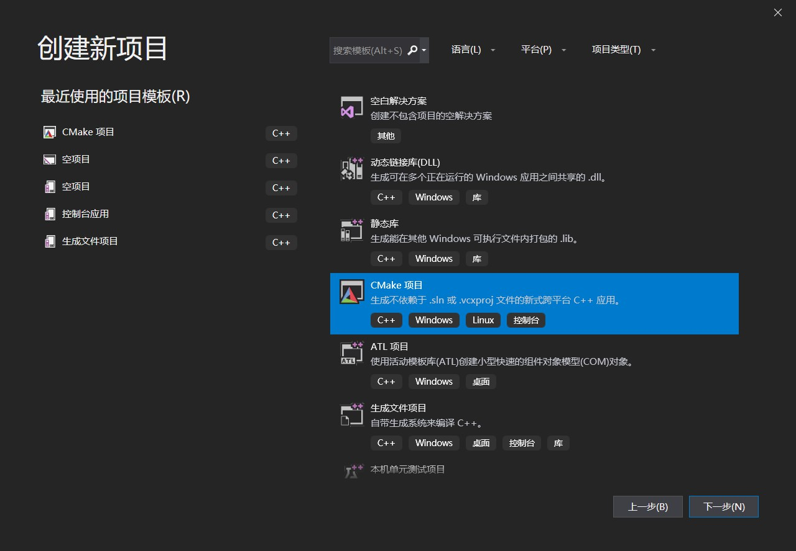
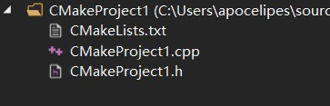
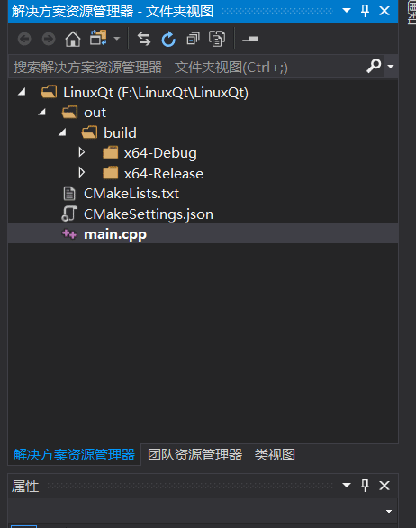
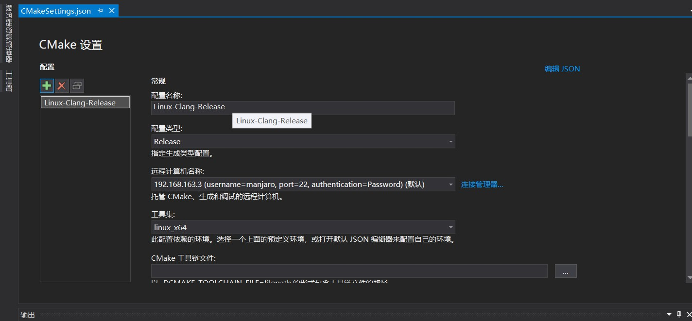
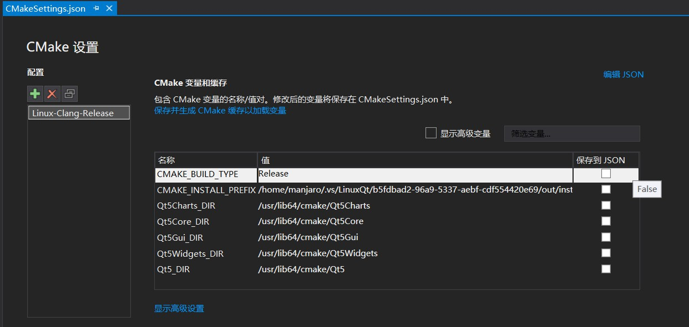
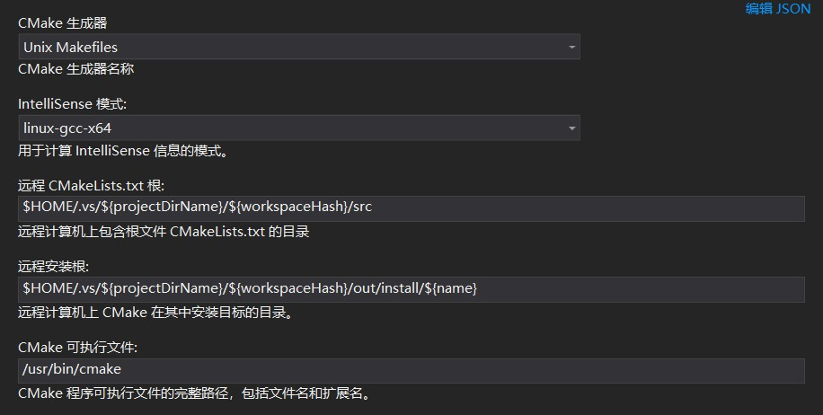
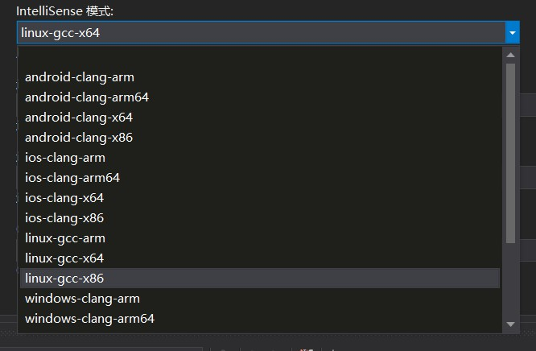
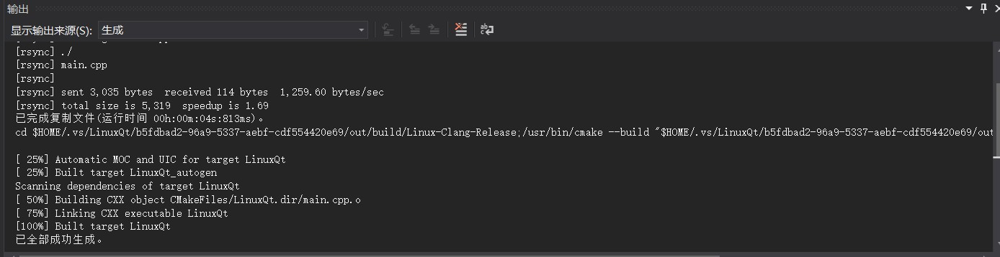
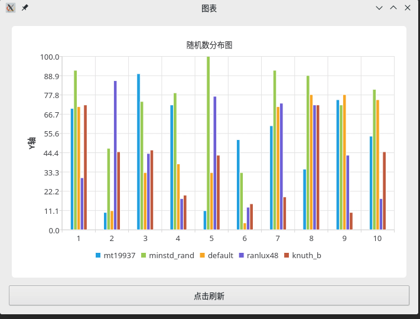

在[上一篇文章](./使用vs2019进行linux远程开发.md)中我们介绍了使用vs2019作为远程Linux系统的开发环境，但我们是创建的传统的sln项目，而对于Linux开发者来说以autotools或是cmake进行项目结构的组织更为简单直观，也符合在Linux环境上的习惯。

autotools是较为古老的也是使用最为广泛的构建系统，你在Linux上总是避免不了类似`./configure && make`这样的命令，背后就是autotools为你完成了检测系统环境到生成makefile的一系列工作。

cmake是较新的一种工具，autotools虽然功能强大使用广泛，但是它的学习成本和维护成本也十分惊人，所以人们创造了cmake来简化工作。cmake十分简单易学，在表现力上丝毫不亚于autotools，同时还提供了丰富的官方模块和第三方模块以便于定制各种各样的功能。已经有许多项目开始使用cmake了，例如google test框架，qbittorrent，KDE，_MySQL_等，未来Qt也会从qmake迁移至cmake，目前已经提供了初步支持。

遗憾的是vs2019并不支持autotools工具链，但是vs2019支持cmake，而且相比vs2017，vs2019提供了远程开发的cmake支持，并且支持了更多的设置选项，所以我们今天将会介绍如何使用vs2019+cmake实现Linux远程开发。不过需要注意的是，本文是介绍如何搭建开发环境的，并不会介绍cmake的语法，并且我也假设各位读者已经基本了解了简单的CMkaeLists.txt该如何编写，如果不了解那么你可能需要先进行简单的cmake学习，这超出了本文的讨论范围你可以寻找其他的博客园文章学习相关知识。当然，即使理解不了后文所罗列的CMakeLists.txt的内容也没关系，我会尽量给出简单易懂的注释。

好了，现在该让我们进入主题了。

## 创建远程cmake项目

创建很简单，在vs的启动窗口中选择“创建新项目”，然后找到“CMkae项目”，选择后点击下一步即可，和创建传统项目的过程完全一样，如图：



创建完成后你的项目里会是如下的场景（假如项目名称叫CMakeProject1）：



也许你会奇怪，为什么cmake项目不像sln项目那样区分出Linux和Windows平台呢？答案是我们可以通过对项目进行设置来切换本地环境和远程环境！

整个项目由CMakeLists.txt进行组织，而vs则负责在什么环境上运行cmake，这样就实现了同一套项目可以几乎不经过修改在不同平台上编译运行（只要你的目标平台装有cmake，且版本最低为3.8；本地环境vs自带了cmake）。

默认情况下的cmake project是在本地环境的，所以接下来我们创建一个叫“LinuxQt”的远程项目，接着设置对应的远程Linux环境。

## 设置远程环境

设置远程环境之前，你需要先在顶部的工具菜单的选项对话框中将远程连接设置好，并同步远程环境的头文件，具体过程可以参考[这篇](./使用vs2019进行linux远程开发.md#配置远程项目)，过程一样就不赘述了。

在初始的项目中启动项要么是某个文件要么是空的，没有我们的远程环境，所以我们需要右键资源管理器中显示的CMakeLists.txt文件：



找到“project-name的CMake设置”，project-name是你的项目名称，点击。这时会生成一个“CMakeSettings.json”的文件，这是整个项目的配置文件，双击打开会显示图形化的配置界面：



首先我们看到了配置名称，这是给你的自定义配置起名字的地方，右边的绿色加号表示添加新的配置，因为我们只想使用Linux远程环境，所以我们直接修改了默认的配置项。

接下来是配置类型，这和cmake中的选项对应，在此处设置后就无需再写进CMakeLists.txt了，有Debug，Release等模式，我们选择Release，因为远程环境上的Qt我没有安装调试符合，选Debug除了增大编译目标的体积外也没什么用。

下面则是重点，远程计算机名称选项。点击下拉框即可出现我们在连接管理器中添加的远程环境，如果你没有添加远程环境，在右侧的按钮可以直接打开连接管理器进行添加。该选项默认是空的，也就是本机编译不启用远程环境。

接下来是工具集，也就是最终调用的编译器工具链，vs支持gcc和clang，`linux_x64`对应gcc，`linux_clang_x64`对应clang，此外还有arm平台的支持，选用什么工具链看对应平台和个人喜好，我这里选择了gcc。

然后是“远程生成根”这个选项，截图里未给出，这是远程编译时vs存放整个项目的路径，默认在你的家目录下的`.vs`目录里，你也可以根据自己的需要修改这一路径，我们演示用的项目就直接使用默认值了。

生成根选项后是设置调用cmake程序时的参数的，只要把需要的参数原样填入输入框即可，这里我们没用到也就不截图了。

vs2019中一个强大的功能就是可以把cmake中由系统或是模块产生的变量的值显示出来（需要在cache成功刷新之后，也就是cmakelists文件保存后或手动在项目菜单中单击为项目生成缓存）：



接着我们点击显示高级选项，因为想要vs能提供代码补全还需要一点设置：



在这里你可以设置cmake生成什么类型的makefile，cmake的运行目录和编译完成后程序的安装目录，以及cmake本身所在的路径（如果你把cmake安装到了不太常规的地方例如/opt）。

其中重点关注IntellSense选项，这是选择代码补全的引擎：



可以看到所有选项都是由`平台名称-编译器名称-32位/64位`这种格式组成的，默认值是空，我们想要代码补全可用就要选择和远程环境完全对应的那种模式。

另外右上角一直有直接编辑json文件的按钮，如果你讨厌gui的话可以选择它。

最后我们保存修改，vs会自动刷新cache，现在我们可以进行远程开发了。

## 编写CMakeLists.txt

前面说过cmake项目的组织需要依靠CMakeLists.txt，现在我们来编写它。

我们的测试项目会使用Qt，随机显示一些不同引擎产生的随机数，然后把它们显示在图表中。选择这个示例是为了更好的展示cmake项目的能力，但是远程开发gui程序在vs上目前还有些困难：

1. vs运行远程环境的程序依靠ssh，然而Linux的gui程序运行需要连接xserver（通常连接信息在环境变量中），ssh启动的shell环境里没有这些环境变量，你可能还需要额外设置程序启动时的命令行参数，否则运行会发生错误。
2. 这是Qt自身的原因，Qt依赖自己的moc系统，和原生c++有些出入，因此代码补全时会经常找不到类型等（clion没有此类问题）。
3. vs自身的问题，虽然Qt自己支持cmake，但是vs在远程环境调用moc时不能正常工作，自定义widget会报类似找不到vtable等问题。
4. qt vs tool无法在远程环境工作。

虽然有以上的缺陷，但是我们编写单个文件的项目并且不自定义widget，同时只编译生成程序而不运行的话还是没有问题的。

下面来看看CMakeLists.txt是如何编写的：

```cmake
project(LinuxQtExample)

# 设置c++语言标准，我使用c++17
set(CMAKE_CXX_STANDARD 17)

cmake_minimum_required (VERSION 3.10)

set(CMAKE_INCLUDE_CURRENT_DIR ON)

# 自动调用moc, uic, rcc
set(CMAKE_AUTOMOC ON)
set(CMAKE_AUTOUIC ON)
set(CMAKE_AUTORCC ON)

# 找到这些Qt组件
find_package(Qt5Widgets REQUIRED)
find_package(Qt5Core REQUIRED)
find_package(Qt5Gui REQUIRED)
find_package(Qt5Charts REQUIRED)

# 将源代码添加到此项目的可执行文件。
add_executable (LinuxQt "main.cpp")

# 将Qt的库链接至程序
target_link_libraries(LinuxQt Qt5::Core Qt5::Widgets Qt5::Gui Qt5::Charts)
```

更多如何用cmake构建Qt程序的内容请移步[这里](../Qt/配置CLion作为Qt5开发环境.md)。

## 编写测试代码

上述设置结束后就可以着手编写代码了，代码提示和补全也能工作了（虽然对于Qt的部分补全不正常，但是c++标准库的补全是可以正常工作的）：

```c++
#include <QApplication>
#include <QBarCategoryAxis>
#include <QBarSet>
#include <QBarSeries>
#include <QChart>
#include <QChartView>
#include <QPushButton>
#include <QString>
#include <QStringList>
#include <QValueAxis>
#include <QVBoxLayout>

#include <iostream>
#include <random>

// 这个函数里变量名起的很烂，因为是示例我偷懒了，请你不要在实际项目中写出这种代码
// 创建柱状图数据的函数
// std::random_device的某些实现在Windows上存在bug，每次运行会返回同样的结果序列，linux没问题
// QtCharts的所有类型/函数都在对应的命名空间中，和其他的QtWidgets不同
static QtCharts::QBarSeries* createSeries()
{
    auto dataSet1 = new QtCharts::QBarSet("mt19937");
    auto seed = std::random_device{}();
    std::uniform_int_distribution<int> u(0, 100);
    std::mt19937 rd1(seed);
    for (int i = 0; i < 10; ++i) {
        auto a = u(rd1);
        std::cout << a << std::endl;
        *dataSet1 << a;
    }

    auto dataSet2 = new QtCharts::QBarSet("minstd_rand");
    std::minstd_rand rd2(seed);
    for (int i = 0; i < 10; ++i) {
        auto a = u(rd2);
        std::cout << a << std::endl;
        *dataSet2 << a;
    }

    auto dataSet3 = new QtCharts::QBarSet("default");
    std::default_random_engine rd3(seed);
    for (int i = 0; i < 10; ++i) {
        auto a = u(rd3);
        std::cout << a << std::endl;
        *dataSet3 << a;
    }

    auto dataSet4 = new QtCharts::QBarSet("ranlux48");
    std::ranlux48 rd4(seed);
    for (int i = 0; i < 10; ++i) {
        auto a = u(rd4);
        std::cout << a << std::endl;
        *dataSet4 << a;
    }

    auto dataSet5 = new QtCharts::QBarSet("knuth_b");
    std::knuth_b rd5(seed);
    for (int i = 0; i < 10; ++i) {
        auto a = u(rd5);
        std::cout << a << std::endl;
        *dataSet5 << a;
    }

    auto barSeries = new QtCharts::QBarSeries;
    barSeries->append(dataSet1);
    barSeries->append(dataSet2);
    barSeries->append(dataSet3);
    barSeries->append(dataSet4);
    barSeries->append(dataSet5);
    return barSeries;
}

int main(int argc, char* argv[])
{
    QApplication app(argc, argv);
    auto chart = new QtCharts::QChart;

    // 创建Y轴显示数据
    auto axisY = new QtCharts::QValueAxis;
    axisY->setRange(0, 100);
    axisY->setTickCount(10);
    axisY->setTitleText("Y轴");
    chart->addAxis(axisY, Qt::AlignLeft);

    // x轴显示10次取随机数的结果
    QStringList x;
    for (int i = 0; i < 10; ++i) {
        x << QString::number(i+1);
    }
    auto axisX = new QtCharts::QBarCategoryAxis;
    axisX->append(x);
    chart->addAxis(axisX, Qt::AlignBottom);

    auto barSeries = createSeries();
    chart->addSeries(barSeries);

    chart->setTitle("随机数分布图");
    // 显示图例以及让图例摆放在图表的底部
    chart->legend()->setVisible(true);
    chart->legend()->setAlignment(Qt::AlignBottom);
    // 显示chart的容器
    auto view = new QtCharts::QChartView(chart);
    view->setRenderHint(QPainter::Antialiasing);

    auto layout = new QVBoxLayout;
    layout->addWidget(view);
    // 点击按钮刷新显示的数据
    auto button = new QPushButton("点击刷新");
    QObject::connect(button, &QPushButton::clicked, [chart]() {
        // removeAll会帮你删除原来的series，所以不必担心内存泄漏
        chart->removeAllSeries();
        auto barSeries = createSeries();
        chart->addSeries(barSeries);
    });
    layout->addWidget(button, Qt::AlignCenter);
    auto window = new QWidget;
    window->setLayout(layout);
    window->setWindowTitle("图表");
    // 图表默认会显示成最小，为了不让图表缩成一团需要给一个固定的大小
    window->resize(700, 500);
    window->show();
    app.exec();
}
```

代码中使用了utf8编码的中文字符串，你需要设置源文件的编码为utf8以免在Linux上运行时出现乱码。具体见[这里](./使用vs2019进行linux远程开发.md#中文乱码)。

## 运行测试

如之前所说，我们不能直接点击运行按钮，所以对于gui程序我们只能选择顶部工具栏的生成->全部生成，这样vs会自动调用cmake和make来完成程序的构建：



可以看到vs将整个项目用rsync同步到了远程机上，接着运行了cmake和make。

生成成功后我们到之前设置的“远程生成根”下`out/build/...`，省略号表示的是你的cmake项目配置的名字，编译好的程序就在这里，下面在远程环境中运行：



## 总结

cmake项目总体上比sln更简单也更好控制，只是细节上还有欠缺。

cmake本省也简单易学，有着强大的功能，如果你是从Linux上的开发环境迁移至Windows不妨试一试cmake。
