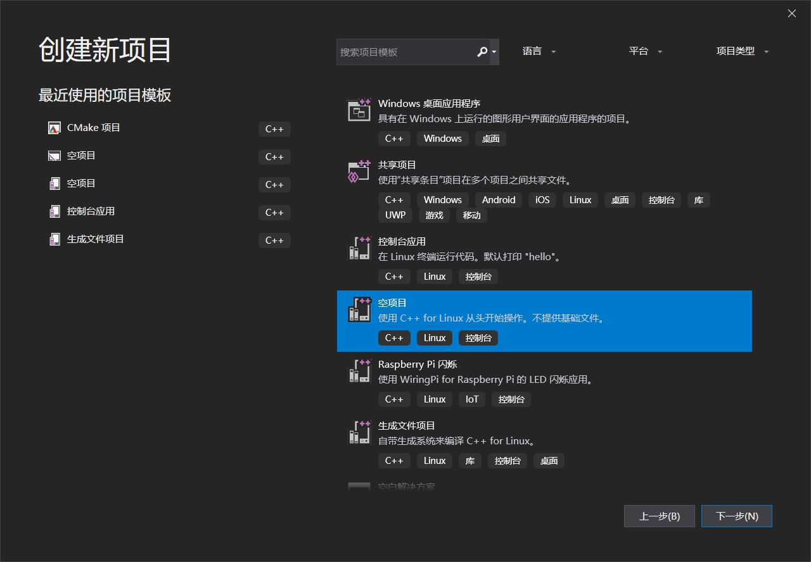
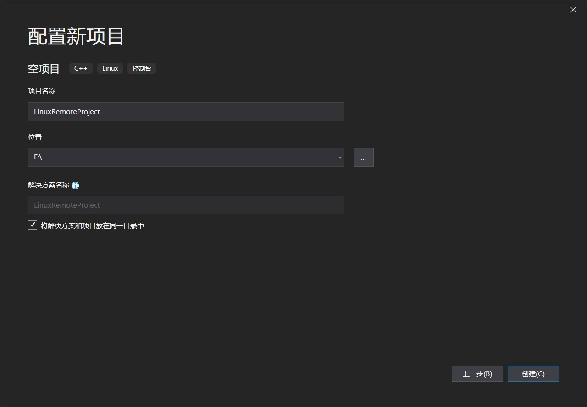
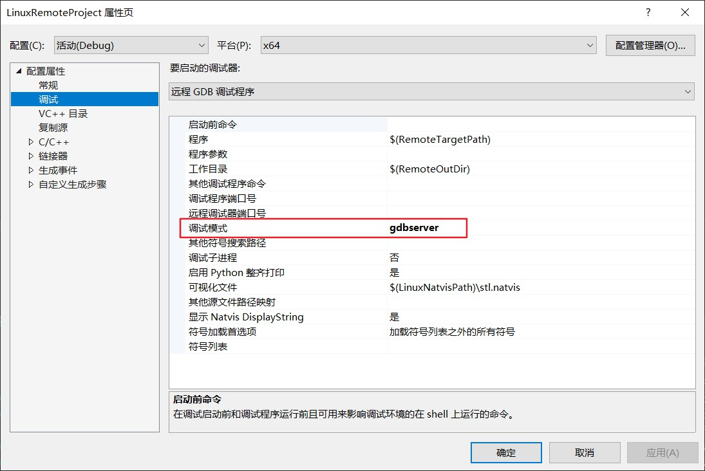
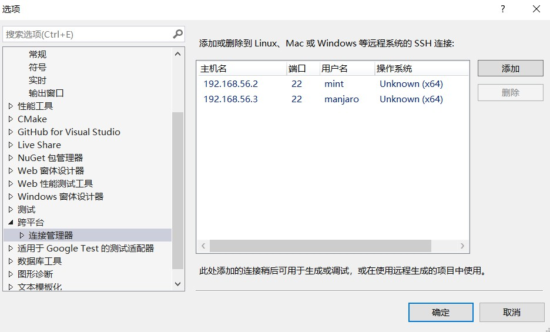
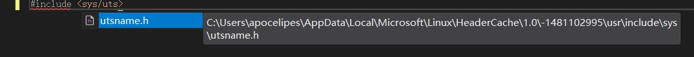
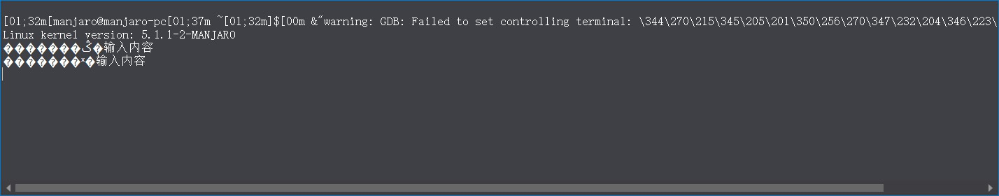
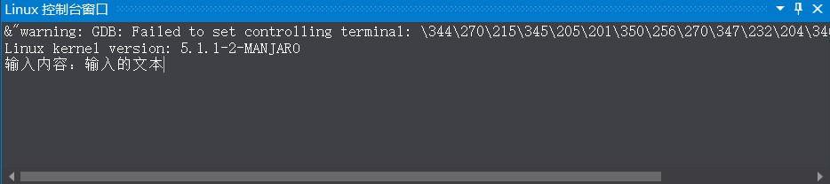

通常，当我们开发Linux程序时有两种方案：
1. 在Linux上直接编写程序并进行运行测试和调试
2. 在Windows或Mac OS X上借助工具进行远程开发

虽然我自己是在Linux环境上直接进行开发的，但也有许多的人是在Windows环境上从事开发工作的，如果离开自己熟悉的系统到陌生的环境上也许会影响到工作效率。

因此今天我们就来看下如何在Windows上使用Visual Studio 2019进行Linux远程开发以及如何避免常见的陷阱。

<blockquote id="bookmark">
  <h4>本文索引</h4>
  <ul>
    <li><a href="#visual-studio的跨平台开发功能简介">Visual Studio的跨平台开发功能简介</a></li>
    <li>
      <a href="#使用vs2019进行linux远程开发">使用vs2019进行Linux远程开发</a>
      <ul>
        <li><a href="#创建项目">创建项目</a></li>
        <li><a href="#配置远程项目">配置远程项目</a></li>
        <li><a href="#添加远程环境">添加远程环境</a></li>
        <li><a href="#本地编写和远程调试">本地编写和远程调试</a></li>
      </ul>
    </li>
    <li>
      <a href="#避免踩坑">避免踩坑</a>
      <ul>
        <li><a href="#中文乱码">中文乱码</a></li>
        <li><a href="#使用数学函数和第三方库">使用数学函数和第三方库</a></li>
      </ul>
    </li>
  </ul>
</blockquote>

## Visual Studio的跨平台开发功能简介
从visual studio 2017开始微软推出了vs的跨平台开发功能，你可以在vs中编辑代码，随后进行跨平台编译和远程调试，将原先我们需要手动完成的工作进行了自动化，大幅减轻了我们的负担。其中支持的平台包括Android和Linux，也就是我们今天要重点介绍的主角。

也许你会好奇，vs究竟是怎样进行远程开发的，虽然你不用了解这些知识也可以进行开发，但我还是希望能用两分钟做个简短的解释。

vs进行远程开发分为两步：
1. 创建远程环境的连接，随后让vs将远程环境中的系统头文件同步到本地（也可以指定其他地方的头文件，后面会讲解），c++的代码补全只需要头文件即可。
2. 当代码写好后，选择合适的远程环境，vs将目标文件和代码复制到远程环境的指定位置，接着根据你的配置进行编译。
3. 随后vs将会在console的gdb或gdbserver中运行你的程序，在此期间你可以充分享受vs debugger带来的高效和便利。

经过上述步骤之后你就可以在vs里调试自己编写的跨平台程序了。

## 使用vs2019进行Linux远程开发
简介到此结束了，下面我们来看看在vs2019进行Linux开发的图文教程。在我们开始之前，首先要做点准备工作：
1. 安装好vs2019，且勾选了c++ for Linux功能；
2. 准备一个可用的Linux远程环境，例如配置了静态IP的Linux虚拟机，并且已经安装好了GCC工具链以及openssh。

做好准备后我们就该进入正题了。

### 创建项目
安装好c++ for Linux功能后我们会在创建新项目的面板中看到Linux的选项，如图：



这里我们选择了使用传统的vs项目解决方案构建的空白控制台程序，后续的文章中你还可以看到如何创建cmake项目，这里暂且不提。

下面没什么要说的，选择项目的存储位置，注意是本地的位置，远程机器的位置在后面会进行配置：



点击创建，我们的远程开发项目就创建成功了。

### 配置远程项目
vs不能编辑空项目的配置，所以我们先在项目中创建一个`main.cpp`，然后点击顶部菜单：项目->属性，你就能看到项目的配置界面了：


远程计算机是在调试中的远程连接管理器中添加的。这里一般不需要改动，除非你需要改变项目的类型或编译结果的存放位置。如果有多个远程环境时，也可以在这里进行选择。

调试部分提供了`gdb`和`gdbserver`，前者是让vs在Linux上启动一个console，然后在其中运行gdb并返回输出，如果你的Linux上的终端配置了彩色输出，那么和遗憾vs并不认识他们，会显示成原始的字符串；使用gdbserver时会在远程启用gdbserver，本地vs解析回传的数据不会出现杂音。这里我们选择了gdbserver，如果你发现无法打断点，那么参考微软的建议，换回gdb方案：



接着是配置的重点，首先是配置需要同步的远程环境的头文件，有了这些文件vs才能对你的代码进行自动补全和提示：


默认复制的路径通常已经包含了Linux上大部分的头文件，通常我们也不需要做更改。头文件的同步发生在第一次构建项目成功后或添加远程连接后手动同步。

接着是c/c++编译器的选择，也就是对gcc和g++编译参数的配置，讲解这些参数超出了我们的讨论范围，我们这里只需要选择合适的c++标准版本：


这里我们选择了c++17。其他设置与在Windows上进行开发时一样，vs可以自动转换成g++的参数，这里就不再赘述。

### 添加远程环境
有了远程环境我们才能同步头文件或者进行调试运行。

在第一次编译或调试你的项目时vs会自动让你连接远程环境，当然，我们推荐在调试->选项->跨平台->连接管理器中进行设置：


填入你的远程ip/域名，端口ssh默认为22，安全起见你需要修改成其他端口，这里方便演示使用了默认配置，密码同上，你应该考虑使用更安全的ssh私钥登录。



登录成功后这个连接就添加完成了，我们看到管理器下面还有一个远程标头管理器的设置项，这就是用来同步头文件的：


点击更新按钮就会开始同步头文件，这些文件会被缓存在本地，因为要从远程一次性复制大量文件，所以可能会花费较长的时间。

这样远程环境就添加好了，可以开始写代码了。

### 本地编写和远程调试
至此你已经可以在vs中编写面向Linux平台的代码了，自动补全可以正常工作：




可以看到Linux中的头文件和结构体都已经可以识别了。如果你发现无法自动补全（通常发生在刚添加远程连接或是项目设置发生了变化后），先试试关闭vs重新打开，如果没用请尝试刷新intellisense或重新同步头文件。

在编辑结束后我们就能点击调试按钮运行我们的程序了：


注意，构建的体系架构必须是和远程环境一致的，比如远程环境是x64，这里可以选择x64或x86，但是不能选择arm，否则会报错。

这是测试代码，它将输出当前Linux系统内核的版本：
```c++
#include <sys/utsname.h>
#include <iostream>
#include <cstdio>

int main()
{
	auto start = chrono::high_resolution_clock::now();
	utsname names;
	if (uname(&names) != 0) {
		std::perror("cannot get unames");
	}

	std::cout << "Linux kernel version: " << names.release << std::endl;
}
```

点击调试->Linux 控制台，会显示一个可以交互的console，你可以在其中输入内容或是看到程序的输出：


程序运行成功。

## 避免踩坑
远程编译顺利完成后，我们就可以接着利用vs debugger设置断点，在断点处查看变量，甚至对运行中的Linux进行动态性能分析了。

不过在此之前，还有一些坑需要提前踩掉。

### 中文乱码
编码问题带来的麻烦永远会被放在第一位，毕竟当人们看到预想的输出实际上是一堆乱码时总会不可避免得紧张起来。

众所周知，编码问题一直是老大难，特别是Windows上中文环境通常是GB18030或GBK，而Linux上统一为utf8时。

下面看个实际例子，通常我们的程序里只包含ASCII字符的话不容易产生问题，所以我们加上一点中文字符：
```c++
#include <sys/utsname.h>
#include <iostream>
#include <cstdio>
#include <string>

int main()
{
	utsname names;
	if (uname(&names) != 0) {
		std::perror("cannot get unames");
	}

	std::cout << "Linux kernel version: " << names.release << std::endl;
	std::cout << "输入内容：";
	std::string input;
	std::cin >> input;
	std::cout << "你输入了：" << input << std::endl;
}
```
对于上面的测试程序，我们添加了一点中文输出信息，现在打开控制台进行调试：


可以看到中文输出变成了乱码，我们输入一些信息进去，这是运行结果：



可以看到，程序内写入的中文发生了乱码，而我们的输入没有。原因很简单，输入时实在linux的控制台环境下，编码默认是utf8的，所以我们的输入被正确编码，而源文件中的内容是GB18030的，所以在Linux控制台（默认以utf8解码数据并显示）中会发生乱码。

错误的原因知道了解决起来也就很简单了，把源文件的编码改成utf8就行，我们选择最简单的方法，在`高级保存选项`中修改编码（这个菜单选项默认被隐藏，网上有很多介绍如何显示它的方法的资料）：


设置好后保存文件，现在文件的编码已经被改为了utf8了。

现在运行修改后的程序：



运行结果也是正常的：


### 使用数学函数和第三方库
在Linux上使用标准库提供的数学函数也是一个老生常谈的问题，根据你使用cpp还是c会有如下几个情况：
1. 使用cpp时，libstdc++依赖于libm，所以使用g++编译你的程序时会自动链接数学函数库；
2. 使用c时，如果是`sqrt(4)`这样的形式，较新的gcc提供了替换措施，不需要显示链接libm；
3. 接上一条，如果你的参数是个变量，那么编译器可能会选择需要你链接libm。

通常在Windows上我们无需操心这点，但在Linux上使用c语言时就很难忽略这个问题了。

因此保险起见，如果你正在编写一个使用了数学函数的c程序，那么总是指定连接libm是没错的。（具体可以参考[这里](http://www.linuxforums.org/forum/programming-scripting/125526-c-gcc-math-h-lm.html)）

另外当你使用例如boost这类第三方库时，也需要注意。在Windows上我们通常指定好附加包含目录和附加库目录即可正常编译，但是Linux上必须明确指定链接库的名字，因此我们在项目属性中进行设置。

在Linux上我们可以使用pkg-config来减轻上述的重复劳动，而在vs中我们不能直接利用这一工具，当你的项目使用了大量第三方库时就会成为不小的麻烦，如果想要解决这一问题，可以参考后续文章里我会介绍的vs+cmake构建项目。

下面我们给例子加上一点boost chrono的功能测试，在Linux上需要指定`-lboost_chrono`，这是设置：


下面是完整的代码：
```c++
#include <sys/utsname.h>
#include <iostream>
#include <cstdio>
#include <string>
#include <boost/chrono.hpp>

int main()
{
	namespace chrono = boost::chrono;
	auto start = chrono::high_resolution_clock::now();
	utsname names;
	if (uname(&names) != 0) {
		std::perror("cannot get unames");
	}

	std::cout << "Linux kernel version: " << names.release << std::endl;
	std::cout << "输入内容：";
	std::string input;
	std::cin >> input;
	std::cout << "你输入了：" << input << std::endl;
	auto counter = chrono::duration_cast<chrono::milliseconds>(chrono::high_resolution_clock::now() - start);
	std::cout << "程序运行了：" << counter.count() << "ms\n";
}
```

点击运行按钮，程序就能正常调试了，否则会报错：


