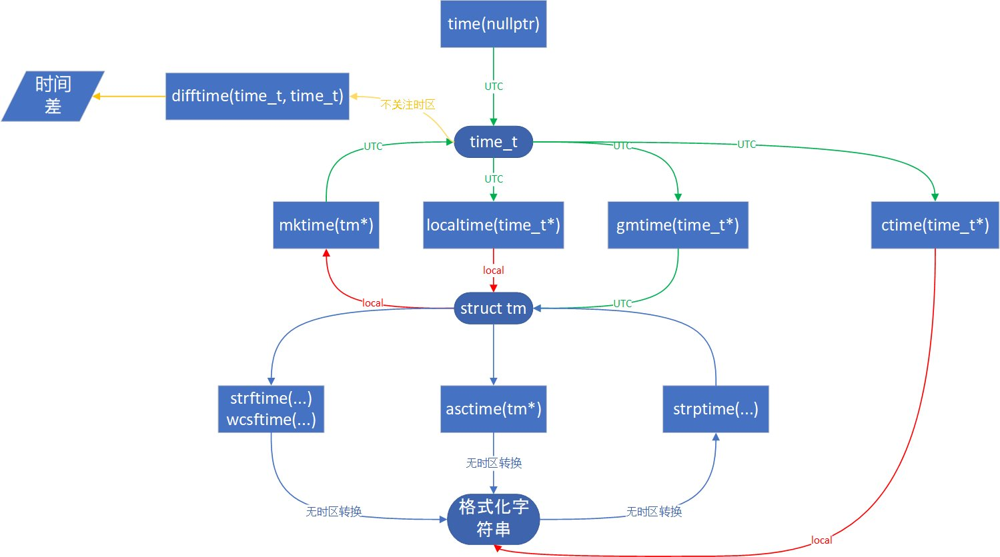

Linux下提供了丰富的api以供开发者们处理和时间相关的问题。然而这些接口看似各自为政实则有有着千丝万缕的联系，在学习和时间中引发了各种各样的混乱。因此时间处理成为了许多Linux开发者的梦魇，遇到时间处理往往避之不及。不过只要你稍微花费一点点精力，学会在Linux上优雅的处理时间和日期也并不是什么难事。

所以本文将会详细介绍Linux api和c标准库对时间的处理，对于更现代化的c++的chrono，会在另一篇文章里再讲。

本文并不会涉及定时器（timer），timer和时间有着关联，而且timer对于程序员来说是极为重要的，但介绍timer接口将会花费相当可观的篇幅，那样多少会使本文离题，所以请允许我在另外的文章中单独讨论timer，这里我们主要集中精力在time pointer和date time上。

#### 本文索引

- [time的分类](#time%e7%9a%84%e5%88%86%e7%b1%bb)
- [时间的表示](#%e6%97%b6%e9%97%b4%e7%9a%84%e8%a1%a8%e7%a4%ba)
  - [time_t](#timet)
  - [带有完整日历信息的struct tm](#%e5%b8%a6%e6%9c%89%e5%ae%8c%e6%95%b4%e6%97%a5%e5%8e%86%e4%bf%a1%e6%81%af%e7%9a%84struct-tm)
  - [过时的timeval](#%e8%bf%87%e6%97%b6%e7%9a%84timeval)
  - [更现代的timespec](#%e6%9b%b4%e7%8e%b0%e4%bb%a3%e7%9a%84timespec)
- [总结](#%e6%80%bb%e7%bb%93)

## time的分类

在讨论具体的时间问题前，我们先要明确时间的概念。也许你觉得时间的概念是那么浅显易懂没有什么额外强调的必要，但对于程序来说却不然。在程序看来时间的定义是灵活多变的，不同的定义下时间的计算是不同的，因此有必要仔细区分。

一般而言Linux上提供了三种时间，每种时间都包含了自己的含义，起点和特征：

- real time
  日历时间，又叫wall-clock或者system clock，如同字面意思，是指和真实世界中同样的时间。因此这是最直观最容易理解的时间。

  对于Linux世界来说这个时间的起点是1970年1月1日0时（UTC），又被叫做`Epoch`，Linux上以此为起点的均为UTC时间。

  real time的最大特点是会受到修改系统时间的命令/api或者ntp服务的影响，因而导致时间出现跳跃。

- monotonic time
  单调时间，意思是不能被设置和影响的时间，因此相比系统时钟它可以提供更精确是时间信息，也不会出现时间跳跃。

  单调时间的起点POSIX标准并没有明确指定，但在Linux上是以系统启动的时间为起点的。

  虽然说单调时钟的时间是稳定的，但它会被adjtime函数和ntp服务影响，同时当系统挂起或休眠时计时会被暂停。

- cpu time
  程序占用的cpu运行时间。

  起点是程序开始运行的时间。

  起点说的不是很严谨，因为严格来说cpu time计算的是程序占用的cpu的ticks数，所以程序上的用户等待时间是不包含在内的。

总结一下，前两种是我们接触最多的，系统时间最常见于date time的处理，单调时间则是计时功能和定时器的基石；而cpu time虽然用的少但是在衡量程序性能时是一个重要的参考指标。

## 时间的表示

存储时间的方法多如牛毛，而对于计算机来说最简单也最有效率的方式便是记录从起点到现在所经过的时间长度。这也是Linux上不同时间表示法的共通之处。

Linux上最常见的时间存储方案有四种：`time_t`，`struct tm`，`struct timeval`和`struct timespec`。我们分别介绍它们。

### time_t

`time_t`是c和c++标准库的一部分，有标准库背书，因此用的也是最广泛的。

`time_t`主要表示日历时间，也就是1970/1/1 0:00 UTC开始到现在的秒数。因此一部分的资料会告诉你他是长整数类型比如`long`的别名，为了方便你可能会将它们转换为整数类型，这时要小心，虽然大多数情况下`time_t`确实和整数类型有关系，但不同的实现可能使用了不同的整数类型，比如`unsigned long`和`long long`，有时候`time_t`甚至可能是编译器内置类型的别名，所以为了可移植性不要轻易断定它的原始类型是什么。

获得系统时间的方法有如下几种：

```c++
// 参数为空指针直接返回当前UTC时间
std::time_t now = std::time(nullptr);

// 参数不为空的时候也会把结果存入参数
std::time_t now_now{};
now = std::time(&now_now);

// 通过tm结构体还原成time_t
std::tm date = {.tm_year = 70}; // 1970/1/1
std::time_t t = std::mktime(&date);
std::cout << std::ctime(&t) << std::endl; // output: Thu Jan  1 00:00:00 1970
```

一切看起来都很自然，时间的获取就应该是一件简单的事情————真的是这样吗？给出一点提示，最后ctime的输出真的正确吗？

答案很遗憾是否定的。首先我们的系统处于`UTC+8`时区，我们设置`tm`为1970年1月1日，因此`mktime`应该返回0，但当我们用`ctime`输出本地时间时却发现时间仍然在1970/1/1 0:00:00，而没有如我们预期的那样+8小时，这是为什么呢？

我们的`time_t`所代表的系统时间又叫做日历时间，是真实世界的时间一致的。而我们知道地球上根据经度不同对于各地区的人来说时间也是不同，因此为了正常生活需要划分出时区；各时区的时间不同，但某些事物会在不同的时区同时发生，因此又需要一个统一的标准时来确定时间，这句是协调世界时（UTC）。

从上面我们可以看到，表达日历时间除了记录时间跨度之外还需要保存时区信息，然而我们的`time_t`并没有保存时区（timezone）！这是因为标准库把时区的设置交给了系统以及用户自己，在标准库里受到支持的只有`local time`和`UTC time`。

因此你会发现标准库函数都对参数是何种时间，返回值是什么时间做了明确的声明。而我们的`mktime`接受的是_local time_而返回的是_UTC time_，所以time_t所表示的时间比我们预想的差了8小时。

所以我们在Linux上处理时间时一定要注意上下文中时间值附带的时区信息。

### 带有完整日历信息的struct tm

和`time_t`息息相关的要数`struct tm`了，它的声明如下：

```c++
struct tm {
  int tm_sec;      /* 秒 [0-60] 允许有1秒的闰秒存在（c++11前和c99前允许2秒的闰秒，所以最大值是61） */
  int tm_min;      /* 分 [0-59] */
  int tm_hour;     /* 时 [0-23] */
  int tm_mday;     /* 日 [1-31] */
  int tm_mon;      /* 月，1月为0 */
  int tm_year;     /* 年份，从1900年开始计算，1970年的值为70 */
  int tm_wday;     /* 星期几，星期天为0，星期六为6，依次递增 */
  int tm_yday;     /* 一年中的第几天，1月1日是0 */
  int tm_isdst;    /* 是否启用夏令时 */
};
```

当然这只是标准给出的必须要有的成员，实际上在某些bsd系统中`struct tm`实际上还会包含时区相关的成员，为了写出可移植的代码我们将这些附加内容视为不存在。

获取`struct tm`除了像我们上一节那样手动指定成员的值之外，还有若干标准库函数可供使用：

```c++
// mktime不再赘述，它除了转换tm到time_t之外还可以根据给出的字段自动将tm设置成合理的值
// localtime 认为收到的是local time，返回该local time对应的tm值
// 注意t1复制了返回值，因为localtime，gmtime返回的是static生命周期的指针，无法保证它的值不会被修改
std::time_t now = std::time(nullptr);
std::tm t1 = *std::localtime(&now);

// gmtime 认为接受的是local time，返回将该local time转换为UTC time之后的值
std::tm *t2 = std::gmtime(&now);

// difftime用于比较两个time_t之间相差的秒数
auto time_end = mktime(&t1);
auto time_beg = mktime(t2);
std::cout << std::difftime(time_end, time_beg) << std::endl; // Output: 28800
```

正如上面代码所示，标准库提供的函数`gmtime`, `localtime`, `asctime`, `ctime`都使用了函数内的static存储，所以必要的情况下必须把结果值进行拷贝；或者你也可以使用posix提供的带`_r`后缀的安全版本。

结果是28800秒，也就是8小时，我们所在的时区是UTC+8，符合预期。

此外我们还可以将tm进行格式化输出：

```c++
// ctime将接收的time_t视为UTC time，将其转换为local time之后再转换成字符串
// ctime相当于asctime(localtime(...))
std::time_t t1{}; // 默认初始化为0
std::cout << std::ctime(&t1) << std::endl;
// Output: Thu Jan  1 08:00:00 1970

// asctime将收到的tm数据原样输出，不做任何时区的转换
std::tm tm1{};
tm1.tm_year = 70;
tm1.tm_mday = 1;
mktime(&tm1);
std::cout << std::asctime(&tm1) << std::endl;
// Output: Thu Jan  1 00:00:00 1970
```

此外我们还有`strftime`和`strptime`（需要`#define _XOPEN_SOURCE`）用来将tm格式化为字符串和将字符串解析为tm，限于篇幅我们不过多介绍。

在看过这些常用接口之后，我觉得你现在一定陷入混乱了，因为每个函数对时区的假设都不同，甚至一个函数的参数和返回值的时区也不相同！这就是为什么在Linux上处理时间问题会成为噩梦的原因之一。

你可以靠下图进行简单的记忆，黄色线代表与时区无关，蓝色代表不进行时区转换，红色代表转换为local time，绿色则是UTC time：



至于local和UTC以外的时区怎么办。。。没办法，只能自己手动算时区偏移量了。

### 过时的timeval

timeval的声明如下：

```c++
#include <sys/time.h>

struct timeval {
  time_t       tv_sec;  // 秒
  suseconds_t  tv_usec; // us 微秒
};

```

前面两种方案精度只能到秒，而`struct timeval`可以存储到微秒。timeval除了表示日期类似于time_t之外，还可以用来表示时间跨度（duration）：

```c++
#include <sys/time.h> // included by time.h
#include <time.h>

struct timeval t;
(void)gettimeofday(&t, nullptr); // UTC

// 使用timeval作为时间长度
struct timeval wait_time = {1, 500000}; // 1.5秒
select(NFDS, read_fds, write_fds, err_fds, &wait_time);
```

`gettimeofday`的第二个参数是时区，然而在Linux和glibc上这个参数的实际意义是没有被定义的，所以我们传递nullptr。

由于`gettimeofday`自身的原因，你通常无法获取到足够到微秒的精度，会存在些许的偏差。另外posix1.2008已经将`gettimeofday`标记为废弃，因此我们不应该继续使用这一api，因此这里不做过多讨论。

使用timeval结构的函数也少的可怜，只有`select`和`pselect`。

### 更现代的timespec

timespec的声明如下：

```c++
#include <time.h>

struct timespec {
  time_t  tv_sec;  // 秒
  long    tv_nsec; // 纳秒
};
```

`struct timespec`是更现代的精度也更高的结构，精度达到了纳秒。同时c11和c++17标准还将其纳入了标准库，因此它现在不再只是posix标准下的了。

获得timespec有两种途径，首先是c和c++标准库提供的方法，我们以c++为例（c的方法完全一样）：

```c++
std::timespec ts;
timespec_get(&ts, TIME_UTC);
```

这样我们就获得了现在的UTC时间的值。第二个参数标准目前只定义了`TIME_UTC`，所以现在还无法直接获取其他时区的时间值。

获取timespec的第二种方法就是使用posix的`clock_gettime`，它不仅能获得自1970/1/1开始的时间，还可以自定义clock的类型以便获取不同的时间值，现在是被推荐的用于获取时间的接口，在需要获取较高精度的时间值时应该优先考虑使用它：

```c
#include <stdio.h>
#include <string.h>
#include <time.h>

void print_time(const char *id, const struct timespec *t)
{
    printf("%s:\nseconds: %ld nanoseconds: %ld\n\n", id, t->tv_sec, t->tv_nsec);
}

// 获取不同时钟的时间值并打印，不支持的时钟类型会让clock_gettime返回-1
// 你不应该模仿这个宏，我只是单纯在偷懒而已
#define get_clock(clk_id) \
    do { \
        if (clock_gettime(clk_id, &t) != 0) { \
            printf("this system doesn't support the " #clk_id "clock\n"); \
        } \
        print_time(#clk_id, &t); \
        memset(&t, 0, sizeof(struct timespec)); \
    } while (0)

int main(void)
{
    struct timespec t = {0, 0};
    // 日历时间，UTC
    get_clock(CLOCK_REALTIME);

    // 单调时钟时间，从系统启动开始计算
    get_clock(CLOCK_MONOTONIC);

    // 类似单调时钟，但是包含了系统休眠时经过的时间
    get_clock(CLOCK_BOOTTIME);
}
```

输出如下：

```plain text
CLOCK_REALTIME:
seconds: 1585273480 nanoseconds: 594245824

CLOCK_MONOTONIC:
seconds: 12018 nanoseconds: 401860644

CLOCK_BOOTTIME:
seconds: 12018 nanoseconds: 401863344
```

因为我的系统并没有休眠，所以BOOTTIME和MONOTONIC的值是相同的。

还有更多的时钟类型，比如基于硬件的更快的单调时钟和系统时钟，记录进程/线程消耗cpu时间的时钟等，具体参见man pages。

timespec的应用也相当广泛，在`clock_nanosleep`，`nanosleep`，`pthread`等系统调用和库中都被广泛使用。

比如在pthread中我们规定等待互斥锁2.5秒，超时就重试或放弃：

```c
struct timespec timeout;
clock_gettime(CLOCK_REALTIME, &timeout);
timeout.tv_sec += 2;
timeout.tv_nsec += 50000000;
pthread_mutex_timedlock(&mutex, &timeout);
```

从上面可以看出超时是根据系统时间进行判断的，通过设置mutex是属性，我们还可以使用更为准确的单调时钟。

## 总结

本文我们介绍了c/c++标准库以及Linux提供的time api一共两套时间处理方案。

对于简单的date time的处理和获取time pointer，标准库的功能就足够了；而对于超时/延时任务以及需要更高精度时间的场合我们需要系统调用的帮助。

两套api间可以在损失微秒/纳秒精度的前提下进行转换，因为`tv_sec`成员都是time_t类型的。

两套api各有所长，然而都有一个缺点————无法处理时区。在不引入第三方库和自己手动计算的情况下，Linux处理时区的手段只有以下两种：

1. 函数自己定义参数和返回值使用local time还是UTC time；
2. 系统根据环境变量`TZ`以及配置文件`/etc/localtime`等改变本地时间（local time）。

因此在处理时间时我们始终要注意当前被处理的时间是解释成本地时间还是UTC时间；同时还要注意获得的时间的本地还是UTC。因此时间处理问题不可避免的变得十分复杂，某些使用夏令时的地区这一问题还会被继续放大。

当然，如果你不想用这么底层的时间处理方法，还有类似xTime，libtai，boost_date_time这样的第三方库可以使用。
