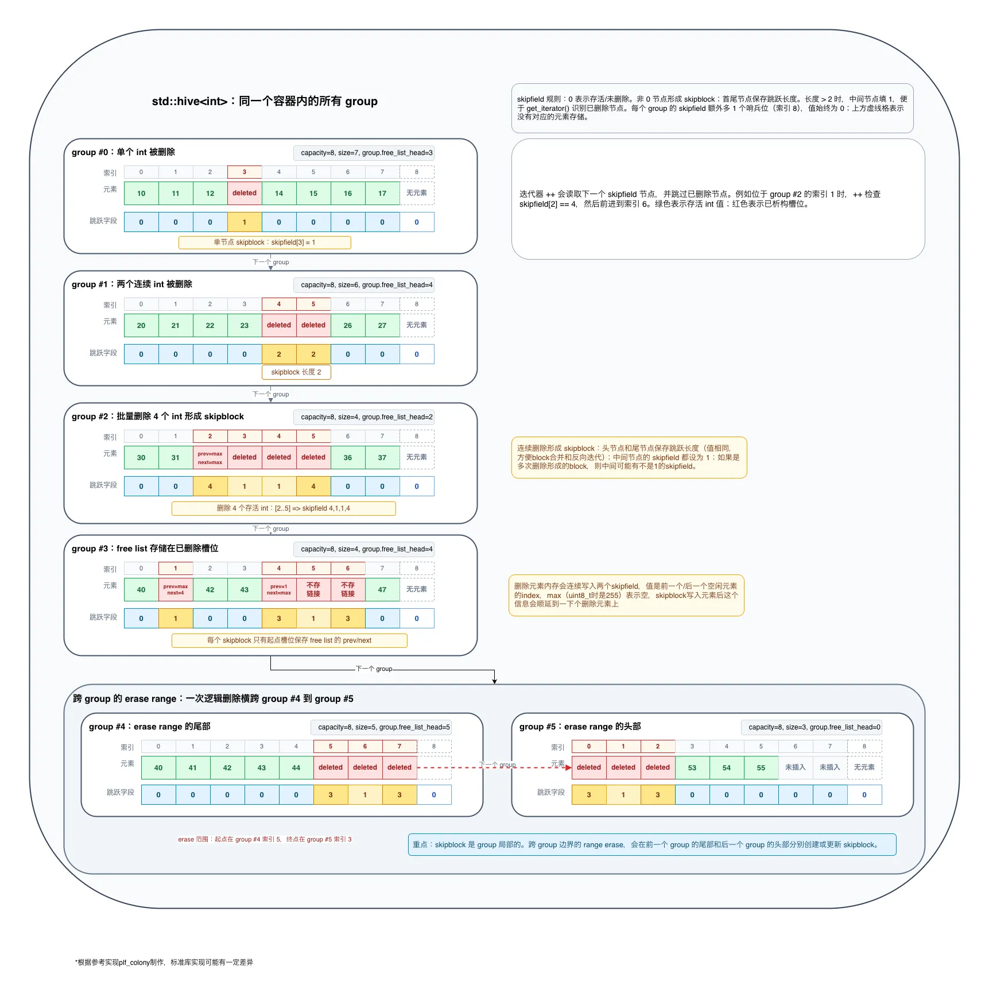

hive类似链表，把一些内存块链接在一起，每个节点被叫做block。

每个block里可以存放n个元素，block可以不是定长的，可以根据元素的添加频率增加新的block的大小。

hive删除元素时只会销毁元素本身，元素占用的空间会被做上标记以便重新使用。

类似hive的数据结构叫bucket array，但不同之处在于它的block的大小通常是一样的且固定的。

## 操作

### 插入

插入元素时，会先查找是否有空位可以使用，有就直接在空位上构建元素。

没有空位时则会查看最后一个block上是否还有从未使用的空间，有就在上面存储元素。

都没有则新分配一个block，block的大小由增长因子或其他条件决定，然后把block链接到hive的尾部，最后把新元素存在新block的第一个位置上。

添加元素时即使扩容也不会影响其他元素，元素也无需移动。

插入的元素并不总是在末尾，因此hive是无序的。

插入完成后需要维护block内的free list，如果块满了还得把自己从整个hive的block free list中删除。

### 删除

删除时先销毁元素，然后把该位置打上标记。可以把新增的空位放入一个空闲链表以便插入的时候加速找到空位。

删除因为直接留下空位，所以无需移动其他元素。

block里所有元素都删除后可以选择把block也释放掉，也可以选择留着等复用，参考实现里是存在block free list里的，但选择释放缓解内存压力也不是不行。

标记放在skipfield里，它分配在element的连续空间之后，会多一个哨兵位。

skipfield记录了迭代器在当前位置要跳过多少个元素的空洞，这样可以branchless。

被删除的元素里需要记录block内的元素free list的信息，因此必须至少有两个skipfield类型那么大，尺寸不够的会自动往需要的大小对齐。

### 随机访问

不支持随机访问，所以没有`operator[]`。迭代器也只是双向迭代器。

### 遍历

block按链接的顺序一个个访问，遇到空位就跳过，直到末尾。

遍历block时可以根据控制信息得出下一个有元素的位置，因此可以快速跳过空位且无需if分支。

## 特点

- 元素之间无序
- 插入和删除任意位置的元素都不需要移动其他的元素
- 扩容不会影响已有的block，因此有指针稳定性
- 同上，有迭代器稳定性
- block里是连续内存，因此遍历时比链表对缓存更友好，性能也更好
- 不需要像链表那样每个元素都得带上前驱后继指针，只有block需要带，因此更节约内存

## 适用场景

使用的前提的元素存储位置之间的先后顺序不重要。

- 需要频繁在尾部之外的位置添加删除元素的；
- 需要元素有指针稳定性的；
- 不希望扩容的时候申请巨大内存空间并且转移大量元素到新空间的；
- 不知道元素数量规模，但需要操作的耗时尽量维持在某个区间内，也就是不想因为元素数量多/少带来的扩容、移动、浪费等问题造成不同数量的元素下相同的接口性能表现有太大的波动；
- 满足上面几条中的至少一条，同时需要大量的遍历操作，且不需要或极少需要用索引访问元素的情况，适用hive。

游戏引擎里处理道具和玩家时经常能满足上述情况，因此不适用vector，需要用hive。

## skipfield工作原理

就是在删除片段的首尾保存了一下有多少个连续的元素被删除了，方便迭代器遍历时直接跳过。

skipfield只管本block/group，不会跨越block/group。

因为要存跳过数量，所以bitmap没戏了。

提案：<https://www.open-std.org/jtc1/sc22/wg21/docs/papers/2024/p0447r28.html>
