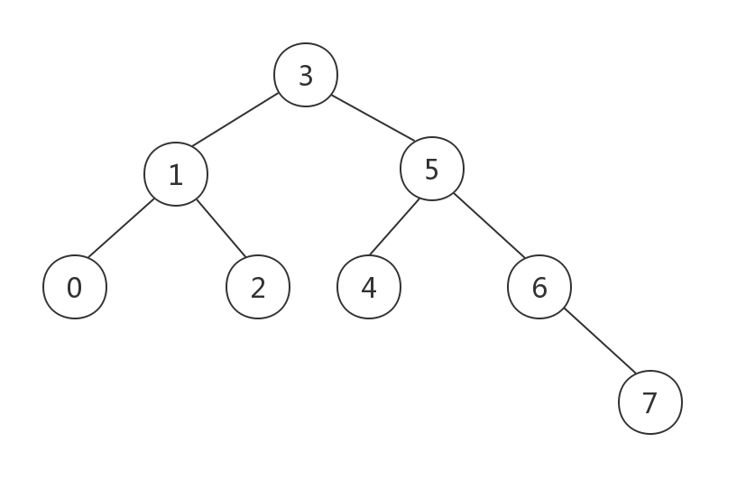
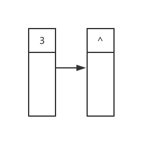
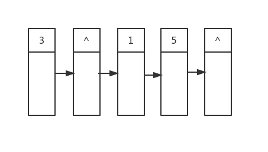
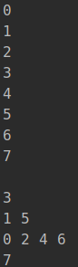

二叉树是极为常见的数据结构，关于如何遍历其中元素的文章更是数不胜数。

然而大多数文章都是讲解的前序/中序/后序遍历，有关逐层打印元素的文章并不多，已有文章的讲解也较为晦涩读起来不得要领。本文将用形象的图片加上清晰的代码帮助你理解层序遍历的实现，同时我们使用现代c++提供的智能指针来简化树形数据结构的资源管理。

那么现在让我们进入正题。

## 使用智能指针构建二叉树

我们这里所要实现的是一个简单地模拟了二叉搜索树的二叉树，提供符合二叉搜索树的要求的插入功能个中序遍历。同时我们使用shared_ptr来管理资源。

现在我们只实现`insert`和`ldr`两个方法，其余方法的实现并不是本文所关心的内容，不过我们会在后续的文章中逐个介绍：

```c++
struct BinaryTreeNode: public std::enable_shared_from_this<BinaryTreeNode> {
    explicit BinaryTreeNode(const int value = 0)
    : value_{value}, left{std::shared_ptr<BinaryTreeNode>{}}, right{std::shared_ptr<BinaryTreeNode>{}}
    {}

    void insert(const int value)
    {
        if (value < value_) {
            if (left) {
                left->insert(value);
            } else {
                left = std::make_shared<BinaryTreeNode>(value);
            }
        }

        if (value > value_) {
            if (right) {
                right->insert(value);
            } else {
                right = std::make_shared<BinaryTreeNode>(value);
            }
        }
    }

    // 中序遍历
    void ldr()
    {
        if (left) {
            left->ldr();
        }

        std::cout << value_ << "\n";

        if (right) {
            right->ldr();
        }
    }

    // 分层打印
    void layer_print();

    int value_;
    // 左右子节点
    std::shared_ptr<BinaryTreeNode> left;
    std::shared_ptr<BinaryTreeNode> right;

private:
    // 层序遍历
    std::vector<std::shared_ptr<BinaryTreeNode>> layer_contents();
};
```

我们的node对象继承自`enable_shared_from_this`，通常这不是必须的，但是为了在层序遍历时方便操作，我们需要从`this`构造智能指针，因此这步是必须的。`insert`会将比root小的元素插入左子树，比root大的插入到右子树；`ldr`则是最为常规的中序遍历，这里实现它是为了以常规方式查看tree中的所有元素。

值得注意的是，对于node节点我们最好使用`make_shared`进行创建，而不是将其初始化为全局/局部对象，否则在层序遍历时会因为`shared_ptr`的析构进而导致对象被销毁，从而引发未定义行为。

现在假设我们有一组数据：[3, 1, 0, 2, 5, 4, 6, 7]，将第一个元素作为root，将所有数据插入我们的树中会得到如下的一棵二叉树：

```c++
auto root = std::make_shared<BinaryTreeNode>(3);
root->insert(1);
root->insert(0);
root->insert(2);
root->insert(5);
root->insert(4);
root->insert(6);
root->insert(7);
```



可以看到节点一共分成了四层，现在我们需要逐层打印，该怎么做呢？

## 层序遍历

其实思路很简单，我们采用广度优先的思路，先将节点的孩子都打印，然后再去打印子节点的孩子。

以上图为例，我们先打印根节点的值`3`，然后我们再打印它的所有子节点的值，是`1`和`5`，然后是左右子节点的子节点，以此类推。。。。。。

说起来很简单，但是代码写起来却会遇到麻烦。我们不能简单得像中序遍历时那样使用递归来解决问题（事实上可以用改进的递归算法），因为它会直接来到叶子节点处，这不是我们想要的结果。不过不要紧，我们可以借助于队列，把子节点队列添加到队列末尾，然后从队列开头也就是根节点处遍历，将其子节点添加进队列，随后再对第二个节点做同样的操作，遇到一行结束的地方，我们使用`nullptr`做标记。

先看具体的代码：

```c++
std::vector<std::shared_ptr<BinaryTreeNode>>
BinaryTreeNode::layer_contents()
{
    std::vector<std::shared_ptr<BinaryTreeNode>> nodes;
    // 先添加根节点，根节点自己就会占用一行输出，所以添加了作为行分隔符的nullptr
    // 因为需要保存this，所以这是我们需要继承enable_shared_from_this是理由
    // 同样是因为这里，当返回的结果容器析构时this的智能指针也会析构
    // 如果我们使用了局部变量则this的引用计数从1减至0，导致对象被销毁，而使用了make_shared创建的对象引用计数是从2到1，没有问题
    nodes.push_back(shared_from_this());
    nodes.push_back(nullptr);
    // 我们使用index而不是迭代器，是因为添加元素时很可能发生迭代器失效，处理这一问题将会耗费大量精力，而index则无此烦恼
    for (int index = 0; index < nodes.size(); ++index) {
        if (!nodes[index]) {
            // 子节点打印完成或已经遍历到队列末尾
            if (index == nodes.size()-1) {
                break;
            }

            nodes.push_back(nullptr); // 添加分隔符
            continue;
        }

        if (nodes[index]->left) { // 将当前节点的子节点都添加进队列
            nodes.push_back(nodes[index]->left);
        }
        if (nodes[index]->right) {
            nodes.push_back(nodes[index]->right);
        }
    }

    return nodes;
}
```

代码本身并不复杂，重要的是其背后的思想。

## 算法图解

如果你第一遍并没有读懂这段代码也不要紧，下面我们有请图解上线：

首先是循环开始时的状态，第一行的内容已经确定了(^代表空指针)：



然后我们从首元素开始遍历，第一个遍历到的是root，他有两个孩子，值分别是1和5：


接着索引值+1，这次遍历到的是nullptr，因为不是在队列末尾，所以我们简单添加一个nullptr在队列末尾，这样第二行的节点就都在队列中了：



随后我们开始遍历第二行的节点，将它们的子节点作为第三行的内容放入队列，最后加上一个行分隔符，以此类推：


简单来说，就是通过队列来缓存上一行的所有节点，然后再根据上一行的缓存得到下一行的所有节点，循环往复直到二叉树的最后一层。当然不只是二叉树，其他多叉树的层序遍历也可以用类似的思想实现。

好了，知道了如何获取每一行的内容，我们就能逐行处理节点了：

```c++
void BinaryTreeNode::layer_print()
{
    auto nodes = layer_contents();
    for (auto iter = nodes.begin(); iter != nodes.end(); ++iter) {
        // 空指针代表一行结束，这里我们遇到空指针就输出换行符
        if (*iter) {
            std::cout << (*iter)->value_ << " ";
        } else {
            std::cout << "\n";
        }
    }
}
```

如你所见，这个方法足够简单，我们把节点信息保存在额外的容器中是为了方便做进一步的处理，如果只是打印的话大可不必这么麻烦，不过简单通常是有代价的。对于我们的实现来说，分隔符的存在简化了我们对层级之间的区分，然而这样会导致浪费至少log2(n)+1个vector的存储空间，某些情况下可能引起性能问题，而且通过合理得使用计数变量可以避免这些额外的空间浪费。当然具体的实现读者可以自己挑战一下，原理和我们上面介绍的是类似的因此就不在赘述了，也可以参考园内其他的博客文章。

## 测试

最后让我们看看完整的测试程序，记住要用make_shared创建root实例：

```c++
int main()
{
    auto root = std::make_shared<BinaryTreeNode>(3);
    root->insert(1);
    root->insert(0);
    root->insert(2);
    root->insert(5);
    root->insert(4);
    root->insert(6);
    root->insert(7);
    root->ldr();
    std::cout << "\n";
    root->layer_print();
}
```

输出：



可以看到上半部分是中序遍历的结果，下半部分是层序遍历的输出，而且是逐行打印的，不过我们没有做缩进。所以不太美观。

另外你可能已经发现了，我们没有写任何有关资源释放的代码，没错，这就是智能指针的威力，只要注意资源的创建，剩下的事都可以放心得交给智能指针处理，我们可以把更多的精力集中在算法和功能的实现上。

智能指针和层序遍历的内容到这里就结束了，在下一篇文章中我们还将看到智能指针和二叉树的更多操作。

如有错误和疑问欢迎指出！
