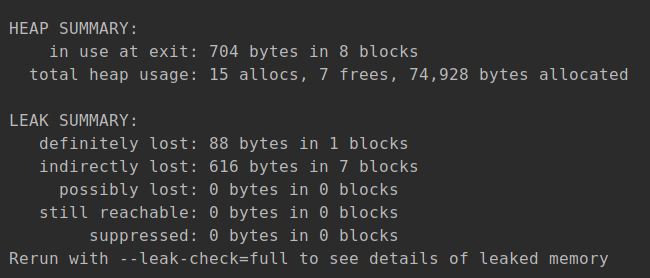
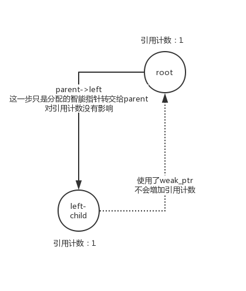

一般来说，当我们在程序中使用了智能指针后就无需亲自过问资源管理的问题了。

然而随着数据结构和算法逐渐变得复杂，资源之间的关系也可能不再是简单的共享，比如下面的例子。

## 误用shared_ptr导致内存泄露
现在为了方便删除我们二叉树的某些节点，我们需要每个节点都包含自己的父节点的信息，也许你会写成如下的样子：
```c++
struct BinaryTreeNode: public std::enable_shared_from_this<BinaryTreeNode> {
    using NodeType = std::shared_ptr<BinaryTreeNode>;

    explicit BinaryTreeNode(const int value = 0)
    : value_{value}, left{NodeType{}}, right{NodeType{}}
    {}

    // 插入/搜索/删除
    void insert(const int value);
    NodeType search(int value);
    NodeType max();
    NodeType min();
    void remove(int value);
    void ldr();
    void layer_print();

    int value_;
    NodeType parent; // 危险！请勿模仿
    NodeType left;
    NodeType right;

private:
    std::vector<NodeType> print_contents();
    void remove_node();
};
```

这样改写后的`insert`方法在插入节点时需要附加上父节点信息，不过这一步很简单：
```c++
void BinaryTreeNode::insert(const int value)
{
    if (value < value_) {
        if (left) {
            left->insert(value);
        } else {
            left = std::make_shared<BinaryTreeNode>(value);
            // 添加指向父节点的智能指针
            left->parent = shared_from_this();
        }
    }

    if (value > value_) {
        if (right) {
            right->insert(value);
        } else {
            right = std::make_shared<BinaryTreeNode>(value);
            right->parent = shared_from_this();
        }
    }
}
```

你可能会觉得这有什么复杂的，管理资源还是一如既往的轻松。

然而你错了，虽然从编译到运行我们的程序都没有肉眼可见的缺陷，然而我们用`valgrind`诊断一下就能发现问题了：
```bash
valgrind ./a.out
```


作为对比这是修复后的运行情况：


可见相比正常情况，有一半的智能指针并没被释放，而我们的层级打印正好正好将所有元素复制了一遍，因此你可能已经意识到了，我们的节点最终并没有被释放，但是节点的副本却被释放掉了！（valgrind对于内存池等缓存技术存在一定的误报，但据我所知对于libstdc++的shared_ptr并未使用这类技术）

这是为什么呢？答案很简单，在`insert`中我们制造了循环引用。下面我们拿根节点和它的左子节点做个演示：


首先是根节点和其左子节点，在没建立节点关系前两者引用计数都为1，接着我们建立关系：


*这种现象其实就是循环引用问题的一种。* 现在问题变得明了了，我们是从根节点释放资源的，根节点释放后接着释放它的子节点，但是现在根节点的计数是2，在用户持有的根节点超出作用域时它的引用计数减去1，变成了1，资源不会被释放，从而造成了内存泄漏，这就是valgrind发出抱怨的原因。

解决办法也很简单，因为叶子节点始终是引用计数为1的，所以先从叶子节点开始释放人工解开循环引用即可，然而这样又要手动管理内存与我们的初衷背道而驰，而且从叶子节点向上释放资源也不够直观，很容易出错。

因此还有一条路：`std::weak_ptr`。

## 使用std::weak_ptr消除循环引用
weak_ptr如其名，是弱引用，不会增加智能指针的引用计数，它可以从shared_ptr构造也可以转换为shared_ptr。

weak_ptr是专门为了类似上一节的情况而设计的，当两个数据对象之间互相存在引用关系时，如果双方都使用shared_ptr为代表的强引用势必会出现麻烦（主流的c++实现都没有gc，而且编译器也不会帮你自动切断循环，因此出问题后往往导致内存泄露，而且这类问题较为隐蔽所以常常会折磨那些粗心的程序员），这就需要将一方的引用形式改为弱引用来避免出现问题，这里便是weak_ptr。弱引用并不能保证引用的对象是可访问的，因此我们选择子节点引用parent的形式为弱引用，因为子节点的生命周期是父节点管理的，父节点生命周期是上层节点或用户进行管理，不属于子节点应该干涉的范围内，因此最适合改为弱引用的形式。

现在我们把结构体修正成如下的样子：
```c++
struct BinaryTreeNode: public std::enable_shared_from_this<BinaryTreeNode> {
    using NodeType = std::shared_ptr<BinaryTreeNode>;

    ...

    int value_;
    std::weak_ptr<BinaryTreeNode> parent; // 解决循环引用
    NodeType left;
    NodeType right;

private:
    // methods
};
```

相应的，`insert`中的`shared_from_this`也应该修改为`weak_from_this`。修改后的节点关系如下图：



现在我们可以正常地依赖智能指针进行资源管理了。而且再也不会听到valgrind的抱怨了。

因此我们在使用智能指针时应该仔细地分析数据之间的关系，选择合理的方案，避免因误用而产生bug。
