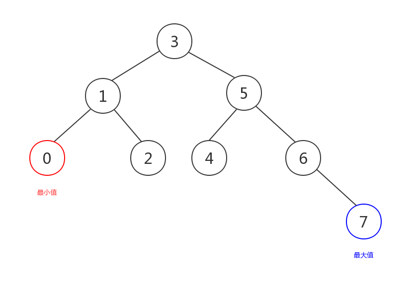
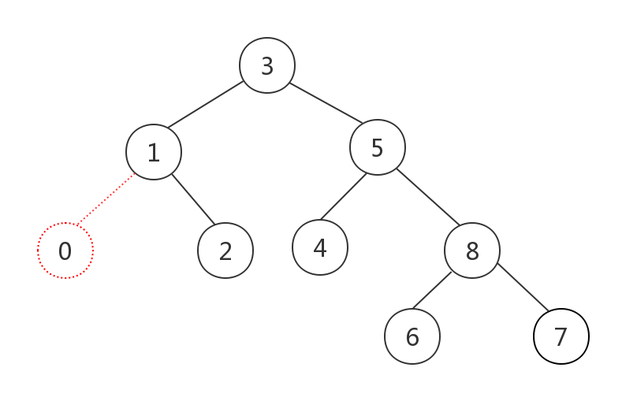
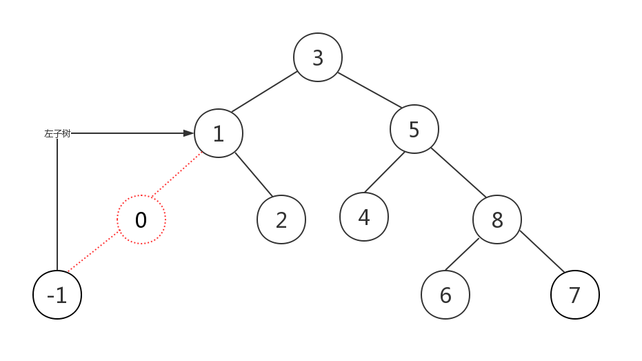
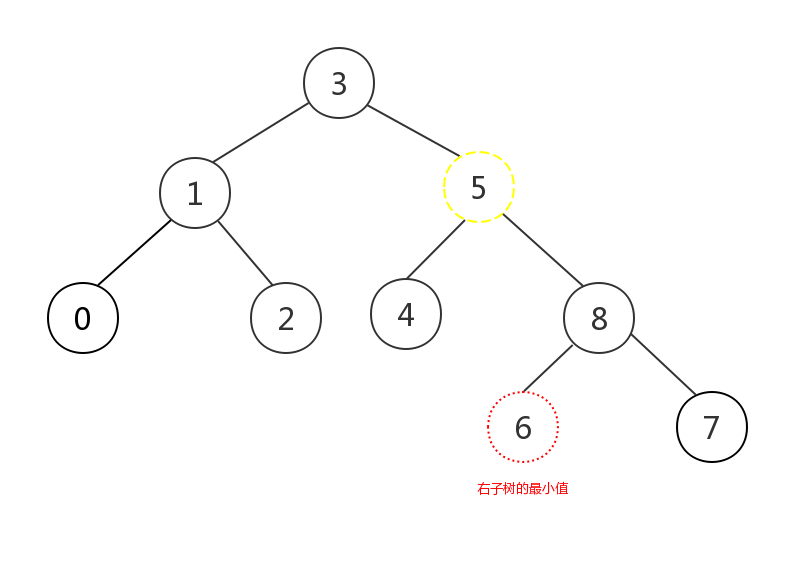
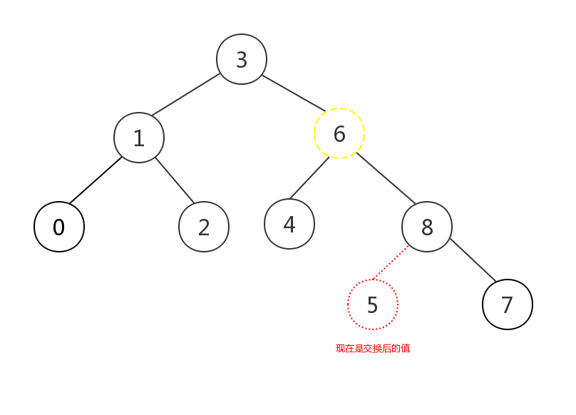
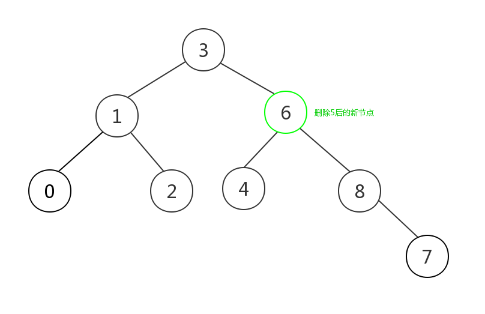
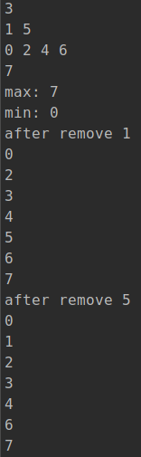

在前两篇文章中我们详细介绍了使用智能指针构建二叉树并进行了层序遍历。

现在我们已经掌握了足够的前置知识，可以深入了解二叉搜索树的查找和删除了。

<blockquote id="bookmark">
  <h4>本文索引</h4>
  <ul>
    <li>
      <a href="#二叉搜索树的查找">二叉搜索树的查找</a>
      <ul>
        <li><a href="#查找最小值和最大值">查找最小值和最大值</a></li>
        <li><a href="#查找特定值">查找特定值</a></li>
      </ul>
    </li>
    <li><a href="#删除节点">删除节点</a></li>
    <li><a href="#测试">测试</a></li>
  </ul>
</blockquote>

## 二叉搜索树的查找

查找将分为两部分，最值查找和特定值查找。

本章中使用的二叉搜索树的结构和上一篇文章中的相同。

下面我们先来看看最值查找。

### 查找最小值和最大值

这是最简单的一种查找。

根据二叉搜索树的性质，左子树的值都比根节点小，右子树的值都比根节点大，且这一性质对根节点下任意的左子树或右子树都适用。

根据以上的性质，对于一棵二叉搜索树来说，最小的值的节点一定在左子树上，且是最左边的一个节点；同理最大值一定是右子树上最右边的那个节点，如图所示：



查找的算法也极为简单，只要不停递归搜索左子树/右子树，然后将左边或右边的叶子节点返回，这就是最小值/最大值：

```c++
NodeType BinaryTreeNode::max()
{
    // 没有右子树时根节点就是最大的
    if (!right) {
        return shared_from_this();
    }

    auto child = right;
    while (child) {
        if (child->right) {
            child = child->right;
        } else {
            return child;
        }
    }

    return nullptr;
}

NodeType BinaryTreeNode::min()
{
    // 没有左子树时根节点就是最小的
    if (!left) {
        return shared_from_this();
    }

    auto child = left;
    while (child) {
        if (child->left) {
            child = child->left;
        } else {
            return child;
        }
    }

    return nullptr;
}
```

这里我们用循环替代了递归，使用递归的实现将会更简洁，读者可以自己留作联系。

### 查找特定值

查找特定值的情况较最值要复杂一些，因为需要判断如下几种情况，假设我们查找的值是`value`：

1. value和当前节点的值相等，查找完成返回当前节点
2. value小于当前节点的值，继续所搜左子树，左子树的值都比当前节点小
3. value大于当前节点的值，继续所搜右子树，右子树的值都比当前节点大
4. 当前节点没有左/右子树而需要继续搜索子树时，查找失败value在树中不存在，返回`nullptr`。

这次我们决定采用递归实现，基于上述描述使用递归实现更简单，如果有兴趣的话也可以用循环实现，虽然两者在性能上的表现并不会相差太多（因为递归查找的次数只有log2(N)+1次，次数较少无法充分体现循环带来的性能优势）：

```c++
NodeType BinaryTreeNode::search(int value)
{
    if (value == value_) {
        return shared_from_this();
    }

    // 继续向下搜索
    if (value < value_ && left) {
        return left->search(value);
    } else if (value > value_ && right) {
        return right->search(value);
    }

    // 未找到value
    return nullptr;
}
```

## 删除节点

查找算法虽然分了两部分，但和删除节点相比还是比较简单的。

通常我们删除一棵树的某个节点时，将其子节点转移给自己的parent即可，然而二叉搜索树需要自己的每一部分都遵守二叉树搜索树的性质，因此对于大部分情况来说直接将子节点交给parent将会导致二叉搜索树被破坏，所以我们需要对如下几个情况分类讨论：

1. 情况a：待删除节点没有任何子节点，此节点是叶子节点，这时可以直接删除它
2. 情况b：待删除节点只有左/右子树，这时直接删除节点，将子节点交给parent即可，不会影响二叉搜索树的性质
3. 情况c：待删除节点同时拥有左右子树，这时为了删除节点后仍是一棵二叉搜索树，有两个待选方案：

  - 选择待删除节点的左子树的最大值，和待删除节点交换值，然后将这个左子树的最大节点删除，因为左子树的值都需要比根节点小，因此删除根节点时从左子树中找到最大值交换到根节点的位置，即可保证满足二叉搜索树的性质；接着对左子树最大节点做相同的分类讨论，最后经过交换后节点会满足前两种中的一种情况，这是删除这个节点，整个删除过程即可完成
  - 原理同上一种，只不过我们选择了右子树中的最小值的节点

只有描述会比较抽象，因此每种情况我们来看图：

情况a：



红色虚线的部分即为待删除节点，这是直接删除即可。

情况b：



如图所示，当只存在一边的子树时，直接删除节点，将子节点交给parent即可。

情况c较为复杂，我们举例选择右子树最小值的情况，另一种情况是相似的：



图中黄色虚线部分就是“待删除节点”，加引号是因为我们并不真正删除它，而是先要把它的值和右子树的最小值也就是红色虚线部分交换：



交换后我们删除右子树的最小值节点，这时它满足情况a，因此直接被删除，删除后的树仍是一棵二叉搜索树：



这里解释下为什么需要交换，首先交换是把情况c尽量往情况a或b转化简化了问题，同时保证了二叉搜索树的性质；其次如果不进行交换，则需要大量移动节点，性能较差且实现极为复杂，因此我们才会选择交换节点值的做法。

我们的代码也会根据上述情况进行分类讨论，这次我们使用递归实现来简化代码，同样读者如果有兴趣可以研究下循环版本：

```c++
// 公开的接口，方便用户调用，具体实现在私有方法remove_node中
void BinaryTreeNode::remove(int value)
{
    auto node = search(value);
    if (!node) {
        return;
    }

    node->remove_node();
}

// 删除节点的具体实现
void BinaryTreeNode::remove_node()
{
    // parent是weak_ptr，需要检查是否可访问
    auto p{parent.lock()};
    if (!p) {
        return;
    }

    // 情况a，这时判断节点在parent的左侧还是右侧
    // 随后对正确的parent子节点赋值nullptr，当前节点会在函数返回后自动被释放
    if (!left && !right) {
        if (value_ > p->value_) {
            p->right = nullptr;
        } else {
            p->left = nullptr;
        }

        return;
    }

    // 情况c，选择和右子树最小值交换
    if (left && right) {
        auto target = right->min();
        target->remove_node();
        // 这里和图解有一点小小的不同
        // 删除target前改变了value_，会导致target被删除时无法正确确认自己是在parent的左侧还是右侧
        // 所以只能在target删除结束后再将值赋值给当前节点
        value_ = target->value_;
        return;
    }

    // 下面是情况b的两种可能的形式
    // 只存在左子树
    if (left) {
        if (value_ > p->value_) {
            p->right = left;
        } else {
            p->left = left;
        }
        left->parent = p;
        return;
    }

    // 只存在右子树
    if (right) {
        if (value_ > p->value_) {
            p->right = right;
        } else {
            p->left = right;
        }
        right->parent = p;
        return;
    }
}
```

进行分类讨论后代码实现起来也就没有那么复杂了。

## 测试

现在该测试上面的代码了：

```c++
int main()
{
    auto root = std::make_shared<BinaryTreeNode>(3);
    root->insert(1);
    root->insert(0);
    root->insert(2);
    root->insert(5);
    root->insert(4);
    root->insert(6);
    root->insert(7);
    root->layer_print();
    std::cout << "max: " << root->max()->value_ << std::endl;
    std::cout << "min: " << root->min()->value_ << std::endl;
    root->remove(1);
    // 删除后是否还是二叉搜索树使用中序遍历即可得知
    std::cout << "after remove 1\n";
    root->ldr();
    root->insert(1);
    root->remove(5);
    std::cout << "after remove 5\n";
    root->ldr();
}
```

结果：



如图，二叉搜索树的中序遍历结果是一个有序的序列，两次元素的删除后中序遍历的结果都为有序序列，算法是正确的。
