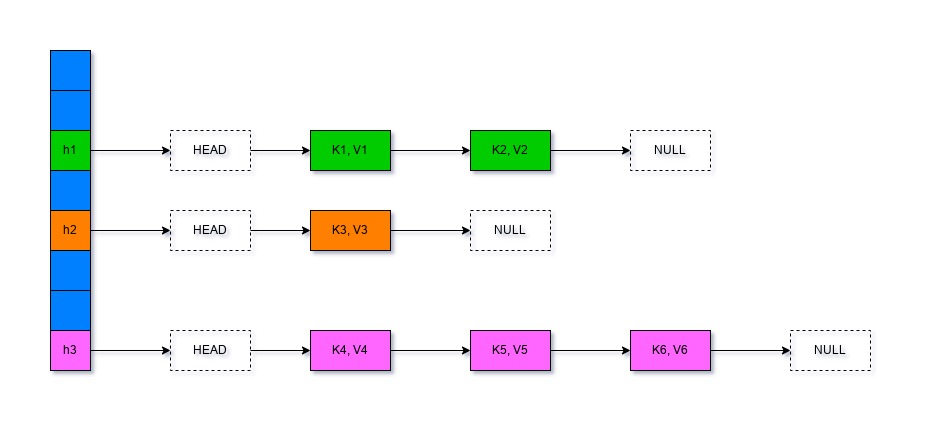
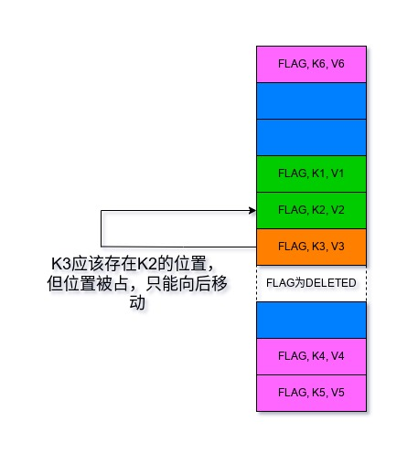
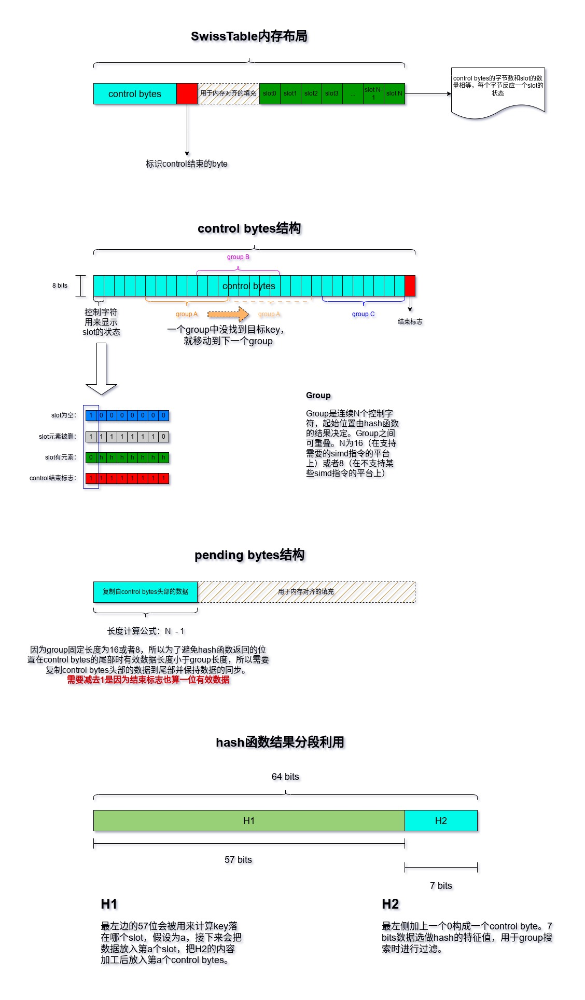
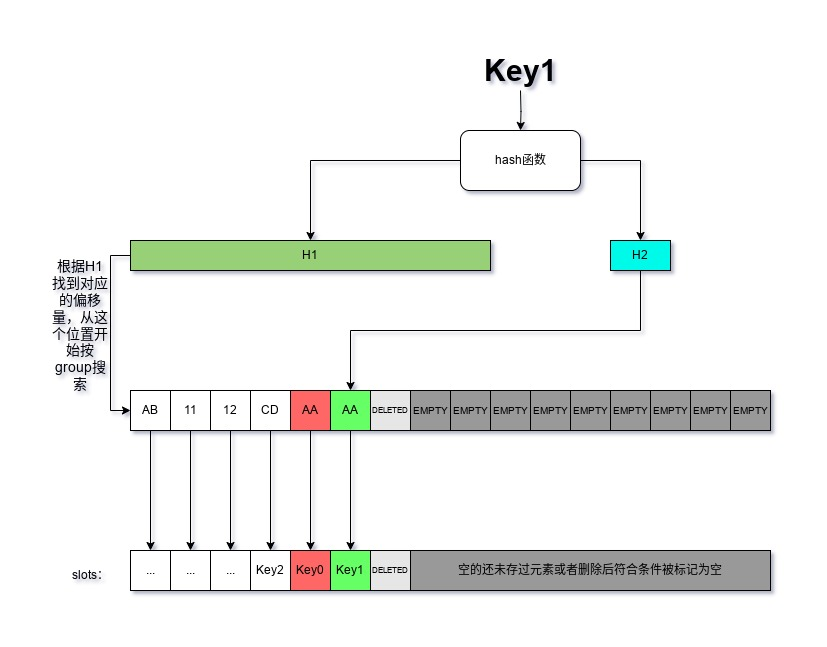
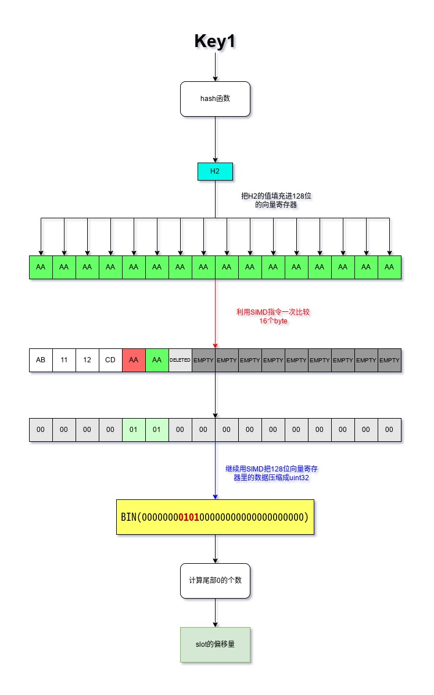

去年看到字节跳动给golang提了issue建议把map的底层实现改成SwissTable的时候，我就有想写这篇博客了，不过因为种种原因一直拖着。

直到最近遇golang官方开始讨论为了是否要接受SwissTable作为map的默认实现，以及实际遇到了一个hashtable有关的问题，促使我重新思考了常见的hashtable算法，并决定写下这篇文章。

友情提示：本文不会从零教你写hashtable或者swisstable，并且需要你对hashtable有一点了解（至少用过且知道常用操作的时间复杂度）；文中给出的示例代码为了简单易懂，放弃了一些实现细节上的优化，所以会和一些现成的实现不一样，还请注意。

接下来我们先简单复习下hashtable，哈希表。

## 传统的哈希表

哈希表提供了一个key到对应value的映射，通过一个hash函数把key转换成某个“位置“，从这个位置上可以直接拿到我们想要的value，这就是哈希表的能力。

哈希表一般来说空间复杂度为`O(n)`，查找、插入、删除的平均时间复杂度是`O(1)`，最坏情况均为`O(n)`。

可见哈希表在理论上是个性能非常好的数据结构。事实上在大多数情况下也确实是这样。

在更进一步探讨之前，我们先要假设几个前提。

1. 假设相同的数据作为key时计算出的hash结果总是一模一样的；而数据不同时（哪怕只有一个bit不同时）计算出的hash结果也会完全不同。

根据鸽巢原理，上述假设在真实世界里是不成立的，不过一般hash函数可产生的hash值的数量很大，通常比较难遇到不同数据产生相同hash的情况，所以这里我们暂且让这条假设成立。

2. 对于hash函数产生的hash值，每一个bit都是随机的，且随机概率均等。

这条假设确保了不会有某些bit会有固定值或者某些值的权重比另一些高导致不平衡，工业级强度的hash函数一般都会尽量保证这条假设里提出的要求。

符合以上两条的我们认为它是一个“理想的hash函数”，这样的函数可以最高效的利用hashtable的内存并减少冲突。换句话说，有了这样的函数的话影响传统hashtable性能的就只有数据在内存中的组织方式了。这样也方便我们接下来的讨论。

不过hash函数再完美，把key映射到一个有限大小的内存空间内也还是不可避免得会产生冲突：两个不同的key会被映射到同一个位置。

为了解决这个问题，传统的hashtable有好几个解决方案，我们挑最常见的解决冲突的办法——“链表法”和“线性探测法”简单复习一下。

### 链表法

链表法是最常见的，它的中心思想在于如果key映射到了相同的位置，那么就把这些key和value存在一张链表里。

查找的时候先用hash函数计算得到位置，然后再从存放在该位置上的链表里一个个遍历找到key相等的条目。

它的结构类似这样：

淡蓝色的表示还没有元素存在。

这个是最原始的实现方式，实际上很多库不会每个位置（以后简称为slot）存一个链表，而是用一张大链表把每个有值存在的slot串联起来，这样可以节约`n-1`个头结点和`n-1`个为节点的内存。

还有一些库会在链表过长的时候把它转换成搜索树等时间复杂度更低的结构。所以总体来看拉链法实现的哈希表常用操作的平均时间复杂度都接近于`O(1)`。

优点：

1. 实现很简单，没那么多边界条件要考虑
2. 插入数据和删除数据很快，插入用链表的头插法，删除只需要移动部分节点的next指针
3. 能采取扩容之外的手段阻止查询性能退化，比如前面提到的把过长链表转换成搜索树
4. 保证了指针稳定性，所以可以放心地用指针去引用哈希表内的元素

缺点：

1. 链表本身对缓存不够友好，冲突较多的时候缓存命中率较低从而影响性能。
2. 不同的slot之间数据在内存里的跨度较大（即使是用大链表串联的情况下），数据结构整体的空间局部性较差

设计上的注意点：

1. 为什么不同双链表？因为单链表够用了操作是有点麻烦还需额外的头节点，但双链表每个节点都会比单链表多出一个指针，会浪费比一个头结点更多的内存。
2. 为什么不直接用vector？因为删除元素的时候vector需要移动大量元素，性能和指针稳定性上都得不到保证，不实用。

### 线性探测法

线性探测是另一种常见的哈希表冲突解决方法。

它解决冲突的方式于链表法不同，在遇到hash冲突的时候，它会从冲突的位置开始向后一个个查找，直到找到一个空位，或者没找到然后索引回到了冲突发生的位置，这时会进行扩容然后再重新执行上述插入流程。

查找也是一样的，首先通过hash函数计算得到元素应该在的位置，然后从这个位置开始一个个比较key是否相等，遇到被删除的元素就跳过，遇到空的slot就停止搜索，这表示元素不在这个哈希表中。

可以看到大多数操作都需要从某个位置开始一个个向后比较，这就是它得名线性探测的原因。

这种方法实现的hash表可以是一个数组，它的结构大致如下：

淡蓝色的仍然是没有元素的空位。值得注意的是虚线标记的被删除元素。

元素是不能直接删除后把slot设置为空的，那样会破坏查找的流程，例如上面图里如果把`K2`删了然后slot设置成空，那你就永远找不到`K3`了。所以需要把slot设置成“已删除”。

插入的时候可以复用“已删除”的slot，但需要先检查key是否存在，否则还是上面那个例子，删除`K2`后我们想插入一个`K3`，实际上`K3`已经存在，但因为他本身应该在的slot空了出来，如果不提前检查的话插入操作就会把新的`K3`存进错误的位置，此时一张哈希表里会有两个`K3`，数据混乱了。这里得批评下github上某本很受欢迎的算法书，它在给出的insert示例里没考虑这种问题，这导致了它给出的代码在一些情况下会导致错误的结果。

这里只是简单复习，更详细的代码实现可以看[这篇](https://www.cnblogs.com/-beyond/p/7726347.html)。

时间复杂度上和链表法差不多，我们来看看优缺点：

优点：

1. 对缓存友好，现在可以用数组或者vector之类的可以在内存里紧密排列的结构实现哈希表
2. slot的利用率高，因为元素是存在slot里的，不过这也不全是好事，后面细说
3. 相对来说更节约内存，当然是和最原始的链表法实现相比，和用大链表串联过的比优势不是很明显，原因在缺点里细说

缺点：

1. 实现复杂，一个slot得分有元素、空、元素被删除三种状态
2. hash冲突是连锁式的，一处冲突可能会连续影响多处，最终导致插入同样的数据，它扩容的次数会比链表法更多，最终可能会用掉更多的内存
3. 因为冲突会造成后续插入和删除的连锁反应，所以查找过程退化到`O(n)`的概率更大，而且没法像链表法那样把有大量冲突的地方转换成搜索树之类的结构
4. 没有指针稳定性，这倒也不是太大的缺点，只有c++标准强制要求标准库的hashmap要有指针稳定性

因为删除元素麻烦，加上冲突会有连锁影响，所以很多库实现的hashtable都是用的链表法。不过即使有这么多缺点，光缓存友好和内存利用率高在现代计算机上就是非常大的性能优势了，所以像golang和python都会使用线性探测法的近似变种来实现哈希表。

## SwissTable简介

我们复习了两种常见的哈希表实现，它们要么浪费内存且对缓存不友好；要么发生冲突后会更容易导致查找、插入、删除操作性能下降。这还是在有“完美哈希函数”的情况下，如果你用了个不那么好的哈希函数，那会导致key冲突的概率大大上升，性能问题会更加明显，最坏的情况下性能甚至会不如在数组里进行线性搜索。

自然而然地，业界开始寻找一种既对缓存友好又不会让查找性能退化的太厉害的哈希表算法。大多数人的研究方向是开发更好的哈希函数，在让哈希函数不断接近“完美哈希函数”的品质的同时用各种手段优化计算性能；另外一些人在改进哈希表本身的结构力求在缓存友好、性能和内存用量上找到平衡。swisstable就属于后者。

swisstable的时间复杂度和线性探测法的差不多，空间复杂度介于链表法和线性探测之间。

swisstable的核心思想是hashtable的大部分操作都是围绕哈希函数计算得到的结果和slot的状态（是否能存数据是否有目标数据在slot里）进行的，而要知道这些信息不需要整个slot的数据，因此把这些操作需要的信息提取出来作为元信息进行操作，内存效率和CPU效率都可以优于直接操作存放完整数据的slot。

swisstable的实现有很多，我们主要基于将这个数据结构推广壮大的abseil库的实现进行简要的介绍，有关这个实现，cppcon中的演讲比我更详细，可以去看看，文末会给出链接。不过我讲的可能和这两个演讲的内容有些出入，比较又过了好几年，代码库总是要随着时代变化而发展的。

### SwissTable的结构

别看这名字都把hash改没了，实际上swisstable依然是hashtable，而且使用改进的线性探测法来解决hash冲突。

所以大家应该能想象到，swisstable的底层应该也是个类似数组的结构。有了这样大致的模糊印象就可以了，现在我们可以来看看swisstable的结构了：

图里东西挺多，但基本都有详细的注释，对于一些比较重要的东西我会稍微再重复讲解一遍。

首先是哈希函数计算的结构，在swisstable里会被分成两部分：57bits长度的为H1，用于确定元素存在哪个slot里，slot的索引和control bytes的是对应的；剩下的7bits叫做H2，被用作是当前key的哈希特征值，用于后面的查找和过滤。

接着是swisstable的主体结构，实际上就是一块连续的内存，但除了slot外还在头部带有描述每个slot状态的控制信息，以及为了内存对齐而放进去的填充数据。

swisstable比传统哈希表更快的秘诀就在于这些被叫做“control bytes”的slot控制信息里，即前面说的“元信息”。

控制信息主要是下面这几种：

- slot是否为空
- slot里的元素是否已经被删除
- slot里存的键值对的key的哈希特征（H2）

对于空、删除和边界这几种特殊状态，对应的值都是特意设置的，目的是为了在SIMD指令操作时获得最高的性能，如果你想自己实现swisstable，注意这些状态值需要和图里给的一样（或者你也可以找到在X86和ARM以外的平台上的最佳值并使用它们）。

查找、插入、删除都是基于这些`control bytes`的，它们非常小，可以尽量多的被放入CPU的高速缓存，同时又包含了足够的信息以满足哈希表的增删改查。而slot就只用来存数据，`control bytes`和slot一一对应，控制信息在`control bytes`里的索引就是对应的数据在slot里的索引。

另外还可以看到图里还有一个`group`的结构，这个结构没有实体存在（虽然在abseil的实现里有对应的类存在），它由连续的N个控制信息组成，swisstable的线性探测是以group为基础单位的，一次探测一个group，没有找到目标就会移动到下一个group继续查找。现在看不懂也没关系，下节会简要说明查找的算法。

到目前为止我们了解了swisstable的结构，至于它为什么这么快，有一个比较次要的原因我们已经知道了：所有的操作基本都在control bytes上进行，一个控制信息只有8bit，而且控制信息们紧密排列在连续的内存里对缓存更友好，所以哈希表操作时的缓存命中率会更高，客观上会提高一点性能。但这不是swisstable最精明的地方，我们接着看看查找一个元素的过程。

在进入下一节之前我还有另外一个重要的说明需要做：对于control bytes以及对它的操作，我会用前后左右这种方位词，但实际上操作control bytes时要考虑的不是方位而是内存的高低位以及字节序，后者会影响到索引的计算方式，为了方便叙述我故意省略了这些细节而使用“前后左右”，我的图也是按照从左到右从前往后的顺序绘制的，如果要考虑这些图会画的比较复杂，算法的描述也将变得繁琐，因此请原谅我偷一个小小的懒。

### SwissTable的查找

提高CPU缓存命中率可以极大提升性能，但不会达到很多性能测试里展示的那种云泥之别。所以swisstable的快主要体现在别的地方——更巧妙的查找算法。

上一节我们已经提到了`group`，swisstable会根据H1的值来确定group的起始位置，然后按照一个个group去做“线性探测”。

假设我们有一个key叫`Key1`，它已经存在了swisstable里，这时候swisstable里的局部数据是下面那样的：

我们要找的数据正好在这个group里，但还有另一个key的哈希特征和我们要找的目标冲突了。按照正常的线性探测法的流程，我们应该根据这个group里的控制信息的索引，找到对应的slot，然后把里面的key拿出来一一做相等比较，直到找到我们要的目标，在这里我们需要相等比较六次。

这样也太小看人类的智慧了，下面才是真正的比较过程，也是swisstable的精华：

事实上swisstable会先一次比较一整个group里的哈希特征信息，先把特征值不相等的元素全部排除，特征值不相等那说明key肯定不会相等。

这样一次检查了16个值，在这个例子里我们过滤出了两个需要检查的索引值，相等比较的次数一次减少了三分之二。上面这样的比较借助现代CPU的SIMD功能，只需要三到四条指令即可完成。

将哈希特征比较结果转换成`uint32`的整数也是很巧妙的一步。不转化的话我们仍然需要遍历去寻找有效的数据的索引，然而转换成数字之后我们只需要去计算这个数字的二进制数据里有多少个尾随的0即可，这在大部分平台上都只需要一条指令就能完成；想要查找下一个有效的所以，只需要一个小小的位运算技巧就可以把上次找到的为1的位转换成0，然后再次计算尾随0的数量即可。整体会比遍历快很多倍。

如果当前的group里没找到，那么就会移动到下一个group，重复上面的步骤，直到找到数据或者遇到了control bytes的结束标志。

这个例子里我们在第一个group里就找到了，而且运气很好只需要一次相等比较（这里计算尾随0的话会导致从后往前检查找到的索引，我们要找的Key1正巧在最后面），而普通的线性探测需要相等比较6次。

这就是swisstable拥有惊人性能的主要原因：它尽量避免线性探测法导致的大量等值比较和链表法会带来的缓存命中率低下，以及**在单位时间内它能同时过滤N个（通常为16，因为16x8=128，是大多数平台上SIMD指令专用的向量寄存器的大小）元素，且可以用位运算代替对数据的遍历。这会为哈希表的吞吐量带来质的飞跃**。

### SwissTable的插入、更新和删除

因为swisstable本质是使用了改进了的线性探测法，因此一些在线性探测法中遇到的问题在这里也跑不掉。所以插入、更新和删除都得基于上一节介绍的查找。

所以对于插入和更新，算法的大致步骤是这样的：

1. 利用查找的过程尝试找到目标key，如果存在那就直接进行更新
2. 不存在的时候会选择合适的有空位的group，当前group没有位置的时候就会顺延到下一个group，这步和线性探测一样
3. 然后选择有空位的group里最左侧的一个空位（控制信息显示为删除或者空的slot），写入控制信息，然后把key和value插入对应的slot（这里的左侧只是个形象的说法，实际上根据实现的不同略有出入，但group是一次比较一整组的，所以相对顺序通常没有那么重要）
4. 如果没找到合适的空位，先尝试把标记为delete的slot按算法将符合条件的标记为空，依然没有合适的空位则会尝试扩容，然后再插入

查找是否有合适的空位和将标记为删除的slot更新为empty这两个操作都是借助SIMD指令和位运算**批量完成**的。

删除的操作需要考虑一些边界条件，并为减少内存使用量做了一些优化：

1. 根据给的key找到对应的control byte和slot
2. 将slot里存的数据释放掉，slot本身保留
3. 将control byte从哈希特征值改成表示数据被删除的标记值
4. 这步是优化，会判断control byte前后的数据，符合条件的情况下可以不标记为被删除，直接标记为empty。

当然了，设置control byte的值用的是位运算，而检查是否符合直接标记为空的操作也借助了SIMD。

从这三个操作来看，SwissTable快的原因还在于：所有可以利用SIMD进行批量操作的地方都进行了对应的优化。

## 所以SwissTable为什么这么快？

看完SwissTable的实现，我觉得可以总结为下面几点：

- 对hashtable的操作从slot转移到了control bytes上，控制信息更小更容易被填入CPU的高速缓存，因此比直接在slot上操作更快，即使需要多付出一次从control bytes得到索引后再去引用slot的代价
- 记录哈希特征值，减少了无意义的key等值比较，这是线性探测法性能下降的主要元凶
- 对slot的查找和操作是通过control bytes批量进行的，单位时间内吞吐量有显著提升
- 标志位的值和整个数据结构的内存布局都为SIMD进行了优化，可以充分发挥性能优势
- 对slot也有优化，比如对太大的数据会压缩存储以提高缓存命中率，不过这只是锦上添花

还有一些abseil特有的优化，比如根据table的大小选择更合适的扩容策略来平衡性能和内存效率。这些不是swisstable算法的一部分，就不列进去了。

在解决了空间局部性问题的基础上，swisstable还利用了现代CPU的特性批量操作元素，所以性能会有飞跃般的提升。

## 如果CPU没有对应的SIMD指令怎么办

swisstable需要的主要是sse2的指令，这些指令最早在2000年由Intel发布，目前X86平台上常见的处理器都支持，20年前发布的处理器还在运行的已经非常稀有了。

在ARM平台上比较特殊，虽然有NEON这样的SIMD指令集存在，但缺少一部分SSE2的功能，虽然可以靠位运算修补，但整体要比X86上多花几条指令。以及NEON的普及程度较SSE2稍差，新的芯片上应该都支持，但稍微老一些的设备和部分嵌入式设备/单板计算机就够呛了。

最麻烦的是一些不支持算法要求的SIMD指令的平台。当然也不是没办法，实际上swisstable算法中描述的批量操作可以靠位运算实现，其中查找的操作还可以一次批量处理8条数据。但吞吐量直接腰斩，一次查找需要的指令数也大幅超过了能使用SIMD的平台，粗略看了下至少得多用三倍的指令，这会带来一些性能衰退。

不过缓存友好和批量操作带来的好处还是可以体验到一部分的，所以即使CPU不支持需要的SIMD指令，你依旧能从swisstable中获益。

## SwissTable还有什么需要注意的地方

对于使用者来说只有一个需要注意的地方：如果你要自定义key的哈希函数，一定得提供一个质量最上乘的。因为现在哈希函数计算出来的值除了要让数据尽量均匀分布之外，还得尽量保证每一个bit的概率均等性，也就是尽量接近前面说的“完美哈希函数”，否则哈希特征值会出现很多重复值，这样即使有再多的批量操作，还是会被大量等值比较拖慢速度。不过这也有上限，最低也差不多在1/128，因为我们就用了七位哈希值。如果我们用了个质量堪忧的哈希函数，这个重复率就可能变成1/20，SIMD带来的性能优势可能就荡然无存了。

对于想实现swisstable的人来说，注意点会稍微多一些。

第一点是注意内存对齐，SSE2要求操作的内存地址是对齐过的，如果不是它会自己转换，这个转换非常耗时。所以abseil的实现上不仅分配的时候处理对齐，还用填充数据保证了这一点。

第二点的slot的个数，选择了不合适的slot数量会导致H1定位冲突的增加，因此像abseil选择了`2**N-1`作为slot的数量，扩容也是按照`N∈{1, 2, 3, 4, ...}`这样的方式扩容的。

第三点，用作存放控制信息的数据类型大小最好是8bit，多了浪费少了不能充分表示信息并加大了冲突概率，而且这8bit必须是全部可以使用的；如果用的是c/c++，那么char不能用，因为char是否带符号是平台和编译器定义的，没有可移植性，不用unsigned char是因为标准只规定了它的最小大小，没规定上限，所以不如`intN_t`这样的类型来的保险。可以学abseil用`int8_t`。

## 总结

整篇文章其实还忽略了一个影响hashtable算法性能的点：哈希函数的算法。因为我们开篇就假设了我们有“完美哈希函数”，所以没有对这点进行过多讨论。现实是哈希函数的性能也很重要，但讨论怎么优化它的性能超出了本文的讨论范围。比较常见的优化方向其实和swisstable在实现查找时用的办法差不多：依赖SIMD增加数据吞吐量或者利用硬件指令（AES、SHA系列）来加速计算。详细的就不做展开了。

如果要说swisstable有什么缺点，那应该只有高度依赖哈希函数的品质这一点了，依赖SIMD其实不是什么大问题，现代CPU都支持，新兴的平台比如RISC-V和LoongArch都有活跃的社区和维护者，随着时间推进提供对等的支持不是太远的事，但哈希函数的品质是很难控制的，何况哈希函数可以使用一些用户自己实现的。使用者想避免这类问题，最好的办法就是用现成的被证明品质良好的哈希算法，比如murmur3或者用库里提供的，而不是自己去写。

swisstable正在逐渐被业界接纳，例如rust就已经把它内置进标准库了；golang最后是否会接受swisstable还是未知数，不过swisstable本身最早就是谷歌设计和实现的，带来的提升也是实打实的，我想官方最终接纳的可能性还是比较大的。

##### 参考资料

首次提出swisstable的cppcon演讲：<https://www.youtube.com/watch?v=ncHmEUmJZf4>

两年后针对swisstable算法的一些改进：<https://www.youtube.com/watch?v=JZE3_0qvrMg>

swisstable用到的位运算可以参考这篇，原理上基本一样：<https://methane.hatenablog.jp/entry/2022/02/22/Swisstable_Hash_%E3%81%AB%E4%BD%BF%E3%82%8F%E3%82%8C%E3%81%A6%E3%81%84%E3%82%8B%E3%83%93%E3%83%83%E3%83%88%E6%BC%94%E7%AE%97%E3%81%AE%E9%AD%94%E8%A1%93>

前面提到的即使没有SIMD也可以同时处理8个控制信息，使用的位运算参考这篇：<http://graphics.stanford.edu/~seander/bithacks.html##ValueInWord>
